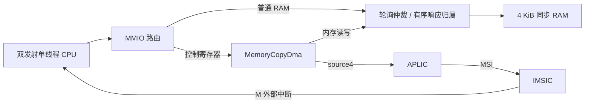

# FENCE、共享RAM和DMA合同

## 2026-10-06：VL100 DMAengine / 2 GiB候选

MemoryCopyDma常驻，0x10001000/APLIC4；GMAC packet DMA独立，0x10002000/APLIC6。
新2GiB可选配置保持64位地址，跨4GiB复制与末端越界拒绝短GSIM通过，旧默认不变。
Linux valence-dma使用DMAengine/vchan，限8字节对齐、不重叠RAM复制；
按需dma-bench用coherent私有缓冲区，不计CPU填充/比较，无硬件abort则超时保留内存。
W=1构建无警告，未板测带宽，详见 [VL100 BSP](vl100-debian-bsp.md)。

## 2026-10-06：网口互锁修复与 BootROM 安全退出候选

CoherentLineCache 在 bypassResponse 等待旧 CPU 回复时，现在仍可接受一致性 B 探测；
probe 期间保持旧 CPU 回复的 VALID/数据，不因同拍 B/C 握手丢失回复，也先安装 refill
再探测其新 tag/data。组合短测试连接真实 AtomicDataMemory、注册请求 FIFO、Home、
TL bridge 和外部独立字节内存。普通 uncached 请求可排在 DMA 后；原子访问则保持 DMA
排他规则，不能把这两种接收顺序混为一谈。

新增可加性寄存器：0x10002090 RX_STOP 仅允许 64-bit 全宽写 1；
0x10002098 CAPABILITIES bit0=1 表示实现安全 RX stop。空接收等待立即完成为
DONE+ERROR；半包先消费完 data/status 两个边界再丢弃；已经获准的 DDR 请求必须排空，
被背压的有效请求不能撤回。停止后需轮询 BUSY=0、ACK，再启动下一次接收。
旧驱动 ABI/ID 不变。旧 bit 没有这两个寄存器，不能直接加载新网络 BootROM 数据。

证据：build/gsim/network-boot-checks-20261006-r4/receipt.json，复用源哈希及模型一致的 r3：
一/两路缓存、各 8 组 FIFO/Home 交互、154 组 DMA 检查和 4 种安全停止场景，
新增各 3 组 refill 交界及关闭 bypassResponse B-ready 后的超时反证，ASan/UBSan 通过。
反证是明确的单能力故障注入，不是整个旧 RTL 重放，也不是物理板卡的逻辑分析记录。
此处仅为模块/组合验证：TCP 板端冻结尚需新 bit 实测归因，100 MHz 新路由尚未验证。

2026-10-04 源码修正：`MachinePlatform` 向 `MemoryCopyDma` 显式传递真实 RAM 基址和容量，
Board40 对应 `0x80200000–0x802fffff`，DDR 对应 `0x80200000–0xa01fffff`（512 MiB）。
控制寄存器 `0x10001000–0x10001027` 与 APLIC 4 不变。旧 bit 没有此修正，仍受旧地址窗口勘误限制；
新源码的短 IP/一致性检查也不等同于板级复制验收。新增网络 DMA 为独立可选功能，见下节。
详细寄存器、错误状态和中断见
[MMIO 寄存器表](soc-registers.md#dma0x10001000)与 [SoC datasheet](soc-datasheet.md)。
下文 4 KiB RAM 平台及 2026-09-22 验收记录为通用 IP/历史集成证据，不是此板级配置的 DMA 验收。

## 自研 GMAC 公共模块（2026-10-04，千兆优先）

用户改为自研 MAC，先接 RTL8211F / 1G RGMII；10G 只记录未来 **SFP1** 单口，
暂不实现 10G MAC/PCS/GTH。新增 `src/main/scala/ip/ethernet/` 不依赖 CPU、
Xilinx TEMAC 或第三方 MAC；CRC 的平行 GF(2) 矩阵和 MDIO/CSR 逻辑为本项目实现。
Berkeley HardFloat 仍只用于 CPU 浮点，与此网口实现无关。

第一批三个公共模块（历史验收保持）：

- `TileLinkGmacControl`：原生 64-bit TL-UL Get/PutFull/PutPartial CSR manager，
  每端口 4 KiB、四项有序 D 回复信用；不是 AXI Ethernet ABI、TL-C 或报文 DMA。
- `EthernetCrc32`：8/64-bit reflected CRC32，并行 GF(2) 矩阵 / 平衡 XOR；
  lane0 为线上的第一字节、全 1 初值、最终取反。不宣称已综合的资源或 Fmax。
- `MdioClause22`：32-bit preamble、读写/TA、背压/复位；MDC 不高于 2.5 MHz。
  IOBUF 应接 `T = !mdioOe`。没有 Clause45 或 PHY 自动配置/自动协商状态机。

短入口 `GSIM_CXX=/usr/lib/llvm-19/bin/clang++ python3 simulator/gsim/self_gmac.py --tag <新标签>`，
只检查这些模块、导出完整 SV 和交叉编译 `fpga/firmware/valence_gmac.h`，不跑 CPU/长 Linux/CAD。
初始公共模块验收 `build/gsim/self-gmac-20261004-r2/receipt.json` 为
`passed_foundation_only`：CRC 20195 向量、MDIO 96 事务、TL 3045 请求，独立负例均通过。
最终 `build/gsim/self-gmac-20261004-r3/receipt.json` 在同 RTL 上补 CSR→MDIO 的
4 次完整串行帧、23 次寄存器请求、462 拍忙时 START 背压、无应答、结果/IRQ 与复位；
三项原检查及联动位序负例全部通过，状态仍为 `passed_foundation_only`。
不能把 CSR 检查通过说成 DMA 或网口已经接通。

新 CSR **尚未接 `BoardSocTop`/APLIC**，默认配置、旧工程与 bit 不变。
`0x10040000` 是新后端的拟用基址；后续与旧 AXI Ethernet 窗口必须互斥，
IRQ source 5 的实际映射仍属于旧候选，不自动赋予新模块。新寄存器 ABI 见
[原生 GMAC 控制器](soc-registers.md#自研-gmac-控制器独立-ip未接板级)。
`GmacPortControl` 的状态/事件和所有字段必须先跨到控制域，不能直连 PHY 域信号；
事件脉冲/计数用可靠握手或快照，不能简单打两拍而丢失。

后续帧接口 `EthernetFrameBeat` 为 1..8 byte/lane 的配置合同，不含 preamble/SFD/FCS；
非尾拍 keep 全 1，尾拍为非零低位连续 mask，`bad` 在尾拍有效。
RX 的物理输入不可背压，需要完整帧缓冲与满帧丢弃；TX 需整帧准备后发出，
实现 padding/FCS/IFG 后才能接 RGMII。1G TX、PHY RX、CPU/DMA 至少三个时钟边界须各自签核。

`EthernetPacketDma` 自身仍保持下文四流合同；第二批已经通过独立原生帧适配器接通
单时钟 DMA↔GMII 模型（见下节），**不是 BoardSocTop/PHY 已接通**。
RGMII/独立时钟帧 CDC、PHY ID/协商/链路、驱动/设备树和新 bit 仍未完成。
现有 64-bit / 100 MHz 标量内存入口理想上限 800 MB/s，尚未扣除协议/一致性开销；
不是 10G 所需的 1.25 GB/s 持续传输能力。10G 后续需单独升级 DMA/内存并发和宽度。

## 自研千兆帧与 DMA 联动（2026-10-04，单时钟功能通过）

新增三个独立 IP，均在 `src/main/scala/ip/ethernet/`，不依赖 CPU 或 TEMAC：

| IP | 合同 |
| --- | --- |
| `GmiiFrameTx` | 2 KiB 同步整帧 RAM，32-bit 输入；收齐后无断流地发出 7x55/D5、帧体、补零、FCS、至少12个空闲字节时间 |
| `GmiiFrameRx` | 2 KiB 同步整帧 RAM，GMII 连续输入；校验后才发出32-bit帧，缓冲占用则完整丢弃新帧 |
| `EthernetDmaFrameAdapter` | 保留现有 DMA 四流接口，TX 六字控制验证后转原生帧，RX 原生数据后生成六字状态；不改 DMA 访存/一致性/描述符逻辑 |

范围限定为 **1G/full-duplex**。输入 TX 帧体为 DA/SA/LT/数据，不含 preamble/SFD/FCS，
合法长度14..2048；不足60字节补零，追加4-byte reflected FCS。非尾拍 keep=0xf，
尾拍 keep=1/3/7/f。错误 keep、短头、超长、尾部 `bad` 全部 drain 到 LAST 后拒绝，
不发部分物理帧；输入缺 LAST 不保证有限完成，需共同复位恢复。
源/目的地址由软件放进帧头，MAC 不重写 TX 地址。

RX 去掉 preamble/SFD/FCS，**保留 padding**；比较包括 FCS 的 CRC residue
`0xdebb20e3`，检查 wire length64..2052、RX_ER、目的地址以及基本 L/T。
EtherType>=1536 按帧接收；<=1500 要求帧体长=max(60,14+LT)，1501..1535 拒绝。
VLAN 标签不剥离，不提供 checksum/pause/多播表；多播可用 promiscuous 接收，
PHY 后续协商不得广告此 MAC 尚未实现的 PAUSE 能力。
enable/MAC/promiscuous/broadcast 在帧首快照；它们必须已经安全跨到 RX 域。
硬件复位释放时先等 DV=0，避免从被取消帧的偶然55/D5序列重新收包。

每方向只有一个帧缓冲。RX 从 EOF 校验到下游消费最后一拍期间都拥有它，
这一期间开始的新物理帧整帧丢弃，即使缓冲在新帧中途释放也不会接其后半帧。
因此 **不是持续千兆线速设计**，后续可加 ping-pong 缓冲/包 FIFO/描述符环。
TX done 在线上最后 FCS 字节，txBytes 为补齐后的帧体长度；RX accepted 在校验 EOF，
rxBytes 不含 FCS，均不是 DMA 内存写完成事件。

适配器只支持 DMA 当前的窄子集：TX TAG=0xa0000000+五个零 APP，格式错会将
原生尾拍 bad=1，由 TX 拒绝；RX TAG=0x50000000，word3 GOOD/BAD bits6/7，
word5 低16位为实际送给 DMA 的长度。其他状态字段为0，不宣称完整 PG138 兼容。
原 DMA TX DONE 仍是送完数据给后级，不是 wire-complete；它仍允许1..13字节描述符，
接此 MAC 后会被短头拒绝。未来驱动必须限制14..2048并区分 DMA/MAC 完成/错误。

最终短验收：`build/gsim/self-gmac-frames-20261004-r3/receipt.json`，状态
`passed_single_clock_frames_dma_only`：3项Scala检查与完整SV导出；帧246例、
适配96例/23936 beats、真实 DMA 联合54例/四项访存信用。
三项独立负例全部通过，使用独立逐位 CRC/字节内存，不引用 DUT CRC 矩阵。
覆盖坏 FCS 不写内存且保留 RX armed、全尾掩码、读写故障排空/重启、满缓冲丢弃、
背压、同时收发与帧 reset cancellation。不跑 CPU/NEMU/长 Linux/全量GSIM。
此前 cache/coherent home 的证据保留；本次联合模型直接用外部 RegisterPort 内存，
不把它说成新跑的 CPU/cache/DDR/独立时钟验收。

资源勘误：首个 RX RTL 有两个语义互斥但物理独立的 `memory.write`，产生三端口 RAM，
首次综合为34413 LUT / 16766 FF / 无BRAM；已停止该批布线并保留失败记录。
修复为单一 write enable/index/data、一个写端口后，原短 oracle 全部再次通过。
本批轻量模块 CAD 使用 `fpga/vivado-self-gmac-frames.tcl`，TX/RX 按8ns、适配器按10ns；
不重综合 CPU，字节一致 TX 已布线检查点复用；仅 RX 与适配器重新布线。
最终 `build/fpga/self-gmac-frames-20261004-r1/audit-final.json` 为
`PASS_GMAC_MODULE_INTERNAL_OOC`，原生 RTL/报告/DCP 已逐文件哈希核对并归档到
该目录的 `native-results/`，失败推断记录在 `rejected-ram-inference/`。
不借用旧 TEMAC/CPU 报告；审计强制检查帧缓冲实际 BRAM 推断，防止此类回退复发。

| 模块 | 周期 | 内部 setup / hold | post-route LUT / FF | RAMB18 / DSP |
| --- | ---: | ---: | ---: | ---: |
| TX | 8 ns | +5.144 / +0.045 ns | 268 / 178 | 1 / 0 |
| RX | 8 ns | +4.747 / +0.052 ns | 245 / 271 | 1 / 0 |
| DMA frame adapter | 10 ns | +8.077 / +0.046 ns | 52 / 43 | 0 / 0 |

RX 修复后的综合值为255 LUT / 271 FF / 1 RAMB18，与首次综合属同阶段比较；
route 后 LUT 为245。三模块合计565 LUT / 492 FF / 2 RAMB18，不包括 CSR/MDIO/
原 DMA/CDC/PHY。内部 setup/hold 通过不代表真实接口通过：零 I/O delay 条件下
TX/RX/adapter 的边界 hold 分别为 -0.049/-0.089/-0.032 ns，须接入实际时钟和接口
预算后再签核，不能由这个 OOC 结果直接生成宣称“网口可用”的 bit。

物理集成未做：RGMII DDR I/O、CPU/TX125/PHY RX 三域帧和配置/事件 CDC、
新 CSR 路由/APLIC、PHY 初始化、Linux driver/DT 与整板时序/bit。
适配器拟留 CPU 域，新 CDC 跨原生 data/keep/last/bad，两方向各一条；
不能直接将此单时钟联合 wrapper 当作板级顶层或将 RXC 接 CPU/TX 时钟。
协议字段核对：[PG138 7.2 接收状态](https://docs.amd.com/r/7.2-English/pg138-axi-ethernet/Receive-AXI4-Stream-Interface)。

## 自研网络 DMA V1（可选，2026-10-04）

`EthernetPacketDma` 是独立 IP，不引用 CPU；`BoardSocTop.ethernetDma` 和
`EthernetSocTop.packetDma` 默认 **false**。启用后接入 MMIO `0x10002000–0x100020ff`，
APLIC source 6 高电平完成中断；source 4 为复制 DMA，source 5 为 MAC，不互相占用。
它不是把 memcpy 端口直接接 MAC，也不是 Xilinx AXI DMA/SG 的寄存器兼容实现。

设计合同：CPU 域有每方向一个描述符、2 KiB 同步 staging RAM；TX/RX 可同时工作，
共享四个有序访存信用、公平仲裁、每拍最多一笔 64-bit 请求/响应。
描述符缓冲区须 8 字节对齐，长度/容量为 1..2048 字节；所有覆盖的完整 8-byte beat
必须在真实 RAM 范围内。允许任意字节尾部，RX 最后写用 byte-enable 保留其他字节。
TX 每帧产生 PG138 定义的六字控制包：TAG `0xa0000000`，APP0..4 为零，关闭 checksum offload；
TX 控制包先于数据，keep=0xf，最后一字 TLAST。数据末字 keep=1/3/7/f。
TX 先全部预读成功再送 MAC，读错则排空已接受/锁定请求，不产生半帧。

RX 数据和状态流可以独立背压、前后交错；两路 TLAST 后才核对六字状态、TAG=5、
GOOD_FRAME、BAD_FRAME/FCS_ERR、APP4 字节数、连续 keep 和缓冲区容量。
通过后才写 DDR；错误帧/短状态/超长帧排空后错误完成，不写 DDR。
DDR 写错会停止后续请求、排空已接受/锁定写，再错误完成；已经成功的写不回滚。
缺失 TLAST 或永久背压没有有限完成保证；此版无 hot-abort，恢复须协调 CPU/互连/MAC 复位。

CPU cache 和 DMA 通过原 `AtomicDataMemory` + `CoherentLineHome` 入口访问：
TX 会探测并写回 CPU 的脏源行；RX 写之前会探测/失效 CPU 缓存目标行。
禁止 CPU 在描述符活跃期间改写或读取 DMA 持有的缓冲区；提交前和完成后仍需 fence 保证顺序。
不绕过 home 直接加到 MIG，避免非一致性写污染现有 L1 和 LR/SC。

CPU 100 MHz ↔ MAC AXIS 125 MHz 用四个 `StreamClockDomainFifo(16)`，完整 data/keep/last
一起跨域；MAC 的 32 us 复位 guard 同时清 FIFO，CPU/DMA 通过本域 reset-release 等待 guard。
只支持协调冷复位，不支持任意单端热复位。Gray 指针须应用已有 scoped max-delay/bus-skew
约束；单时钟 GSIM 不能验证真实 CDC，CDC-only xsim/物理报告单独记录。

编程 ABI 见 [寄存器表](soc-registers.md#网络-dma可选0x10002000)，裸机/RTOS helper 为
`fpga/firmware/ethernet_dma.h`。短检查：

```sh
GSIM_CXX=/usr/lib/llvm-19/bin/clang++ python3 simulator/gsim/ethernet_dma.py --tag <fresh-tag>
mill -i IonSoC.test.runMain ooo.EthernetTimingMain <fresh-rtl> rv64gc board staged-fetch-feedback dma
```

验证状态以 `build/gsim/ethernet-dma-*/receipt.json` 为准。暂未宣称整板 MAC/PHY 收发、
1G 线速或 Linux 支持。当前每方向只一个软件描述符，没有 SG/描述符环/IOMMU，
存储入口仍为标量 64-bit 请求而非多帧 DDR burst；DMA 的 TX 完成表示末字进入 CDC FIFO，
不是 PHY 发射完成。通用 Linux xilinx_axienet 驱动不能直接使用这个自研 ABI，需专用驱动适配。
接口依据 [PG138 TX](https://docs.amd.com/r/7.2-English/pg138-axi-ethernet/Transmit-AXI4-Stream-Interface) 和
[PG138 RX](https://docs.amd.com/r/7.2-English/pg138-axi-ethernet/Receive-AXI4-Stream-Interface)。

设计与验收合同：单hart单线程保持不变。参考SMT可以共享执行资源，但不等于DMA或多项在途访存。
SMT需独立PC、架构/重命名映射、ROB归属、异常/CSR/中断及资源配额，并单独验证公平性与隔离。
Intel参考：https://www.intel.com/content/www/us/en/developer/articles/guide/hyper-thread-tuning-guide-for-video-ai-workload.html 。

## FENCE

机器核实现opcode0x0f、funct3=0的FENCE，忽略rd/rs1并按完整IORW屏障保守执行所有pred/succ/fm。
只在 ROB 队首且 LSU/写缓冲完全排空后执行，阻止年轻访存越过。
机器核的 FENCE.I 采用相同排空边界，并在完成时刷新取指前端；
单 hart TileLink RAM 执行验证见[取指路径](tilelink-fetch.md)。
依据RISC-V非特权ISA 20240411的FENCE规则，可用更强的完整屏障实现；不宣称缓存一致性或多hart完整性。
https://docs.riscv.org/reference/isa/v20240411/_attachments/riscv-unprivileged.pdf

## 独立DMA IP

RegisterPort控制/访存边界，不引用CPU类型。默认控制区0x10001000，DMA 默认参数只允许
0x80010000起4KiB范围；仅在对应通用平台配置中它才与真实普通RAM一致。
64位寄存器，size3/mask0xff且8字节对齐：0x00源地址、0x08目标地址、0x10长度（字节）、0x18控制、0x20状态。
控制bit0启动，bit1清完成/错误，bit2完成中断使能。状态bit0忙、bit1完成、bit2错误。
空闲时配置，启动时校验正长度/8字节对齐/范围无溢出/源目标不重叠；非法描述符无访存并报告错误完成。
忙时配置/控制写返回错误，状态可读；复位中止需整个互连一同复位。禁止在DMA使用的源/目标区同时CPU写入。

四项数据缓冲和四项有序请求标签；每拍最多一项外部请求，每拍最多一项响应，允许多笔读写在途，
传输至少需要每8字节一读一写，理想共享单端口带宽上限每2拍8字节，实际还受RAM延迟/仲裁限制。
只有全部写响应成功才报告完成。任一总线错误停止新增请求并排空已接受请求，报告错误；已完成写不回滚。
独立 IP 无scatter/gather、外设握手、字节尾部、重叠memmove或IOMMU，亦不自行实现缓存协议；
集成方负责内存可见性；当前平台通过 CoherentLineHome/Cache 处理可选脏缓存探测。

## 仲裁与平台

本节图示为最初的 4 KiB RAM 集成配置。当前板级 RAM 容量、缓存路径和 DMA 限制见
[SoC datasheet](soc-datasheet.md)。



两个主设备轮询仲裁，锁定被背压的请求，8项有序响应归属标签；CPU有多笔在途时不串行化到单项。
持续竞争且从设备接受请求时，服务交替，不允许DMA独占；背压时无固定时钟延迟保证。
RAM保持原两项信用，单端口每拍最多一项，DMA不会制造额外RAM端口。
DMA完成/错误接APLIC source4高电平；source3仍为UART。外部sources位2/3应置0。
在本节无数据缓存的历史配置中，软件先FENCE确保源数据可见再启动，完成后FENCE再读目标区，
按非一致性DMA处理。当前 BoardSocTop 已配置 coherent data cache，窗口修正只存在于新源码，不改变旧 bit。

测试必须覆盖随机背压、多项在途、地址/数据/掩码、完成只在最终写响应后、错误排空、非法描述符、
忙时重编程拒绝、CPU/DMA争用公平性、CPU性能对照、独立RAM模型和端到端启动固件。
Vivado资源/Fmax/CDC/DDR尚未验证；DMA模块吞吐与CPU IPC必须分别测量。

## 复用和测试入口

- `make gsim-dma-test`：独立内存拷贝IP，含轮询/IRQ、错误排空及独立数据模型负向注入。
- `make gsim-shared-data-test`：双主设备并发、背压、响应保序、公平性及负向注入。
- `make gsim-machine-test`：机器核FENCE、CSR、异常/中断及已有NEMU差分。
- `make gsim-machine-platform-test`：原UART/RAM固件与新增DMA中断固件，同一硬件、两种核心配置。
- `make dma-rtl`：独立DMA IP RTL导出到 `build/ip/dma`；`make machine-platform-rtl` 导出集成生产平台。

DMA寄存器响应为两项FIFO；请求接受后下一拍可见，每拍最多一项。访存响应须严格按请求顺序，
没有事务ID；响应必须遵守valid/ready，允许请求当拍出现响应但DMA将在已有标签可用后接受。
`active`为忙状态输出，`irq`为受控制bit2使能的完成电平（错误也算完成），均来自寄存器状态。

板级 owner 时序切分（2026-10-01）：`SharedDataArbiter.registerResponseOwners` 与
`AtomicDataMemory.registerResponseOwners` 通用默认均为false；BoardSocTop通过
`MachinePlatform.registerPhysicalResponseOwners=true` 同时启用非flow owner队列。
容量仍8项、请求仍一拍一笔，响应仍按序，不增加缓存数据流水拍。
零拍下游须遵守valid/ready并保持未接受响应；至少一拍下游无新增响应延迟。
共享仲裁两种模式均通过12596笔请求、8项在途、7417次公平性检查、4112次背压检查、
连续480笔流及两组零拍响应/接收背压，负向oracle PASS。
这是独立IP定向检查，不等同于确认板级DMA已支持大DDR描述符范围。

## SMT 后续评估条件

本节历史默认配置为2发射、64物理整数寄存器；当前 BoardSocTop 使用48物理整数寄存器。
SMT-2会使同时存活的架构寄存器状态接近翻倍，并竞争现有单数据端口。
需要按线程管理取指/重命名/ROB归属、恢复、CSR/精确异常和中断，明确共享PRF/队列配额与防饥饿策略。
现阶段不为每个模块预埋未经验证的threadId，也不把双发射说成双线程。
先建立单线程缓存/访存和真实FPGA时序基线；之后用双程序总吞吐、单线程退化、资源占用和Fmax评估是否值得增加SMT。

## 2026-09-22 验收结果

`make test`通过29项Scala检查及全部GSIM/NEMU/负向注入。独立DMA48组用例、6,612项请求，
最大4项在途；共享仲裁12,607项请求、8项在途、7,561次双主设备公平性检查，连续482拍每拍接受一项。
独立DMA在无请求背压、响应队列额外等待参数为1的模型下（请求到响应至少2拍），2KiB拷贝556拍（含控制寄存器配置、完成读回/清除及测试响应背压），
不是CPU IPC，也不是最高频率测量。

集成同步RAM下1KiB拷贝的DMA忙周期/期间CPU获准的RAM请求，以及整个固件周期：

| 配置 | seed | DMA忙周期 | 同期CPU请求 | 固件周期 |
| --- | ---: | ---: | ---: | ---: |
| ROB8 / PRF36 | 0 | 294 | 36 | 5,546 |
| ROB8 / PRF36 | 17 | 293 | 36 | 6,492 |
| ROB8 / PRF36 | 8191 | 292 | 35 | 6,442 |
| ROB32 / PRF64 | 0 | 294 | 36 | 5,440 |
| ROB32 / PRF64 | 17 | 294 | 36 | 6,347 |
| ROB32 / PRF64 | 8191 | 292 | 35 | 6,295 |

每次DMA恰为128读+128写，source4中断一次，CPU核对128个目标值和独立C结果376。
固件周期包含清零RAM、C负载、配置、并发CPU工作、陷阱/中断和校验，不包含ROM装载/复位。
原RAM/UART启动的12组周期记录与上一轮完全一致；44条裸核IPC记录逐项一致，报告模型哈希随源码更新。
全量日志 `build/gsim/dma-final.log`，导出日志 `build/gsim/dma-rtl-export.log`。
原IPC没有提升；本轮增益是增加独立传输能力并验证CPU/DMA同时前进，未宣称所有负载性能最优。
