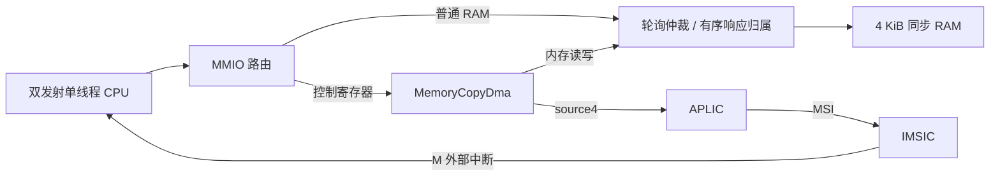

# FENCE、共享RAM和DMA合同

设计与验收合同：单hart单线程保持不变。参考SMT可以共享执行资源，但不等于DMA或多项在途访存。
SMT需独立PC、架构/重命名映射、ROB归属、异常/CSR/中断及资源配额，并单独验证公平性与隔离。
Intel参考：https://www.intel.com/content/www/us/en/developer/articles/guide/hyper-thread-tuning-guide-for-video-ai-workload.html 。

## FENCE

机器核实现opcode0x0f、funct3=0的FENCE，忽略rd/rs1并按完整IORW屏障保守执行所有pred/succ/fm。
只在 ROB 队首且 LSU/写缓冲完全排空后执行，阻止年轻访存越过。
机器核的 FENCE.I 采用相同排空边界，并在完成时刷新取指前端；
单 hart TileLink RAM 执行验证见[取指路径](tilelink-fetch.md)。
依据RISC-V非特权ISA 20240411的FENCE规则，可用更强的完整屏障实现；不宣称缓存一致性或多hart完整性。
https://docs.riscv.org/reference/isa/v20240411/_attachments/riscv-unprivileged.pdf

## 独立DMA IP

RegisterPort控制/访存边界，不引用CPU类型。默认控制区0x10001000，平台只允许访问0x80010000起4KiB普通RAM。
64位寄存器，size3/mask0xff且8字节对齐：0x00源地址、0x08目标地址、0x10长度（字节）、0x18控制、0x20状态。
控制bit0启动，bit1清完成/错误，bit2完成中断使能。状态bit0忙、bit1完成、bit2错误。
空闲时配置，启动时校验正长度/8字节对齐/范围无溢出/源目标不重叠；非法描述符无访存并报告错误完成。
忙时配置/控制写返回错误，状态可读；复位中止需整个互连一同复位。禁止在DMA使用的源/目标区同时CPU写入。

四项数据缓冲和四项有序请求标签；每拍最多一项外部请求，每拍最多一项响应，允许多笔读写在途，
传输至少需要每8字节一读一写，理想共享单端口带宽上限每2拍8字节，实际还受RAM延迟/仲裁限制。
只有全部写响应成功才报告完成。任一总线错误停止新增请求并排空已接受请求，报告错误；已完成写不回滚。
首版无scatter/gather、外设握手、字节尾部、重叠memmove、IOMMU和缓存一致性。

## 仲裁与平台

两个主设备轮询仲裁，锁定被背压的请求，8项有序响应归属标签；CPU有多笔在途时不串行化到单项。
持续竞争且从设备接受请求时，服务交替，不允许DMA独占；背压时无固定时钟延迟保证。
RAM保持原两项信用，单端口每拍最多一项，DMA不会制造额外RAM端口。
DMA完成/错误接APLIC source4高电平；source3仍为UART。外部sources位2/3应置0。
软件先FENCE确保源数据可见再启动；完成后FENCE再读目标区。无数据缓存的当前平台按非一致性DMA处理。

测试必须覆盖随机背压、多项在途、地址/数据/掩码、完成只在最终写响应后、错误排空、非法描述符、
忙时重编程拒绝、CPU/DMA争用公平性、CPU性能对照、独立RAM模型和端到端启动固件。
Vivado资源/Fmax/CDC/DDR尚未验证；DMA模块吞吐与CPU IPC必须分别测量。

## 复用和测试入口

- `make gsim-dma-test`：独立内存拷贝IP，含轮询/IRQ、错误排空及独立数据模型负向注入。
- `make gsim-shared-data-test`：双主设备并发、背压、响应保序、公平性及负向注入。
- `make gsim-machine-test`：机器核FENCE、CSR、异常/中断及已有NEMU差分。
- `make gsim-machine-platform-test`：原UART/RAM固件与新增DMA中断固件，同一硬件、两种核心配置。
- `make dma-rtl`：独立DMA IP RTL导出到 `build/ip/dma`；`make machine-platform-rtl` 导出集成生产平台。

DMA寄存器响应为两项FIFO；请求接受后下一拍可见，每拍最多一项。访存响应须严格按请求顺序，
没有事务ID；响应必须遵守valid/ready，允许请求当拍出现响应但DMA将在已有标签可用后接受。
`active`为忙状态输出，`irq`为受控制bit2使能的完成电平（错误也算完成），均来自寄存器状态。

## SMT 后续评估条件

当前默认2发射、64物理整数寄存器；SMT-2会使同时存活的架构寄存器状态接近翻倍，并竞争现有单数据端口。
需要按线程管理取指/重命名/ROB归属、恢复、CSR/精确异常和中断，明确共享PRF/队列配额与防饥饿策略。
现阶段不为每个模块预埋未经验证的threadId，也不把双发射说成双线程。
先建立单线程缓存/访存和真实FPGA时序基线；之后用双程序总吞吐、单线程退化、资源占用和Fmax评估是否值得增加SMT。

## 2026-09-22 验收结果

`make test`通过29项Scala检查及全部GSIM/NEMU/负向注入。独立DMA48组用例、6,612项请求，
最大4项在途；共享仲裁12,607项请求、8项在途、7,561次双主设备公平性检查，连续482拍每拍接受一项。
独立DMA在无请求背压、响应队列额外等待参数为1的模型下（请求到响应至少2拍），2KiB拷贝556拍（含控制寄存器配置、完成读回/清除及测试响应背压），
不是CPU IPC，也不是最高频率测量。

集成同步RAM下1KiB拷贝的DMA忙周期/期间CPU获准的RAM请求，以及整个固件周期：

| 配置 | seed | DMA忙周期 | 同期CPU请求 | 固件周期 |
| --- | ---: | ---: | ---: | ---: |
| ROB8 / PRF36 | 0 | 294 | 36 | 5,546 |
| ROB8 / PRF36 | 17 | 293 | 36 | 6,492 |
| ROB8 / PRF36 | 8191 | 292 | 35 | 6,442 |
| ROB32 / PRF64 | 0 | 294 | 36 | 5,440 |
| ROB32 / PRF64 | 17 | 294 | 36 | 6,347 |
| ROB32 / PRF64 | 8191 | 292 | 35 | 6,295 |

每次DMA恰为128读+128写，source4中断一次，CPU核对128个目标值和独立C结果376。
固件周期包含清零RAM、C负载、配置、并发CPU工作、陷阱/中断和校验，不包含ROM装载/复位。
原RAM/UART启动的12组周期记录与上一轮完全一致；44条裸核IPC记录逐项一致，报告模型哈希随源码更新。
全量日志 `build/gsim/dma-final.log`，导出日志 `build/gsim/dma-rtl-export.log`。
原IPC没有提升；本轮增益是增加独立传输能力并验证CPU/DMA同时前进，未宣称所有负载性能最优。
