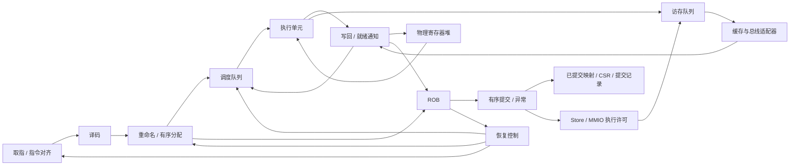

# OoO Core 架构草案

## 状态与范围

2026-09-18：产品线规划覆盖 MCU 到高性能 SoC，包含顺序核和 2/4/6 发射乱序核。
当前工作聚焦乱序核。本文定义首个双发射实现的建议规格和验收顺序；已有理想供指/独立 RAM 下的裸核 IPC，尚无完整系统性能或综合验证，
不表示仓库已经实现完整乱序核。用户明确指出现有顺序核有 bug；它保留用于历史问题复现，
不作为新核的设计模板或正确性标准，新顺序核暂不进入实现范围。

新核必须使用 GSIM 作为主仿真后端，其接入是首个里程碑的必要交付。
GSIM 是唯一受支持的仿真后端；Verilator 及其隐式 ChiselSim/旧 emu 入口均已退役，不再进行旧工程或交叉仿真回归。

实施进度：已新增独立的重命名/ROB 基础模块和固定版本的 GSIM 构建/仿真入口，
并接入整数 PRF 数据/就绪表、最老就绪选择、双 ALU、独立译码和组合供指接口。
现已接 64 项 bimodal 条件分支方向预测，按退休顺序训练，保存每条分支的预测下一 PC 并在执行时校正；
JAL 及紧邻 AUIPC→JALR 已接精确目标预测；普通寄存器间接跳转和返回仍顺序预测，尚无 BTB/RAS；新增 FPGA 单在途同步 ROM 取指适配器，原理想供指基准保留。
现已加入六种条件分支、JAL/JALR、执行重定向和目标对齐检查，与 11 种 load/store 合计支持 49 种 RV64I 编码；另已接 Zicond 两条条件置零指令和 RV64M 的 13 条乘除指令，并接入 B（Zba/Zbb/Zbs）40 条编码，共 104 种；实现合同见 [RV64B](rv64b.md)。
M 使用可逐项取消的六周期流水乘法和独立单槽迭代除法，与 LSU 共用完成端口；性能基线与限制见 [RV64M 合同](rv64m.md)。
GSIM 驱动按动态程序路径，通过 NEMU DiffTest API 逐条检查 PC、nextPc 和整数寄存器。
覆盖直线程序、循环、调用/返回、错误路径清空及较老分支撤销较年轻重定向，具体回归记录见 GSIM 说明。
四槽 LSU 已接独立 RAM，可运行受限 C 栈/数组程序并测 IPC。显式普通 RAM 范围内的 load
可提前执行。现有 ROB 索引投机 SQ 提前保存非队首 store 的地址/数据，准备共享整数发射预算；
load 可越过地址已明确、对齐且位于普通 RAM 的不相交较老 store。未知地址、重叠或非 RAM store
仍阻塞 load，除非成功完成的源 store 完整覆盖 load 并直接转发。
其他访存仍限 ROB 头部。LSU 与 ALU 共享默认 2 条/周期
发射预算；支持已取消 load 排空及迟到响应隔离。LSU 可在旧结果完成时锁存下一笔独立访存，
并保留尚未退休的非投机事务保护。已加入成功 store 完成窗口内的单项转发，
普通 RAM load 最多四笔在途，数据端要求严格按请求握手顺序返回；store/区间外读取仍在队首启动。已接四项不可撤销 store buffer，显式保证写成功的 RAM 可入队后完成/退休，
外部写仍按序排空，跨恢复保留；部分/不相交 load 先等待排空，全字节覆盖 load 从最新待排 store 转发。
`bufferedRamStores` 默认关闭，GSIM 固定 RAM 显式开启，详见裸核 IPC 合同。
SQ 容量暂等于 ROB，尚无独立紧凑 LQ/SQ、投机 SQ 的部分覆盖合并、未知地址推测/重放、事务 ID 或乱序响应支持。
FPGA 入口已接 Chisel 同步 ROM、顺序预取、跨 packet 双路供指与同步字节写 RAM，集成平台已通过 C 程序 NEMU 差分；
ROB32/PRF64 下 1,310 条指令用 1,529 周期，IPC 0.857，报告独立于理想供指基准。
缓存及完整异常状态仍未实现，
尚不支持完整 RV64I 或通用裸机平台。Vivado 导出与限制见 [FPGA 基线](fpga-bringup.md)。
接口、负载与测量口径见 [裸核 IPC](bare-core-ipc.md)。
M0 的整数子集参考构建与 ABI 审查已完成，完整平台参考配置仍待逐步审查。
复现命令、模块边界和工具兼容性记录见 [GSIM 接入说明](../simulator/gsim/README.md)。

首版沿用现有 RV64 平台，先建立双发射整数乱序执行的正确性闭环，再接入特权态、MMU 和系统软件。
新应用 SoC 的架构目标已固定为 RVA23S64（覆盖 RVA23U64）；F/D、向量和 H/Sha 虚拟化均为必选，
按阶段实现而非可选裁剪。完整差距与验收顺序见 [RVA23 目标](rva23.md)。
RV32 MCU、多核一致性及四/六发射实现仍按产品阶段推进，频率和面积目标待测量确定。

机器平台新增完整排空式FENCE、独立四项在途内存拷贝DMA、CPU/DMA共享RAM轮询仲裁与APLIC source4完成中断。
接口/限制见 [DMA合同](dma.md)。仍为单hart单线程，SMT只是后续评估方向，未增加线程上下文或发射宽度。

## 性能设计与验收要求

高性能是新 SoC 的设计目标。每个新模块在实现前应明确目标吞吐率、延迟、容量、端口数和背压行为，
评估关键组合路径及其对整核频率的影响；接口与结构选择需要考虑未来四/六发射配置。
性能验收同时覆盖独立、相关和资源冲突场景，记录实际吞吐、停顿原因和恢复开销，不能仅检查功能结果。
有综合与时序工具后记录固定约束下的面积、关键路径和时序裕量；尚未测量的指标必须标为未验证。

优化以整机工作负载表现及功耗、频率、面积约束为依据，不能假定模块局部最优等于 SoC 全局最优。
目标工艺、频率、功耗/面积预算及工作负载未确定前，不宣称“最优性能”。早期为正确性闭环采用的
串行恢复、保守访存等方案应明确标记为基线，并通过后续测量决定是否替换，不能直接作为高性能验收结论。
GSIM 的仿真运行速度单独测量，不作为硬件性能证据；开启 sanitizer 的功能测试也不是仿真速度基准。

## 现有实现与复用边界

公共 ISA 编码已完成第一步拆分：`soc.isa` 不再依赖核心控制包，新核共享 opcode、相关 funct 和异常编号。
旧控制表移至 `core/pipeline/decode`，具体审查范围见 [ISA 复用说明](isa-reuse.md)。
其余各项仍为候选复用范围；先独立定义新核需求和接口，再审查候选代码。

| 当前模块 | 新核处理方式 |
| --- | --- |
| `isa/Instruction`、`isa/CSR` | 新核已共享相关编码和异常编号；不代表整个 ISA/CSR 实现已验收 |
| `core/pipeline/decode/InstrTable`、`isa/Compressed` | 旧控制表保持独立；压缩展开仍待独立验证与接入 |
| `core/pipeline/InstrDecode` | 按新契约实现无寄存器读数的译码，不继承旧核旁路、stall 或异常补丁 |
| `core/pipeline/ALU` | 按规范建立独立运算期望，再审查可提取逻辑及带指令标识的执行接口 |
| `core/Core`、`RegisterFile`、`WirteBack` | 新建 OoO 顶层、物理寄存器堆、ROB 和提交控制 |
| `core/pipeline/LSU`、`StoreBuffer` | 旧测试提供边界场景，访存语义按规范重新定义，新建队列和副作用控制 |
| `core/csr/CSRFile`、`Sv39` | 复用前先审查时序、副作用及异常边界，不能直接接到乱序完成端 |
| TileLink、UART、CLINT、PLIC、地址映射 | 沿用接口前明确协议和平台契约，补独立验证，不能只凭旧核能运行认定正确 |
| `memory/cache/L1Cache` | 独立内存模型验证通过后，才通过单请求适配器接入；新核早期使用独立测试内存 |
| `system/IonSoC` 的 DiffTest 接线 | 从单条提交扩展到有序提交向量，保留架构异常事件 |
| `legacy/simulator/harness/verilator_main.cpp` | 程序加载和外设模型可提取；内部层次名访问不能作为新核的稳定接口 |

“复用”不意味着已经确认正确。现有测试、裸机 payload 和历史 bug 记录作为候选回归资产保留，
其断言和期望值也必须审查，不能以“兼容旧核”为理由保留错误行为。
新实现建议放入 `soc.core.ooo`，避免在旧顺序流水线控制上叠加 ROB 和重命名状态。

## 独立设计与验证依据

1. 实现前固定所支持扩展及 RISC-V 非特权/特权规范版本，按章节记录指令、异常和 CSR 的预期语义。
2. ROB、重命名、调度、恢复和 LSU 从新接口及不变量设计，不复制旧流水线控制与补丁。
3. 参考模型采用匹配 ISA 配置的 NEMU；记录上游版本并审查本仓库已有修改，不能假设定制参考模型天然正确。
4. 新核和参考模型不一致时，先用规范与最小用例裁决；必要时引入第二个独立参考实现。
   不允许为通过差分而让参考模型迎合 DUT，也不能因旧核得到相同结果就关闭问题。
5. 新核初期使用独立的测试内存和受控外设输入；分别验证核心与平台后再集成，避免同时继承旧 LSU/cache 的错误。
6. 候选复用模块必须留下接口契约、规范或平台依据、独立测试结果和已知限制；缺少依据时重写或延后接入。

GSIM 负责执行硬件模型，不是 ISA 正确性的参考模型。两种仿真器运行同一份有 bug 的 RTL，
也可能得到完全一致的错误结果；后端一致性检查不能替代规范检查、差分和模块不变量验证。

## 配置与首版结构

ISA、核微架构、SoC 外设、仿真后端分别配置。新增核配置不要继续堆入 `SoCFeatures`。
2/4/6 是产品档位名称，各阶段宽度仍应分别描述和约束。

| 配置项 | 双发射首版建议 | 含义 |
| --- | ---: | --- |
| `xlen` | 64 | 首版只实现 RV64 |
| `fetchBytes` | 8 | 每个取指块字节数，不保证每周期返回一个块 |
| `decodeWidth` | 2 | 每周期最多译码的架构指令数 |
| `renameWidth` | 2 | 每周期最多重命名的指令数 |
| `dispatchWidth` | 2 | 每周期最多进入后端的指令数 |
| `issueWidth` | 2 | 所有执行端口合计每周期最多接受的操作数 |
| `commitWidth` | 2 | 每周期最多提交的架构指令数 |
| `robEntries` | 32 | 程序顺序和精确异常的记录窗口 |
| `physicalIntRegs` | 64 | 包含固定零寄存器，启动时建立 32 个架构寄存器映射 |
| `intIssueEntries` | 16（规划） | 当前整数基线按 ROB 索引预留槽位，容量等于 `robEntries`；独立 16 项队列待评估 |
| `loadQueueEntries` | 8 | 在途 load 记录 |
| `storeQueueEntries` | 8 | 提交前 store 地址、数据、异常记录 |
| `dataOutstanding` | 1 | 缓存/总线适配器最多一个未完成数据请求 |

这些容量是便于实现和覆盖边界测试的起点。四/六发射不预设未经测量的容量表。
第一阶段每条指令对应一个 ROB 项；若后续引入多 uop，必须补充架构指令完成和原子提交规则。

当前两个执行槽均支持整数 ALU/分支，以验证不跳转分支的双宽吞吐；同周期只选择最老的重定向。
后续根据综合结果评估单/双分支端口，并共享连接乘除法或地址生成单元。
每槽每周期最多接受一项；乘除法或访存完成可以与 ALU 完成重合，完成仲裁必须能够反压或暂存结果。
不能依赖“只有两发射”推断同周期只有两个结果到达。
整数寄存器堆初始按最多四读、两写组织；具体实现及关键路径需要综合检查。
首版写回后下一周期唤醒依赖者，不先引入跨全部单元的同周期组合唤醒链。

## 接口约定

以下是待实现的数据契约，字段名称可在 Chisel 实现时调整，但语义必须保留。

| 接口 | 必要信息 |
| --- | --- |
| `DecodedUop` | PC、原始指令、长度（明确使用 2/4 字节）、操作类别、源/目的架构寄存器及有效位、立即数、预测信息、异常 |
| `RenamedUop` | 译码信息、源物理寄存器、目标物理寄存器、旧目标映射、ROB 标识、必要的 LQ/SQ 标识 |
| `Completion` | ROB 分配标识、目标物理寄存器、结果、异常信息、实际分支方向和目标 |
| `Redirect` | 恢复原因、边界指令标识、保留/清除边界规则、目标 PC |
| `MemoryRequest/Response` | 请求标识、地址/大小/字节掩码/数据、访问属性、响应数据及错误 |
| `CommitRecord` | 有序序号、PC、原始指令和长度、架构寄存器写入、访存与 CSR 验证所需信息 |

普通通道使用 valid/ready：未握手时保持载荷；恢复取消是明确的协议事件，不能作为普通反压处理。
双宽分配/提交采用程序顺序连续前缀，不能 lane 1 成功而 lane 0 留下。
首版前后端之间通过队列解耦；不能用一个全局 stall 同时冻结取指、执行和提交。

ROB 标识必须包含分配世代或等价的存活标识，不能只有循环数组下标。
被清除指令的晚到结果必须在写物理寄存器、唤醒依赖者和更新 ROB 之前被拒绝。
标识回绕前必须保证旧请求已排空；如果不能证明，禁止复用该标识。
取指使用独立的请求路径标识丢弃重定向前的返回。

## 重命名、提交与恢复不变量

### 重命名

- 区分投机映射表和已提交映射表；x0 固定映射到零寄存器，不分配、不回收。
- 同周期较年轻指令必须看到较老指令刚建立的新映射，覆盖 RAW、WAW 和同目的寄存器连续写。
- 分配 ROB、物理寄存器、调度队列和所需访存队列必须协调完成；资源不足只接受可用的连续前缀。
- ROB 记录本指令的新、旧物理目的寄存器。正常提交后才释放旧映射。
- 没有架构目的寄存器的指令仍需要 ROB 项，以维持异常、分支及 store 的程序顺序。

### 完成与提交

- 执行完成只更新投机结果。CSR、设备写入和架构异常进入必须经过提交控制。
- ROB 从头部提交连续的已完成指令；异常指令不计为正常退休，其后指令不能越过它。
- 两条指令同周期写同一架构寄存器时，已提交映射按程序顺序更新，最终保留较年轻者。
- 分支必须等待真实方向和目标确定后才能提交。
- 中断只在明确的指令边界进入；不可取消的 MMIO 进行中不能直接清除其所有者。
- 串行化指令和架构事件首版独占提交周期，先把与普通双提交的组合规则简化。

### 首版恢复算法

首版使用 ROB 尾部逐项反向回滚，暂不加入每个分支的映射表检查点。
每撤销一条有目的寄存器的指令，恢复其旧投机映射并回收其新物理寄存器。
分支预测错误清除分支之后的指令，保留分支本身及其链接寄存器结果。
异常在 ROB 头处理，撤销异常指令及其全部年轻指令。

恢复期间暂停重命名、分配和提交，阻止被撤销指令写回；保留指令的合法完成仍可记录。
已接受的外部请求继续按协议排空，不能因暂停恢复造成响应死锁。
同时出现多个恢复请求时，以存活指令的程序年龄选择最老边界；恢复中发现更老的重定向时继续向更老边界回滚。
恢复完成后再从目标 PC 开始取指。这个方案优先易验证性，分支恢复延迟随后单独优化。

## 当前访存策略与平台约束

普通 RAM load 可在队首之前执行，默认四笔在途；store 和区间外读取在队首获得许可。
该整数基准配置尚无投机 SQ、MMU、真实 MMIO 设备接入或中断处理；机器核中断进展见文末。

1. 区域必须显式声明为可投机、无副作用 RAM，其他地址不得推测读取。
2. 未退休 store 可提前准备地址/数据。地址已知且安全的普通 RAM store 与 load 不相交时允许越过；未知地址或重叠保守等待，保留完成窗口转发。已入缓冲 store 按字节转发，部分覆盖保守等待排空。
3. load 异常只在队首报告；取消 load 保持请求稳定并排空响应，禁止迟到写回。
4. 默认 store 等真实成功响应后退休，错误写必须无副作用。显式 `bufferedRamStores` 模式仅用于平台保证写成功的 RAM，入队即不可撤销，确认后可退休；平台违反承诺触发断言，不能恢复成精确异常。
5. MMIO 在队首获得执行许可，并排空更老事务与缓冲写。中断、权限检查、平台设备语义尚待实现。
6. 当前机器配置已支持排空式 `fence` 和 `fence.i`；后者在排空后刷新前端并重取下一条。机器平台的原子操作也采用队首授权与写缓冲排空；地址空间变化仍待实现。

外部数据口没有事务 ID，响应必须严格按请求握手顺序返回；owner FIFO 分别路由 load 和缓冲写响应。
缓冲为空时保留四槽 load 并发。接入可能乱序返回的 cache/总线时，适配器必须恢复响应顺序。

## ISA 与系统功能推进

首个执行闭环从 RV64I 整数、分支、自然对齐 load/store 和同步异常记录开始。
没有启用的扩展必须报告非法指令，不能静默执行，也不能在 ISA 声明中提前标为支持。
随后补齐 M、C、Zicsr/Zifencei、M-mode trap/interrupt，再接 A、S/U-mode、PMP 和 Sv39。
未对齐访存首版明确产生异常；后续跨页或拆分访存必须单独验证副作用和异常精确性。

Linux 是后续系统验收目标；裸机闭环、双发射正确性或已有顺序核的启动日志都不等同于 OoO 已支持 Linux。
旧平台的 ISA 扩展集合不能直接作为未完成的新核的默认 ISA 声明。

## 仿真与验证

GSIM 是新核的主仿真后端，构建、程序加载、周期推进、提交记录和回归入口必须接入 GSIM。
Verilator/ChiselSim/旧emu入口已退役，不参与实现、回归或交叉检查。
锁定的 GSIM 版本接受 CHIRRTL、生成 C++；Chisel 7.3 的 smoke、重命名/ROB 和整数执行模型已跑通，
这不证明全部 Chisel 构造都兼容。完整程序加载、ROM 初始化、BlackBox 和整核运行接口仍需验证。
先固定 GSIM 版本，对小设计验证组合逻辑、寄存器复位、带写掩码的同步存储器和结果采样时序，再接新核。
新仿真入口使用明确的程序加载和提交接口，避免直接继承旧 ROM BlackBox、DPI 和层次信号访问方式。
加速比需要本项目实测，不把论文倍数写成验收承诺。

新核提供稳定的提交向量和架构事件接口。仿真驱动不通过生成器内部层次名推断“哪条指令已经执行完”。
DiffTest 按提交序号逐条推进参考模型，周期末架构快照在处理完该周期全部提交后比较。
MMIO、计时器和中断需明确同步策略；不能把 `skip` 当作绕开普通指令差异的通用办法。

两种比较分开进行：

- 同一GSIM模型在无背压与受控背压下，对比独立语义模型的提交及异常序列，检查协议与恢复。
- 不同微架构与参考模型对比架构语义；涉及时间的设备和中断需要受控输入，不能要求不同核周期相同。

验证重点包括：同包 RAW/WAW、资源耗尽、ROB 回绕、连续双提交、错误路径写回、恢复时物理寄存器复用、
分支与更老异常竞争、访存反压、已杀死 load 的晚到响应、MMIO 恰好一次、零寄存器、双提交与中断边界。
模块测试之后必须加入随机依赖指令流和端到端差分，单靠模块测试或成功打印 UART 不足以验收。

性能分别报告 guest cycles、retired、IPC、host 仿真 cycles/s、生成/编译时间和峰值 RSS。
硬件频率、面积、寄存器堆端口和旁路关键路径另用综合评估；GSIM 的宿主运行速度不能替代硬件性能指标。

## 实现里程碑与退出条件

| 阶段 | 交付 | 退出条件 |
| --- | --- | --- |
| M0 | 固定规范及参考模型版本，接通 GSIM；核参数、接口、ROB/重命名/恢复基础及独立测试 | GSIM 完成可复现的生成、编译、运行及结果检查；分配、回收、同包依赖、回绕和恢复不变量通过 |
| M1 | 双发射整数执行闭环、最小取指和 GSIM 提交驱动 | 在 GSIM 下独立 ALU 流确实出现双发射/双提交；依赖链、分支恢复及随机指令流差分通过 |
| M2 | 保守 LSU、RAM/ROM 与平台适配、裸机异常处理 | load/store 错误及清空、MMIO 单次副作用通过；裸机程序端到端差分通过 |
| M3 | 完善 ISA、特权态、缓存/MMU 与系统软件接入 | 针对声明能力的回归通过；固件和 Linux 启动里程碑分别记录，不预先宣称完整启动 |
| M4 | 双发射性能优化及四/六发射拓展 | 每个新配置独立通过差分及恢复测试，提交性能和综合证据 |

当前 M1 已接通整数/控制流译码、最小供指、执行重定向和 NEMU 提交差分，
整数独立流双执行/双提交及依赖链单周期推进已有定向验证。分支恢复也进入程序级差分验证。
M2 已完成保守 LSU 与独立 RAM 访存差分、受限 C 程序及裸核 IPC 基线。
现已接同步ROM/RAM、MMIO、机器级精确异常/外部中断、UART与DMA闭环；完整缓存、M/S/U特权架构及MMU仍属后续M3。
性能设计从每个模块开始执行，M4 是整核优化与扩展阶段，不是推迟所有性能评估的理由。

后续运行验收均使用 GSIM。若工具兼容性受阻，记录最小复现并继续独立设计工作，
但 M0 保持未完成，不能悄悄把主仿真后端换回 Verilator。
M4 可能需要分布式调度、寄存器堆分银行、分层旁路、更多访存并行度和更宽前端，不能只修改发射宽度常量。

## 参考与待验证项

- [GSIM 官方仓库与接入说明](https://github.com/OpenXiangShan/gsim)
- [GSIM 论文](https://arxiv.org/abs/2508.02236)
- [现有顺序核结构](../legacy/docs/core-pipeline.md)
- [现有缓存和 TileLink](../legacy/docs/memory-cache-tilelink.md)
- [现有仿真和固件路径](../legacy/docs/simulation-firmware-debug.md)
- [历史 bring-up 问题](../legacy/docs/bringup-bug-record.md)

本文仍未解决的实测问题：GSIM 与后续整核 CHIRRTL/存储初始化的兼容性、首版寄存器堆与调度器时序、
现有 cache 对双发射吞吐的限制，以及未来高性能档位的 ISA/PPA 目标。

## 模块化中断平台

应用 SoC 当前选择 AIA，预期路径为 APLIC → MSI → IMSIC → 精确中断入口；PLIC 为后续兼容替换 IP。
新 IMSIC 位于 `soc.ip.interrupt`，不依赖 ROB/PRF 或核心参数，默认 M/S 文件，可配置 guest 文件。
CPU 侧已接 M/S CSR 权限、M/S 文件间接访问、提交授权及同步/外部/SSI/STI 中断入口；VGEIN 和 VS 路径尚待实现；单 M 域 APLIC 已有独立与 WiredMachineCore 组合实现；
IMSIC 独立验收不能当作整核已支持 AIA。接口、背压和模块复用合同见 [模块化 SoC](modular-soc.md)。

## 机器级开发配置

新增 `MachineCore` 与 `OooParams(machineSystem=true)`：六种 CSR 编码、ECALL/EBREAK/MRET/SRET、
ROB 队首不可撤销执行、同步陷阱保存/跳转/返回，及 IMSIC M 文件 CSR 桥接。与原整数编码合并
构成机器核开发配置；不宣称完整 RV64I、特权架构或 RVA23。
原整数基准仍默认 `machineSystem=false`，其非法/错误访问保持停止接口。
现已增加 M/S 外部中断、精确向量入口，并接入有限 S 态同步异常委托、S CSR 与 SRET。
验证及未完成范围见 [机器核合同](machine-core.md)。

APLIC 中断线到 MSI 的新 IP 和机器核组合已实现，详细范围见 [APLIC 合同](aplic.md)。

MappedMachineCore 已接程序配置 APLIC 的数据地址映射；并发与保序合同见 [数据口映射](core-mmio.md)。

同步 ROM/RAM 机器核平台已接入编译后的汇编/C 启动固件，覆盖 CPU 配置 APLIC、M 外部中断、处理程序更新 RAM 和 MRET。见 [平台合同与验证边界](machine-platform.md)。后续可在此基础上推进定时器、串口及系统软件启动；S/VS/MMU 和 RVA23 必需扩展仍未完成。

整机另有独立M→S→U→S的UART启动测试，覆盖U态ECALL、越权CSR异常的委托和SRET，串行输出`SU!\n`；
该物理地址特权切换测试现已加入PMP权限、锁定条目、MPRV和逐字取指检查；
Sv39与完整S/U特权验收仍待实现。

启动平台已增加8N1串行UART和接收中断固件，寄存器响应通过两项队列隔离组合背压；保留原RAM启动周期及44条裸核IPC对照。下一轮性能重点仍是访存吞吐/延迟和长延迟执行，UART本身不构成整数核IPC提升。见 [UART合同](uart.md)。

写缓冲已支持多项写按序在途，默认连续4拍发出4笔；12周期RAM下默认C数组IPC提升至0.825977，44项基准无周期退步，全量GSIM/NEMU通过。下一步可继续解决不完整覆盖load等待整个缓冲排空的限制；见 [排空优化合同](store-drain.md)。

普通RAM中无字节冲突的load已可在旧写发出后、响应前请求；部分重叠和MMIO保持等待。默认12周期RAM C数组IPC为0.831746，44项基准无周期退步，全量GSIM/NEMU通过。见 [读写重叠合同](load-overlap.md)。

原计划继续推进机器级系统基础：新增独立mtime/mtimecmp IP、MTIP/MTIE、MEI优先于MTI和BASE+28定时向量。
机器平台通过同步timerTick接收固定频率时基，定时中断不经过APLIC；后续已接 time CSR 与 Sstc M/S 路径，板级 RTC/CDC 仍待完成。
设计合同和验证见 [机器定时器](machine-timer.md)。单线程、双发射及GSIM-only路线保持不变，未引入SMT。

原子访存第一阶段新增独立AtomicMemory IP：W/D LR/SC、九种AMO及DMA排他，普通路径保留8笔在途、每拍一笔吞吐。
第二阶段已接CPU译码、LSU、写缓冲排空和精确异常；MachinePlatform默认开启atomicMemory并使用原子共享边界。
22种W/D编码与全部aq/rl组合采用强串行排序，裸核默认关闭，需要连接执行端后显式开启；尚不宣称完整A/RVA23合规。见 [原子内存合同](atomic-memory.md)。
当前性能应描述为双发射乱序原型；小型整数流接近IPC 2不代表复杂程序或FPGA实机高性能。见 [性能记录](performance-status.md)。

新增可选共享读缓存，位于原子/DMA边界之后：1KiB、64字节行、8字节扇区按需填充、写穿透与写失效。
独立与CPU/平台路径已做开关对照，12拍重复读有收益，但流式/DMA明显受单项阻塞限制，因此不默认开启。
命中已流水化为每拍一项，三项响应容量切断ready组合环；后续重点是多笔未命中在途。范围与数据见[共享读缓存](shared-read-cache.md)。

共享缓存已实现8项有序返回槽、最多4笔下游读未命中在途，CPU/DMA/原子与平台定向测试通过。
12拍流式读由缓存上一版3846降至1094周期，无缓存为903；平台同步RAM仅支持2笔在途，DMA缓存版仍较无缓存慢。
继续默认关闭缓存；下一步减少填充气泡并据停顿计数优化平台RAM/写路径，详见[共享读缓存](shared-read-cache.md)。

写路径停顿计数表明，平台DMA缓存版主要受独占写与等待旧写完成限制，
本轮测试中缓存下游容量和同步RAM请求背压均未出现。完成写响应后释放独占使DMA固件6426→6004周期；
仍慢于无缓存5440，故不默认开启。后续优先研究有序写响应队列与安全的写/读重叠，
并用停顿报告、NEMU及FPGA时序约束验证。

缓存填充与不同 SRAM 字读查询已允许同拍：默认整核 1 拍流式读 518→327 周期，
12 拍 1094→1031；平台缓存版 DMA 6004→5910，仍慢于无缓存 5440。
缓存维持可选，待 Vivado 验证 BRAM 推断与 ready 路径频率，见[共享读缓存](shared-read-cache.md)。

缓存范围内的写后读已允许在旧写响应前接单，下游与上游仍保持有序；不缓存请求和后续写继续等待。
默认平台缓存版 DMA 5910→5714 周期，仍慢于无缓存 5440，故暂不默认启用。
独立 GSIM、四种整核原子/NEMU 配置及 60 条平台启动定向检查通过，详见[共享读缓存](shared-read-cache.md)。

缓存范围内的连续写现可保留最多 4 笔下游在途；仍须等旧读完成后才能接新写，避免过期填充。
默认缓存版 DMA 5714→5452 周期，无缓存仍为 5440；原子平台也改善，但缓存尚不默认启用。
后续瓶颈要结合真实负载和 Vivado 时序继续评估，详见[共享读缓存](shared-read-cache.md)。

高吞吐 LSU 的 8 槽参数现已通过完整整核 GSIM/NEMU 差分，含错误路径、恢复、随机访存、
负向不匹配注入及 22 条 IPC 基准；4 槽默认配置保持不变。12 拍独立 load 903→459 周期，
C 数组 1575→1491 周期；参数扩容的资源和时序代价尚未有 Vivado 数据，
因此作为可验证配置保留，详见[性能记录](performance-status.md)。

8 槽同步机器平台的 RAM/DMA/原子固件共 9 次启动通过，与 4 槽同配置周期逐项相同。
当前一拍、两信用 RAM 无法证明扩槽在整机中有收益；优先推进支持长延迟并发请求的
外部内存边界，并在 Vivado 可用后检查面积与 Fmax。见[机器平台对照](machine-platform.md)。

已加入默认关闭的 8 项有序延迟响应队列作为外部内存压力模型。
40 拍额外响应延迟、排空写后重复独立读取时，8 槽整机较 4 槽在三个种子上
减少 1403–1417 周期，提交及内存结果一致。该模型仍使用本地同步 RAM，
不能代替 AXI/DDR；下一步需定义请求 ID、返回重排序、DMA/原子交互与 FPGA 时序边界，
见[机器平台对照](machine-platform.md)。

已实现独立的单拍 AXI4 有序内存桥基线：8 笔同 ID 读在途，写 AW/W 独立握手，
读写方向切换时排空旧响应；GSIM 独立模型和 RTL 导出通过。
写错误、外部原子互斥及 DDR/FPGA 集成仍是显式限制，不能据此宣称机器平台已接外部内存。
接口与测试见[AXI4 内存桥](axi4-memory-bridge.md)。
该桥仅是 FPGA 外部内存边界实验，不表示新核内部总线已由 TileLink 换成 AXI；
旧 SoC 的 TileLink、新机器平台默认直连及可选 TileLink RAM 通路见[模块化 SoC](modular-soc.md)。

新核 `DataPort`→TileLink 的独立有序桥基线现已通过 GSIM 验证：8 个 source 并发读、
乱序 D 匹配与上游有序交付、读错误及背压；写路径暂为单笔并要求内存窗口保证写成功。
该桥已接入 `MachinePlatform` 可选普通 RAM 通路，默认仍直连 RAM；
独立 TL→AXI4 边界已实现并通过 GSIM，外部 DDR 接入仍待实现，
接口与限制见[TileLink 内存桥](tilelink-memory-bridge.md)。

片上双 RAM 窗口的可选 TileLink 路由现已接通：独立 GSIM 验证两个从端的
source 归属、乱序 D、未映射 denied 和背压；跨两个窗口的机器启动镜像及
原 DMA/原子镜像均通过三个调度种子。此配置保持单主端口，同窗口写可流水化、
跨 manager 写先排空，尚不代表完整多主 SoC 互联，见[TileLink 路由](tilelink-router.md)。

可选 `tileLinkFetch` 已将取指作为第二个 TL-UL 主端口。双主互联按 ROM/RAM 窗口
分别仲裁；取指桥将允许的两指令包转换为一或两笔对齐64位Get，PMP跨界只发允许字的32位Get，
两组 source 轮换使旧包最后 D 与新包首 A 可以同拍交接。
独立 GSIM 覆盖乱序、背压、双窗口并行和错误注入；同步平台 RAM/DMA/原子
各三个调度种子由独立 C++ 体系结构模型核对，未使用 NEMU。
单 RAM DMA 种子 0 从初版双主路径 6692 降到 6154 拍，但仍比数据侧单主路径
5644 拍慢；默认平台保持直连 ROM/RAM。取指缓冲与 Fmax 是后续重点，
见[TileLink 取指路径](tilelink-fetch.md)。

取指桥增加单个只读 ROM beat 复用后，连续跨 beat 包可少发一次 Get。
独立 GSIM 覆盖命中、RAM 不复用、背压与编程复位；单 RAM DMA 种子 0
由 6154 降至 5766 拍，距原单主路径仍差 122 拍。该局部复用不解决
多行指令缓存或 FPGA 组合路径时序，详见[取指路径](tilelink-fetch.md)。

参数化页表遍历模块已独立实现，`maxLevels=3/4/5` 对应 Sv39/Sv48/Sv57 上限，
含 Svade、Svpbmt、64 KiB Svnapot、PMP 页表读检查与精确的遍历错误分类。
MachinePlatform 可选双路 TLB 服务现已通过仲裁共享 TileLink RAM 读取 PTE；
每路非叶 PTE 缓存减少同一区域不同页的重复页表读取，并与 TLB 一起失效。
机器核已有 `satp`、`SUM/MXR` 和全局 `SFENCE.VMA` 排空/失效控制。
可选数据侧已接入 LSU 译址、译址后 PMP/原子 RAM 范围检查和精确页故障；
GSIM M-mode 取指加 MPRV=S 固件验证了有效页 load 与缺页异常。
可选 I-TLB 路径也已接到取指前端，GSIM 固件从 S-mode 虚拟地址执行并读取虚拟数据，并验证
双指令包跨页时第一条成功、第二条精确页故障。虚拟数据访存在队首串行执行；
I 侧适配器目前每次只接收一个包，吞吐和 FPGA 时序仍待优化、实测。
见[页表遍历合同](virtual-memory.md)。

单 hart 性能路径现允许通过令牌与恢复检查的非异常队首完成当拍退休；
同一固定 CoreMark 镜像在 12 拍 RAM、写回 L1 下减少 12,695 周期，
整核 NEMU 与机器平台固件通过。退休旁路增加完成端到提交端的组合路径，
目标 FPGA 的资源和 Fmax 仍需 Vivado 实测，详见[性能记录](performance-status.md)。

可选写回 L1 的读命中现在支持一拍受理间隔和一拍孤立响应延迟；
两项响应缓冲处理 CPU 背压，满额时阻止继续受理。写命中、缺失和探测仍采用
保序控制；固定 CoreMark 镜像再减少 8,038 周期。单核 GSIM 回归已通过，
但实际缓存 SRAM 端口映射、面积与时序仍待 Vivado 验证。

LSU 对齐有效请求现可在 start 当拍交给有序数据端口；背压时回退到稳定的寄存请求状态，
零延迟响应仍按令牌与异常边界完成。固定单核 CoreMark 镜像减少 25,542 周期；
8 槽 LSU 在该镜像上无额外收益，默认保持 4 槽。该路径的 FPGA Fmax 尚未测得。
