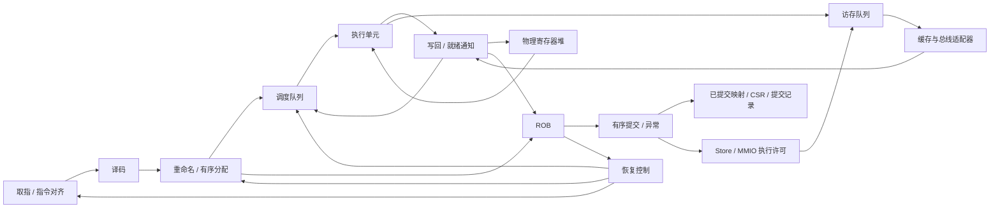

# OoO Core 架构草案

Opt-in shared fetch PMP comparisons (2026-10-08):
`sharedFetchPmpRelations` shares neighboring-word high comparisons without
changing full address width, first-overlap priority, permission policy, state,
or fetch latency. It remains default-off and unpromoted.
[Contract, focused test commands, and evidence limits](shared-fetch-pmp.md).
No full-core or physical PPA qualification follows from the bounded module proof.

Opt-in load-to-registered-issue experiment (2026-10-07): `staged-load-issue`
keeps existing profiles unchanged. [Contract and validation status](registered-load-issue-forwarding.md).
Focused GSIM A/B passed: one-iteration board CoreMark ticks 834653 → 831768 (0.346% fewer); DDR essentially unchanged, including a 5-tick COPY regression. Physical timing remains unverified; this opt-in experiment is not a default bitstream replacement.

> 文档角色（2026-09-30）：本页是按阶段追加的架构建议/实施日志，不是当前配置规格表。
> 早期“未实现 MMU/缓存/间接预测”“尚无综合”等描述只适用于所在阶段，
> 撤回的时序实验和旧测试数据仍保留供追溯。当前板级参数、MMIO、CSR 与已知限制
> 以 [Board40 datasheet](soc-datasheet.md)、[寄存器手册](soc-registers.md)、
> [OS 适配指南](os-software-porting.md) 为入口；最新 FPGA 证据见
> [时序状态](fpga-timing-windows.md)。Board40 为双发射/40 MHz 配置，
> 不代表本文规划的 4/6 发射产品或 RVA23 已实现；板级 DMA 地址勘误尚未修复。

> 最新 FPGA 交付（2026-10-03）：双发射 `staged-throughput` 整板 100 MHz / UART460800
> 严格静态签核通过，最终 WNS+0.101ns/hold+0.010ns/pulse+0.081ns，bit 已生成。
> 这是新的 DDR 板级候选，不改变 Board40 的历史参数；真实板卡 Linux 启动与压力测试
> 尚未验证。完整产物、约束范围、资源代价和证据见上述时序状态文档。

> 最新接续（2026-10-03 晚）：用户已报告上述整数版真实板卡 Linux 启动成功、
> CoreMark CRC 通过；不是新增长时间压力验收。F/D 已按明确授权增量合入原
> `/home/openion/Valence` 工作区，实验默认关闭、misa/DT F/D 不宣告。
> 最新主工程合入、短 GSIM 与浮点模块 10 ns 测量记录见本页末尾；历史“原工程未修改”
> 仅描述独立分支阶段，不再表示当前状态。

## 状态与范围

2026-09-18：产品线规划覆盖 MCU 到高性能 SoC，包含顺序核和 2/4/6 发射乱序核。
当前工作聚焦乱序核。本文定义首个双发射实现的建议规格和验收顺序；已有理想供指/独立 RAM 下的裸核 IPC，尚无完整系统性能或综合验证，
不表示仓库已经实现完整乱序核。用户明确指出现有顺序核有 bug；它保留用于历史问题复现，
不作为新核的设计模板或正确性标准，新顺序核暂不进入实现范围。

新核必须使用 GSIM 作为主仿真后端，其接入是首个里程碑的必要交付。
GSIM 是唯一受支持的仿真后端；Verilator 及其隐式 ChiselSim/旧 emu 入口均已退役，不再进行旧工程或交叉仿真回归。

实施进度：已新增独立的重命名/ROB 基础模块和固定版本的 GSIM 构建/仿真入口，
并接入整数 PRF 数据/就绪表、最老就绪选择、双 ALU、独立译码和组合供指接口。
现已接 64 项 bimodal 条件分支方向预测，按退休顺序训练，保存每条分支的预测下一 PC 并在执行时校正；
JAL 及紧邻 AUIPC→JALR 已接精确目标预测；普通寄存器间接跳转和返回仍顺序预测，尚无 BTB/RAS；新增 FPGA 单在途同步 ROM 取指适配器，原理想供指基准保留。
现已加入六种条件分支、JAL/JALR、执行重定向和目标对齐检查，与 11 种 load/store 合计支持 49 种 RV64I 编码；另已接 Zicond 两条条件置零指令和 RV64M 的 13 条乘除指令，并接入 B（Zba/Zbb/Zbs）40 条编码，共 104 种；实现合同见 [RV64B](rv64b.md)。
M 使用可逐项取消的六周期流水乘法和独立单槽迭代除法，与 LSU 共用完成端口；性能基线与限制见 [RV64M 合同](rv64m.md)。
GSIM 驱动按动态程序路径，通过 NEMU DiffTest API 逐条检查 PC、nextPc 和整数寄存器。
覆盖直线程序、循环、调用/返回、错误路径清空及较老分支撤销较年轻重定向，具体回归记录见 GSIM 说明。
四槽 LSU 已接独立 RAM，可运行受限 C 栈/数组程序并测 IPC。显式普通 RAM 范围内的 load
可提前执行。现有 ROB 索引投机 SQ 提前保存非队首 store 的地址/数据，准备共享整数发射预算；
load 可越过地址已明确、对齐且位于普通 RAM 的不相交较老 store。未知地址、重叠或非 RAM store
仍阻塞 load，除非成功完成的源 store 完整覆盖 load 并直接转发。
其他访存仍限 ROB 头部。LSU 与 ALU 共享默认 2 条/周期
发射预算；支持已取消 load 排空及迟到响应隔离。LSU 可在旧结果完成时锁存下一笔独立访存，
并保留尚未退休的非投机事务保护。已加入成功 store 完成窗口内的单项转发，
普通 RAM load 最多四笔在途，数据端要求严格按请求握手顺序返回；store/区间外读取仍在队首启动。已接四项不可撤销 store buffer，显式保证写成功的 RAM 可入队后完成/退休，
外部写仍按序排空，跨恢复保留；部分/不相交 load 先等待排空，全字节覆盖 load 从最新待排 store 转发。
`bufferedRamStores` 默认关闭，GSIM 固定 RAM 显式开启，详见裸核 IPC 合同。
StoreBuffer 现按物理槽并行做地址匹配、再由 head 选择 1 位结果；独立模块布局
最慢路径 4.060→3.635 ns、LUT 503→448，定向 GSIM 周期未变。整机时序收益未验证。
IntegerBackend 的旧 store 区间与 RAM/对齐条件已在准备阶段寄存，避免
年轻 load 发射组合链重复计算；单模块综合最差路径 34.043→33.125 ns，
增加 165 LUT 和 1057 FF。定向 GSIM、8 槽整核 NEMU 对照通过，
紧凑平台 675 条/1577 周期不变；布局后和整机 WNS 收益未测。
LSU 完成槽位现独立于 ROB 的同拍完成授权释放；ROB 仍以 token 和恢复边界决定是否写回。
LSU 槽位的同拍 cancel 不再反馈到 start.ready；后端在恢复获准时本来就禁止新 start。
这两处改动不固定增加正常访存周期：8/32 项 IntegerBackend GSIM、8 槽整核 NEMU 差分通过；
紧凑相干平台仍为 675 条/1577 周期、IPC 0.428028。
同一 IntegerBackend OOC 综合口径下，最差路径依次为 33.125→32.985→32.710 ns，
终点仍是 StoreBuffer owner 队列写使能，127～128 级逻辑。最新路径经发射选择、分支恢复授权和
LSU start.valid 贯通到请求/响应握手；局部解耦没有形成真正的时序边界，不能宣称达到 10 ns。
紧凑配置已在预测错误分支的重定向/完成结果上加入一个带 token 的寄存槽，
并将 ROB 回滚从每拍 1 项扩到 4 项；默认后端的外部恢复仲裁保持原状。
同一模块综合口径下，进一步先排序双 ALU 候选、再固定槽 1 最老/槽 0 次老，
最差路径从 21.616 降至 18.278 ns、72 级逻辑、60,082 LUT，
仍无法满足 10 ns。32 ROB/64 PRF/8 LSU 槽的同载荷裸核 C 测试在内存延迟
1/4/12 拍分别为 1065/1090/1028 周期，旧同拍分支配置为 1199/1228/1219；
紧凑相干平台首陷阱仍是 675 条/1577 周期。新模式整核 NEMU 282 程序通过，
但同次取消多笔乘法的覆盖尚未触发。下一步应给 LSU 发射判定或分支完成至 ROB
同拍提交建立寄存边界，保留双发射、精确恢复与无错误路径副作用；整机布局/布线
频率仍未验证，不能把模块综合估算当作 100 MHz 结论。
后续只延后分支提交的实验使模块最差路径 18.278→18.955 ns，已撤回；
寄存 StoreBuffer 响应归属队列也仅得 18.446 ns，且零延迟缓冲压力测试
增加 761 周期，不在紧凑顶层启用。为下一轮结构性拆分，已先将对齐
2 的幂 RAM 窗口的 64 位末端加法改为高位相等加低位界限比较；
NEMU 282 程序及紧凑相干 GSIM 通过、IPC 不变，但尚无新版 Vivado 时序结果。
地址准备级与寄存响应归属组合后的 `IntegerBackend` 未布局模块综合最差路径
为 14.323 ns（先前参考 18.278 ns），尚距 10 ns 4.323 ns；
紧凑相干平台 675 条从 1577 增至 1708 周期，IPC 0.428028→0.395199，
store-load 依赖链增加 25% 周期。该组合保留为紧凑时序配置以便继续验证，
不是整机 100 MHz 签核结果。新最差路径落在分支结果到 ROB 同拍提交；
额外的分支延后退休开关已通过 NEMU 282 程序，但模块最差数据路径
14.328 ns，未改善且默认关闭。本地应答寄存候选反而为 15.732 ns，
亦维持关闭。可选的恢复原始请求保守阻塞 LSU 发射减少 ROB 授权反馈，
模块最差数据路径降到 13.777 ns，LUT 60,216→61,798；8 槽 NEMU
282 程序与紧凑相干平台通过，所测 IPC 不变。按未布局模块的
`10 ns - WNS` 周期代理估算，频率×IPC 比当前紧凑配置约高 3.9%，
但仍未达到 10 ns，板上收益未确认，故先保留为非默认实验。
早期恢复阻塞与延后分支退休组合后，定向紧凑相干平台仍是
675 条/1708 周期，8 槽 NEMU 282 程序通过；`IntegerBackend` 未布局
最差路径为 13.176 ns、WNS -3.280 ns，LUT 60,610。按相同平台
IPC 和 `10 ns - WNS` 周期代理，频率×IPC 比只开早期阻塞约高 4.5%，
但离 10 ns 还差 3.280 ns，整机布局与板上收益未验证。试验性的
直接退休授权虽功能通过却使最差路径恶化至 14.129 ns，已撤回。
更窄的错预测分支提前完成方案保持紧凑平台 675 条/1708 周期，
裸核 NEMU 282 程序与双发射检查通过；模块综合路径降至 12.318 ns、
WNS -2.336 ns，LUT 60,265。以相同紧凑 IPC 的周期代理估算，
频率×IPC 比前一组合约高 7.7%；未布局综合的新瓶颈移至
LSU/StoreBuffer 同拍响应链。该模式仍为默认关闭的实验；后文记录
其独立模块布局，整机时序尚未验证。
删除 staged memory 无效候选对访存 size 的置零门控后，完整 token
校验仍在；寄存和非寄存访存选择的 8 槽 NEMU 各 282 程序、
双发射检查与紧凑相干平台通过，
后者保持 675 条/1708 周期（IPC 0.395199）。但模块综合最慢路径
12.318→13.158 ns、WNS -2.336→-3.262 ns，频率×IPC 代理退化，
所以 size 门控微调已撤回；此前 index-only 候选也因恶化至
13.119 ns 而撤回。当前继续检查 load replay 路径。
将 load replay 的逐槽 beat/lane 重叠比较移至发射当拍寄存也通过
282 程序和紧凑平台，IPC 不变；但模块综合最慢路径回到 LSU/StoreBuffer，
12.318→12.710 ns、LUT 60,265→60,651，频率×IPC 代理下降约
3.1%，故撤回。两个反例说明单独消除一条路径不足以逼近 10 ns。
两项局部改动同时启用仍为 13.183 ns、WNS -3.287 ns，虽 LUT
降至 59,473，路径却从 `memoryLive` 穿过 replay/恢复至 ROB 提交；
8 槽 NEMU 和紧凑平台功能、IPC 均不变，组合也已撤回。
后续需要 replay→提交与 LSU 同拍响应两处真正的流水边界，并量化
每次投机 load 可能增加的退休停顿。
可选 `registeredLoadReplay` 以寄存 replay 决定，并在待决检查期间
暂停提交；合用寄存本地应答后 282 个 NEMU 程序、DMA replay 和
紧凑平台通过，但模块最慢路径仍 12.720 ns，整核 C 数组变慢。
进一步添加非透传 LSU 请求队列后仍为 12.490 ns，紧凑平台 IPC
0.395199→0.342292、C 数组 1174→1598 周期；频率×IPC 均不如
12.318 ns 基线。这些开关保持默认关闭，下一步要审查 ALU 完成
到 ROB 数据寄存的组合链，而非把更多固定延迟加到访存路径。
同一 12.318 ns 候选经独立 `IntegerBackend` 布局后 WNS 为
**-3.269 ns**、最慢数据路径 **13.251 ns**，现由 staged memory
索引经访存重叠判断到地址寄存器，约 73% 延迟是估算连线；这既非
最终布线也非整机 Fmax。用 beat/字节掩码替换区间比较可减少
814 LUT 和 917 FF，NEMU 282 程序及紧凑平台 IPC 不变，
但同口径未布局最慢路径恶化为 13.898 ns，转至 PRF `ready`→ROB
数据写入；此候选已撤回。下一轮须将访存准备与 ALU/ROB 写入两组
临界路径联合考虑，详见[FPGA 时序记录](fpga-timing-windows.md)。
预选下一访存并保留未发射准备槽的结构试验，在允许旧候选抢占后
通过 NEMU 282 程序和紧凑平台且 IPC 不变，但模块综合最慢路径
为 13.003 ns，转向 PRF `ready`→bit-manip→ROB 数据写入；再将
bit-manip 结果改为一热选择也仅得 13.018 ns。两项均已撤回。
后续需真正流水化完成数据，同时保持双发射与依赖旁路，不能再以
局部组合门控或单一访存边界作为 10 ns 达标证据。
实验开关 `registeredLocalStoreResponses` 把本地 StoreBuffer 应答延后一拍，
用于切断请求到 LSU 完成的组合反馈；默认/紧凑 FPGA 顶层都保持同拍应答。
紧凑相干 GSIM 定向程序 675 条/1577 周期不变，但独立 StoreBuffer 压力测试有周期代价。
10 ns OOC 整机布局下 WNS -23.198→-23.423 ns，LUT 123208→122705；
时序未改善且压力场景吞吐下降，因此只保留可选实验，不在紧凑顶层启用。
板级频率与整机 IPC 收益未验证；可先逐模块比较综合/布局后的内部路径与资源，
但模块间连线、边界预算和整机拥塞最终仍须集成布局确认。
SQ 容量暂等于 ROB，尚无独立紧凑 LQ/SQ、投机 SQ 的部分覆盖合并、未知地址推测/重放、事务 ID 或乱序响应支持。
FPGA 入口已接 Chisel 同步 ROM、顺序预取、跨 packet 双路供指与同步字节写 RAM，集成平台已通过 C 程序 NEMU 差分；
ROB32/PRF64 下 1,310 条指令用 1,529 周期，IPC 0.857，报告独立于理想供指基准。
缓存及完整异常状态仍未实现，
尚不支持完整 RV64I 或通用裸机平台。Vivado 导出与限制见 [FPGA 基线](fpga-bringup.md)。
接口、负载与测量口径见 [裸核 IPC](bare-core-ipc.md)。
M0 的整数子集参考构建与 ABI 审查已完成，完整平台参考配置仍待逐步审查。
复现命令、模块边界和工具兼容性记录见 [GSIM 接入说明](../simulator/gsim/README.md)。

首版沿用现有 RV64 平台，先建立双发射整数乱序执行的正确性闭环，再接入特权态、MMU 和系统软件。
新应用 SoC 的架构目标已固定为 RVA23S64（覆盖 RVA23U64）；F/D、向量和 H/Sha 虚拟化均为必选，
按阶段实现而非可选裁剪。完整差距与验收顺序见 [RVA23 目标](rva23.md)。
RV32 MCU、多核一致性及四/六发射实现仍按产品阶段推进，频率和面积目标待测量确定。

机器平台新增完整排空式FENCE、独立四项在途内存拷贝DMA、CPU/DMA共享RAM轮询仲裁与APLIC source4完成中断。
接口/限制见 [DMA合同](dma.md)。仍为单hart单线程，SMT只是后续评估方向，未增加线程上下文或发射宽度。

## 性能设计与验收要求

高性能是新 SoC 的设计目标。每个新模块在实现前应明确目标吞吐率、延迟、容量、端口数和背压行为，
评估关键组合路径及其对整核频率的影响；接口与结构选择需要考虑未来四/六发射配置。
性能验收同时覆盖独立、相关和资源冲突场景，记录实际吞吐、停顿原因和恢复开销，不能仅检查功能结果。
有综合与时序工具后记录固定约束下的面积、关键路径和时序裕量；尚未测量的指标必须标为未验证。

优化以整机工作负载表现及功耗、频率、面积约束为依据，不能假定模块局部最优等于 SoC 全局最优。
目标工艺、频率、功耗/面积预算及工作负载未确定前，不宣称“最优性能”。早期为正确性闭环采用的
串行恢复、保守访存等方案应明确标记为基线，并通过后续测量决定是否替换，不能直接作为高性能验收结论。
GSIM 的仿真运行速度单独测量，不作为硬件性能证据；开启 sanitizer 的功能测试也不是仿真速度基准。

## 现有实现与复用边界

公共 ISA 编码已完成第一步拆分：`soc.isa` 不再依赖核心控制包，新核共享 opcode、相关 funct 和异常编号。
旧控制表移至 `core/pipeline/decode`，具体审查范围见 [ISA 复用说明](isa-reuse.md)。
其余各项仍为候选复用范围；先独立定义新核需求和接口，再审查候选代码。

| 当前模块 | 新核处理方式 |
| --- | --- |
| `isa/Instruction`、`isa/CSR` | 新核已共享相关编码和异常编号；不代表整个 ISA/CSR 实现已验收 |
| `core/pipeline/decode/InstrTable`、`isa/Compressed` | 旧控制表保持独立；压缩展开仍待独立验证与接入 |
| `core/pipeline/InstrDecode` | 按新契约实现无寄存器读数的译码，不继承旧核旁路、stall 或异常补丁 |
| `core/pipeline/ALU` | 按规范建立独立运算期望，再审查可提取逻辑及带指令标识的执行接口 |
| `core/Core`、`RegisterFile`、`WirteBack` | 新建 OoO 顶层、物理寄存器堆、ROB 和提交控制 |
| `core/pipeline/LSU`、`StoreBuffer` | 旧测试提供边界场景，访存语义按规范重新定义，新建队列和副作用控制 |
| `core/csr/CSRFile`、`Sv39` | 复用前先审查时序、副作用及异常边界，不能直接接到乱序完成端 |
| TileLink、UART、CLINT、PLIC、地址映射 | 沿用接口前明确协议和平台契约，补独立验证，不能只凭旧核能运行认定正确 |
| `memory/cache/L1Cache` | 独立内存模型验证通过后，才通过单请求适配器接入；新核早期使用独立测试内存 |
| `system/IonSoC` 的 DiffTest 接线 | 从单条提交扩展到有序提交向量，保留架构异常事件 |

“复用”不意味着已经确认正确。现有测试、裸机 payload 和历史 bug 记录作为候选回归资产保留，
其断言和期望值也必须审查，不能以“兼容旧核”为理由保留错误行为。
新实现建议放入 `soc.core.ooo`，避免在旧顺序流水线控制上叠加 ROB 和重命名状态。

## 独立设计与验证依据

1. 实现前固定所支持扩展及 RISC-V 非特权/特权规范版本，按章节记录指令、异常和 CSR 的预期语义。
2. ROB、重命名、调度、恢复和 LSU 从新接口及不变量设计，不复制旧流水线控制与补丁。
3. 参考模型采用匹配 ISA 配置的 NEMU；记录上游版本并审查本仓库已有修改，不能假设定制参考模型天然正确。
4. 新核和参考模型不一致时，先用规范与最小用例裁决；必要时引入第二个独立参考实现。
   不允许为通过差分而让参考模型迎合 DUT，也不能因旧核得到相同结果就关闭问题。
5. 新核初期使用独立的测试内存和受控外设输入；分别验证核心与平台后再集成，避免同时继承旧 LSU/cache 的错误。
6. 候选复用模块必须留下接口契约、规范或平台依据、独立测试结果和已知限制；缺少依据时重写或延后接入。

GSIM 负责执行硬件模型，不是 ISA 正确性的参考模型。两种仿真器运行同一份有 bug 的 RTL，
也可能得到完全一致的错误结果；后端一致性检查不能替代规范检查、差分和模块不变量验证。

## 配置与首版结构

ISA、核微架构、SoC 外设、仿真后端分别配置。新增核配置不要继续堆入 `SoCFeatures`。
2/4/6 是产品档位名称，各阶段宽度仍应分别描述和约束。

| 配置项 | 双发射首版建议 | 含义 |
| --- | ---: | --- |
| `xlen` | 64 | 首版只实现 RV64 |
| `fetchBytes` | 8 | 每个取指块字节数，不保证每周期返回一个块 |
| `decodeWidth` | 2 | 每周期最多译码的架构指令数 |
| `renameWidth` | 2 | 每周期最多重命名的指令数 |
| `dispatchWidth` | 2 | 每周期最多进入后端的指令数 |
| `issueWidth` | 2 | 所有执行端口合计每周期最多接受的操作数 |
| `commitWidth` | 2 | 每周期最多提交的架构指令数 |
| `robEntries` | 32 | 程序顺序和精确异常的记录窗口 |
| `physicalIntRegs` | 64 | 包含固定零寄存器，启动时建立 32 个架构寄存器映射 |
| `intIssueEntries` | 16（规划） | 当前整数基线按 ROB 索引预留槽位，容量等于 `robEntries`；独立 16 项队列待评估 |
| `loadQueueEntries` | 8 | 在途 load 记录 |
| `storeQueueEntries` | 8 | 提交前 store 地址、数据、异常记录 |
| `dataOutstanding` | 1 | 缓存/总线适配器最多一个未完成数据请求 |

这些容量是便于实现和覆盖边界测试的起点。四/六发射不预设未经测量的容量表。
第一阶段每条指令对应一个 ROB 项；若后续引入多 uop，必须补充架构指令完成和原子提交规则。



当前两个执行槽均支持整数 ALU/分支，以验证不跳转分支的双宽吞吐；同周期只选择最老的重定向。
后续根据综合结果评估单/双分支端口，并共享连接乘除法或地址生成单元。
每槽每周期最多接受一项；乘除法或访存完成可以与 ALU 完成重合，完成仲裁必须能够反压或暂存结果。
不能依赖“只有两发射”推断同周期只有两个结果到达。
整数寄存器堆初始按最多四读、两写组织；具体实现及关键路径需要综合检查。
首版写回后下一周期唤醒依赖者，不先引入跨全部单元的同周期组合唤醒链。

## 接口约定

以下是待实现的数据契约，字段名称可在 Chisel 实现时调整，但语义必须保留。

| 接口 | 必要信息 |
| --- | --- |
| `DecodedUop` | PC、原始指令、长度（明确使用 2/4 字节）、操作类别、源/目的架构寄存器及有效位、立即数、预测信息、异常 |
| `RenamedUop` | 译码信息、源物理寄存器、目标物理寄存器、旧目标映射、ROB 标识、必要的 LQ/SQ 标识 |
| `Completion` | ROB 分配标识、目标物理寄存器、结果、异常信息、实际分支方向和目标 |
| `Redirect` | 恢复原因、边界指令标识、保留/清除边界规则、目标 PC |
| `MemoryRequest/Response` | 请求标识、地址/大小/字节掩码/数据、访问属性、响应数据及错误 |
| `CommitRecord` | 有序序号、PC、原始指令和长度、架构寄存器写入、访存与 CSR 验证所需信息 |

普通通道使用 valid/ready：未握手时保持载荷；恢复取消是明确的协议事件，不能作为普通反压处理。
双宽分配/提交采用程序顺序连续前缀，不能 lane 1 成功而 lane 0 留下。
首版前后端之间通过队列解耦；不能用一个全局 stall 同时冻结取指、执行和提交。

ROB 标识必须包含分配世代或等价的存活标识，不能只有循环数组下标。
被清除指令的晚到结果必须在写物理寄存器、唤醒依赖者和更新 ROB 之前被拒绝。
标识回绕前必须保证旧请求已排空；如果不能证明，禁止复用该标识。
取指使用独立的请求路径标识丢弃重定向前的返回。

## 重命名、提交与恢复不变量

### 重命名

- 区分投机映射表和已提交映射表；x0 固定映射到零寄存器，不分配、不回收。
- 同周期较年轻指令必须看到较老指令刚建立的新映射，覆盖 RAW、WAW 和同目的寄存器连续写。
- 分配 ROB、物理寄存器、调度队列和所需访存队列必须协调完成；资源不足只接受可用的连续前缀。
- ROB 记录本指令的新、旧物理目的寄存器。正常提交后才释放旧映射。
- 没有架构目的寄存器的指令仍需要 ROB 项，以维持异常、分支及 store 的程序顺序。

### 完成与提交

- 执行完成只更新投机结果。CSR、设备写入和架构异常进入必须经过提交控制。
- ROB 从头部提交连续的已完成指令；异常指令不计为正常退休，其后指令不能越过它。
- 两条指令同周期写同一架构寄存器时，已提交映射按程序顺序更新，最终保留较年轻者。
- 分支必须等待真实方向和目标确定后才能提交。
- 中断只在明确的指令边界进入；不可取消的 MMIO 进行中不能直接清除其所有者。
- 串行化指令和架构事件首版独占提交周期，先把与普通双提交的组合规则简化。

### 首版恢复算法

首版使用 ROB 尾部逐项反向回滚，暂不加入每个分支的映射表检查点。
每撤销一条有目的寄存器的指令，恢复其旧投机映射并回收其新物理寄存器。
分支预测错误清除分支之后的指令，保留分支本身及其链接寄存器结果。
异常在 ROB 头处理，撤销异常指令及其全部年轻指令。

恢复期间暂停重命名、分配和提交，阻止被撤销指令写回；保留指令的合法完成仍可记录。
已接受的外部请求继续按协议排空，不能因暂停恢复造成响应死锁。
同时出现多个恢复请求时，以存活指令的程序年龄选择最老边界；恢复中发现更老的重定向时继续向更老边界回滚。
恢复完成后再从目标 PC 开始取指。这个方案优先易验证性，分支恢复延迟随后单独优化。

## 当前访存策略与平台约束

普通 RAM load 可在队首之前执行，默认四笔在途；store 和区间外读取在队首获得许可。
该整数基准配置尚无投机 SQ、MMU、真实 MMIO 设备接入或中断处理；机器核中断进展见文末。

1. 区域必须显式声明为可投机、无副作用 RAM，其他地址不得推测读取。
2. 未退休 store 可提前准备地址/数据。地址已知且安全的普通 RAM store 与 load 不相交时允许越过；未知地址或重叠保守等待，保留完成窗口转发。已入缓冲 store 按字节转发，部分覆盖保守等待排空。
3. load 异常只在队首报告；取消 load 保持请求稳定并排空响应，禁止迟到写回。
4. 默认 store 等真实成功响应后退休，错误写必须无副作用。显式 `bufferedRamStores` 模式仅用于平台保证写成功的 RAM，入队即不可撤销，确认后可退休；平台违反承诺触发断言，不能恢复成精确异常。
5. MMIO 在队首获得执行许可，并排空更老事务与缓冲写。中断、权限检查、平台设备语义尚待实现。
6. 当前机器配置已支持排空式 `fence` 和 `fence.i`；后者在排空后刷新前端并重取下一条。机器平台的原子操作也采用队首授权与写缓冲排空；地址空间变化仍待实现。

外部数据口没有事务 ID，响应必须严格按请求握手顺序返回；owner FIFO 分别路由 load 和缓冲写响应。
缓冲为空时保留四槽 load 并发。接入可能乱序返回的 cache/总线时，适配器必须恢复响应顺序。

## ISA 与系统功能推进

首个执行闭环从 RV64I 整数、分支、自然对齐 load/store 和同步异常记录开始。
没有启用的扩展必须报告非法指令，不能静默执行，也不能在 ISA 声明中提前标为支持。
随后补齐 M、C、Zicsr/Zifencei、M-mode trap/interrupt，再接 A、S/U-mode、PMP 和 Sv39。
未对齐访存首版明确产生异常；后续跨页或拆分访存必须单独验证副作用和异常精确性。

Linux 是后续系统验收目标；裸机闭环、双发射正确性或已有顺序核的启动日志都不等同于 OoO 已支持 Linux。
旧平台的 ISA 扩展集合不能直接作为未完成的新核的默认 ISA 声明。

## 仿真与验证

GSIM 是新核的主仿真后端，构建、程序加载、周期推进、提交记录和回归入口必须接入 GSIM。
Verilator/ChiselSim/旧emu入口已退役，不参与实现、回归或交叉检查。
锁定的 GSIM 版本接受 CHIRRTL、生成 C++；Chisel 7.3 的 smoke、重命名/ROB 和整数执行模型已跑通，
这不证明全部 Chisel 构造都兼容。完整程序加载、ROM 初始化、BlackBox 和整核运行接口仍需验证。
先固定 GSIM 版本，对小设计验证组合逻辑、寄存器复位、带写掩码的同步存储器和结果采样时序，再接新核。
新仿真入口使用明确的程序加载和提交接口，避免直接继承旧 ROM BlackBox、DPI 和层次信号访问方式。
加速比需要本项目实测，不把论文倍数写成验收承诺。

新核提供稳定的提交向量和架构事件接口。仿真驱动不通过生成器内部层次名推断“哪条指令已经执行完”。
DiffTest 按提交序号逐条推进参考模型，周期末架构快照在处理完该周期全部提交后比较。
MMIO、计时器和中断需明确同步策略；不能把 `skip` 当作绕开普通指令差异的通用办法。

两种比较分开进行：

- 同一GSIM模型在无背压与受控背压下，对比独立语义模型的提交及异常序列，检查协议与恢复。
- 不同微架构与参考模型对比架构语义；涉及时间的设备和中断需要受控输入，不能要求不同核周期相同。

验证重点包括：同包 RAW/WAW、资源耗尽、ROB 回绕、连续双提交、错误路径写回、恢复时物理寄存器复用、
分支与更老异常竞争、访存反压、已杀死 load 的晚到响应、MMIO 恰好一次、零寄存器、双提交与中断边界。
模块测试之后必须加入随机依赖指令流和端到端差分，单靠模块测试或成功打印 UART 不足以验收。

性能分别报告 guest cycles、retired、IPC、host 仿真 cycles/s、生成/编译时间和峰值 RSS。
硬件频率、面积、寄存器堆端口和旁路关键路径另用综合评估；GSIM 的宿主运行速度不能替代硬件性能指标。

## 实现里程碑与退出条件

| 阶段 | 交付 | 退出条件 |
| --- | --- | --- |
| M0 | 固定规范及参考模型版本，接通 GSIM；核参数、接口、ROB/重命名/恢复基础及独立测试 | GSIM 完成可复现的生成、编译、运行及结果检查；分配、回收、同包依赖、回绕和恢复不变量通过 |
| M1 | 双发射整数执行闭环、最小取指和 GSIM 提交驱动 | 在 GSIM 下独立 ALU 流确实出现双发射/双提交；依赖链、分支恢复及随机指令流差分通过 |
| M2 | 保守 LSU、RAM/ROM 与平台适配、裸机异常处理 | load/store 错误及清空、MMIO 单次副作用通过；裸机程序端到端差分通过 |
| M3 | 完善 ISA、特权态、缓存/MMU 与系统软件接入 | 针对声明能力的回归通过；固件和 Linux 启动里程碑分别记录，不预先宣称完整启动 |
| M4 | 双发射性能优化及四/六发射拓展 | 每个新配置独立通过差分及恢复测试，提交性能和综合证据 |

当前 M1 已接通整数/控制流译码、最小供指、执行重定向和 NEMU 提交差分，
整数独立流双执行/双提交及依赖链单周期推进已有定向验证。分支恢复也进入程序级差分验证。
M2 已完成保守 LSU 与独立 RAM 访存差分、受限 C 程序及裸核 IPC 基线。
现已接同步ROM/RAM、MMIO、机器级精确异常/外部中断、UART与DMA闭环；完整缓存、M/S/U特权架构及MMU仍属后续M3。
性能设计从每个模块开始执行，M4 是整核优化与扩展阶段，不是推迟所有性能评估的理由。

后续运行验收均使用 GSIM。若工具兼容性受阻，记录最小复现并继续独立设计工作，
但 M0 保持未完成，不能悄悄把主仿真后端换回 Verilator。
M4 可能需要分布式调度、寄存器堆分银行、分层旁路、更多访存并行度和更宽前端，不能只修改发射宽度常量。

## 参考与待验证项

- [GSIM 官方仓库与接入说明](https://github.com/OpenXiangShan/gsim)
- [GSIM 论文](https://arxiv.org/abs/2508.02236)
- [现有顺序核结构](../legacy/docs/core-pipeline.md)
- [现有缓存和 TileLink](../legacy/docs/memory-cache-tilelink.md)
- [现有仿真和固件路径](../legacy/docs/simulation-firmware-debug.md)
- [历史 bring-up 问题](../legacy/docs/bringup-bug-record.md)

本文仍未解决的实测问题：GSIM 与后续整核 CHIRRTL/存储初始化的兼容性、首版寄存器堆与调度器时序、
现有 cache 对双发射吞吐的限制，以及未来高性能档位的 ISA/PPA 目标。

## 模块化中断平台

应用 SoC 当前选择 AIA，预期路径为 APLIC → MSI → IMSIC → 精确中断入口；PLIC 为后续兼容替换 IP。
新 IMSIC 位于 `soc.ip.interrupt`，不依赖 ROB/PRF 或核心参数，默认 M/S 文件，可配置 guest 文件。
CPU 侧已接 M/S CSR 权限、M/S 文件间接访问、提交授权及同步/外部/SSI/STI 中断入口；VGEIN 和 VS 路径尚待实现；单 M 域 APLIC 已有独立与 WiredMachineCore 组合实现；
IMSIC 独立验收不能当作整核已支持 AIA。接口、背压和模块复用合同见 [模块化 SoC](modular-soc.md)。

## 机器级开发配置

新增 `MachineCore` 与 `OooParams(machineSystem=true)`：六种 CSR 编码、ECALL/EBREAK/MRET/SRET、
ROB 队首不可撤销执行、同步陷阱保存/跳转/返回，及 IMSIC M 文件 CSR 桥接。与原整数编码合并
构成机器核开发配置；不宣称完整 RV64I、特权架构或 RVA23。
原整数基准仍默认 `machineSystem=false`，其非法/错误访问保持停止接口。
现已增加 M/S 外部中断、精确向量入口，并接入有限 S 态同步异常委托、S CSR 与 SRET。
验证及未完成范围见 [机器核合同](machine-core.md)。

APLIC 中断线到 MSI 的新 IP 和机器核组合已实现，详细范围见 [APLIC 合同](aplic.md)。

MappedMachineCore 已接程序配置 APLIC 的数据地址映射；并发与保序合同见 [数据口映射](core-mmio.md)。

同步 ROM/RAM 机器核平台已接入编译后的汇编/C 启动固件，覆盖 CPU 配置 APLIC、M 外部中断、处理程序更新 RAM 和 MRET。见 [平台合同与验证边界](machine-platform.md)。后续可在此基础上推进定时器、串口及系统软件启动；S/VS/MMU 和 RVA23 必需扩展仍未完成。

整机另有独立M→S→U→S的UART启动测试，覆盖U态ECALL、越权CSR异常的委托和SRET，串行输出`SU!\n`；
该物理地址特权切换测试现已加入PMP权限、锁定条目、MPRV和逐字取指检查；
Sv39与完整S/U特权验收仍待实现。

启动平台已增加8N1串行UART和接收中断固件，寄存器响应通过两项队列隔离组合背压；保留原RAM启动周期及44条裸核IPC对照。下一轮性能重点仍是访存吞吐/延迟和长延迟执行，UART本身不构成整数核IPC提升。见 [UART合同](uart.md)。

写缓冲已支持多项写按序在途，默认连续4拍发出4笔；12周期RAM下默认C数组IPC提升至0.825977，44项基准无周期退步，全量GSIM/NEMU通过。下一步可继续解决不完整覆盖load等待整个缓冲排空的限制；见 [排空优化合同](store-drain.md)。

普通RAM中无字节冲突的load已可在旧写发出后、响应前请求；部分重叠和MMIO保持等待。默认12周期RAM C数组IPC为0.831746，44项基准无周期退步，全量GSIM/NEMU通过。见 [读写重叠合同](load-overlap.md)。

原计划继续推进机器级系统基础：新增独立mtime/mtimecmp IP、MTIP/MTIE、MEI优先于MTI和BASE+28定时向量。
机器平台通过同步timerTick接收固定频率时基，定时中断不经过APLIC；后续已接 time CSR 与 Sstc M/S 路径，板级 RTC/CDC 仍待完成。
设计合同和验证见 [机器定时器](machine-timer.md)。单线程、双发射及GSIM-only路线保持不变，未引入SMT。


原子访存第一阶段新增独立AtomicMemory IP：W/D LR/SC、九种AMO及DMA排他，普通路径保留8笔在途、每拍一笔吞吐。
第二阶段已接CPU译码、LSU、写缓冲排空和精确异常；MachinePlatform默认开启atomicMemory并使用原子共享边界。
22种W/D编码与全部aq/rl组合采用强串行排序，裸核默认关闭，需要连接执行端后显式开启；尚不宣称完整A/RVA23合规。见 [原子内存合同](atomic-memory.md)。
当前性能应描述为双发射乱序原型；小型整数流接近IPC 2不代表复杂程序或FPGA实机高性能。见 [性能记录](performance-status.md)。


新增可选共享读缓存，位于原子/DMA边界之后：1KiB、64字节行、8字节扇区按需填充、写穿透与写失效。
独立与CPU/平台路径已做开关对照，12拍重复读有收益，但流式/DMA明显受单项阻塞限制，因此不默认开启。
命中已流水化为每拍一项，三项响应容量切断ready组合环；后续重点是多笔未命中在途。范围与数据见[共享读缓存](shared-read-cache.md)。

共享缓存已实现8项有序返回槽、最多4笔下游读未命中在途，CPU/DMA/原子与平台定向测试通过。
12拍流式读由缓存上一版3846降至1094周期，无缓存为903；平台同步RAM仅支持2笔在途，DMA缓存版仍较无缓存慢。
继续默认关闭缓存；下一步减少填充气泡并据停顿计数优化平台RAM/写路径，详见[共享读缓存](shared-read-cache.md)。

写路径停顿计数表明，平台DMA缓存版主要受独占写与等待旧写完成限制，
本轮测试中缓存下游容量和同步RAM请求背压均未出现。完成写响应后释放独占使DMA固件6426→6004周期；
仍慢于无缓存5440，故不默认开启。后续优先研究有序写响应队列与安全的写/读重叠，
并用停顿报告、NEMU及FPGA时序约束验证。

缓存填充与不同 SRAM 字读查询已允许同拍：默认整核 1 拍流式读 518→327 周期，
12 拍 1094→1031；平台缓存版 DMA 6004→5910，仍慢于无缓存 5440。
缓存维持可选，待 Vivado 验证 BRAM 推断与 ready 路径频率，见[共享读缓存](shared-read-cache.md)。

缓存范围内的写后读已允许在旧写响应前接单，下游与上游仍保持有序；不缓存请求和后续写继续等待。
默认平台缓存版 DMA 5910→5714 周期，仍慢于无缓存 5440，故暂不默认启用。
独立 GSIM、四种整核原子/NEMU 配置及 60 条平台启动定向检查通过，详见[共享读缓存](shared-read-cache.md)。

缓存范围内的连续写现可保留最多 4 笔下游在途；仍须等旧读完成后才能接新写，避免过期填充。
默认缓存版 DMA 5714→5452 周期，无缓存仍为 5440；原子平台也改善，但缓存尚不默认启用。
后续瓶颈要结合真实负载和 Vivado 时序继续评估，详见[共享读缓存](shared-read-cache.md)。

高吞吐 LSU 的 8 槽参数现已通过完整整核 GSIM/NEMU 差分，含错误路径、恢复、随机访存、
负向不匹配注入及 22 条 IPC 基准；4 槽默认配置保持不变。12 拍独立 load 903→459 周期，
C 数组 1575→1491 周期；参数扩容的资源和时序代价尚未有 Vivado 数据，
因此作为可验证配置保留，详见[性能记录](performance-status.md)。

8 槽同步机器平台的 RAM/DMA/原子固件共 9 次启动通过，与 4 槽同配置周期逐项相同。
当前一拍、两信用 RAM 无法证明扩槽在整机中有收益；优先推进支持长延迟并发请求的
外部内存边界，并在 Vivado 可用后检查面积与 Fmax。见[机器平台对照](machine-platform.md)。

已加入默认关闭的 8 项有序延迟响应队列作为外部内存压力模型。
40 拍额外响应延迟、排空写后重复独立读取时，8 槽整机较 4 槽在三个种子上
减少 1403–1417 周期，提交及内存结果一致。该模型仍使用本地同步 RAM，
不能代替 AXI/DDR；下一步需定义请求 ID、返回重排序、DMA/原子交互与 FPGA 时序边界，
见[机器平台对照](machine-platform.md)。

已实现独立的单拍 AXI4 有序内存桥基线：8 笔同 ID 读在途，写 AW/W 独立握手，
读写方向切换时排空旧响应；GSIM 独立模型和 RTL 导出通过。
写错误、外部原子互斥及 DDR/FPGA 集成仍是显式限制，不能据此宣称机器平台已接外部内存。
接口与测试见[AXI4 内存桥](axi4-memory-bridge.md)。
该桥仅是 FPGA 外部内存边界实验，不表示新核内部总线已由 TileLink 换成 AXI；
旧 SoC 的 TileLink、新机器平台默认直连及可选 TileLink RAM 通路见[模块化 SoC](modular-soc.md)。

新核 `DataPort`→TileLink 的独立有序桥基线现已通过 GSIM 验证：8 个 source 并发读、
乱序 D 匹配与上游有序交付、读错误及背压；写路径暂为单笔并要求内存窗口保证写成功。
该桥已接入 `MachinePlatform` 可选普通 RAM 通路，默认仍直连 RAM；
独立 TL→AXI4 边界已实现并通过 GSIM，外部 DDR 接入仍待实现，
接口与限制见[TileLink 内存桥](tilelink-memory-bridge.md)。

片上双 RAM 窗口的可选 TileLink 路由现已接通：独立 GSIM 验证两个从端的
source 归属、乱序 D、未映射 denied 和背压；跨两个窗口的机器启动镜像及
原 DMA/原子镜像均通过三个调度种子。此配置保持单主端口，同窗口写可流水化、
跨 manager 写先排空，尚不代表完整多主 SoC 互联，见[TileLink 路由](tilelink-router.md)。

可选 `tileLinkFetch` 已将取指作为第二个 TL-UL 主端口。双主互联按 ROM/RAM 窗口
分别仲裁；取指桥将允许的两指令包转换为一或两笔对齐64位Get，PMP跨界只发允许字的32位Get，
两组 source 轮换使旧包最后 D 与新包首 A 可以同拍交接。
独立 GSIM 覆盖乱序、背压、双窗口并行和错误注入；同步平台 RAM/DMA/原子
各三个调度种子由独立 C++ 体系结构模型核对，未使用 NEMU。
单 RAM DMA 种子 0 从初版双主路径 6692 降到 6154 拍，但仍比数据侧单主路径
5644 拍慢；默认平台保持直连 ROM/RAM。取指缓冲与 Fmax 是后续重点，
见[TileLink 取指路径](tilelink-fetch.md)。

取指桥增加单个只读 ROM beat 复用后，连续跨 beat 包可少发一次 Get。
独立 GSIM 覆盖命中、RAM 不复用、背压与编程复位；单 RAM DMA 种子 0
由 6154 降至 5766 拍，距原单主路径仍差 122 拍。该局部复用不解决
多行指令缓存或 FPGA 组合路径时序，详见[取指路径](tilelink-fetch.md)。

参数化页表遍历模块已独立实现，`maxLevels=3/4/5` 对应 Sv39/Sv48/Sv57 上限，
含 Svade、Svpbmt、64 KiB Svnapot、PMP 页表读检查与精确的遍历错误分类。
MachinePlatform 可选双路 TLB 服务现已通过仲裁共享 TileLink RAM 读取 PTE；
PMP 的首重叠项优先选择改为一热掩码，独立模块布局最慢路径
3.828→3.047 ns、LUT 2317→2295；功能与平台定向 GSIM 通过，整机时序收益未验证。
每路非叶 PTE 缓存减少同一区域不同页的重复页表读取，并与 TLB 一起失效。
机器核已有 `satp`、`SUM/MXR` 和全局 `SFENCE.VMA` 排空/失效控制。
可选数据侧已接入 LSU 译址、译址后 PMP/原子 RAM 范围检查和精确页故障；
GSIM M-mode 取指加 MPRV=S 固件验证了有效页 load 与缺页异常。
可选 I-TLB 路径也已接到取指前端，GSIM 固件从 S-mode 虚拟地址执行并读取虚拟数据，并验证
双指令包跨页时第一条成功、第二条精确页故障。虚拟数据访存在队首串行执行；
I 侧适配器目前每次只接收一个包，吞吐和 FPGA 时序仍待优化、实测。
见[页表遍历合同](virtual-memory.md)。

单 hart 性能路径现允许通过令牌与恢复检查的非异常队首完成当拍退休；
同一固定 CoreMark 镜像在 12 拍 RAM、写回 L1 下减少 12,695 周期，
整核 NEMU 与机器平台固件通过。退休旁路增加完成端到提交端的组合路径，
目标 FPGA 的资源和 Fmax 仍需 Vivado 实测，详见[性能记录](performance-status.md)。

可选写回 L1 的读命中现在支持一拍受理间隔和一拍孤立响应延迟；
两项响应缓冲处理 CPU 背压，满额时阻止继续受理。写命中、缺失和探测仍采用
保序控制；固定 CoreMark 镜像再减少 8,038 周期。单核 GSIM 回归已通过，
但实际缓存 SRAM 端口映射、面积与时序仍待 Vivado 验证。

LSU 对齐有效请求现可在 start 当拍交给有序数据端口；背压时回退到稳定的寄存请求状态，
零延迟响应仍按令牌与异常边界完成。固定单核 CoreMark 镜像减少 25,542 周期；
8 槽 LSU 在该镜像上无额外收益，默认保持 4 槽。该路径的 FPGA Fmax 尚未测得。

### DDR50 稳定性与提频候选（2026-09-30）

共同对齐分块范围比较覆盖 512 MiB DDR 的非自然对齐起点；LSU 复用范围检查，
PMP 预译码末字节偏移，StoreBuffer 将 payload size 译码与 late valid 解耦。
不增加流水拍数，必要 GSIM/NEMU、边界与错误注入检查通过。

DataTranslationAdapter 综合延迟 4.430→4.215 ns；后端 LUT 59144→58064，
但后端最差综合延迟 15.641→15.719 ns，不能宣称后端或整机已经提速。
UART RX 两级 FF 补 ASYNC_REG；属性在既有 DCP 上验证，尚未重新布局。
保持原 bit，不把旧 WNS +0.001 ns 当作串口故障已确诊的证据。
以稳定 50 MHz 为底线，后续提频仍需新的整机时序和同负载 IPC 对照。
完整记录见 [时序台账](fpga-timing-windows.md#2026-09-30ddr50-敏感路径组合逻辑优化)。

### DDR50 新签核候选（2026-10-01）

板级默认选用 earlyRecoveryIssueBlock，无新增请求/响应流水拍。
模块后端 15.719→13.618 ns；整机 CPU WNS +0.001→+0.328 ns，
全局 WNS +0.267 ns / WHS +0.010 ns / WPWS +0.081 ns，LUT 129178 / FF 78077。
必要 282 程序 NEMU 差分、26 条 IPC A/B、实际 DDR 测试均通过；所选候选周期不变。
已生成独立 early-issue bit，未烧录，物理稳定性仍需 UART/DDR 上板验证。
更高频率的新主要瓶颈是 PC 反馈路径 19.539 ns，而不是继续把模块 OOC 当整机 Fmax。
可选 registered-response 仅测 GSIM，总周期 +0.562%，不默认启用、不纳入发布 bit。
见 [完整签核与产物](fpga-timing-windows.md#新整机-post-route-与-bit2026-10-01-已完成)。

### DDR copy / PC 反馈候选（2026-10-01）

BoardSoc 源码默认两路 2 KiB L1，home 匹配；单路对照参数保留。
同 bin/独立 AXI 模型的 4 KiB copy 59280→11419 cycles（5.19×），
read/write/chase 基本不变。旧已上板 bit 未覆盖，17.104 MiB/s 不是板测结果。
前端窄 packet offset/预计算 PC 无新增流水拍；前端 OOC 最差 data delay
8.450→6.691 ns、LUT 9408→7738。L1 OOC +137 LUT/+50 FF、
BRAM 不变、setup WNS +15.221 ns。
参数、单/双路 dirty/probe/flush/under-miss、二/四路 fetch、四路虚拟取指通过。
新整机 post-route/Fmax/CoreMark IPC/板上 DDR A/B 未测；
不能将模块 OOC 或 copy 收益外推成整机性能。
见 [台账](fpga-timing-windows.md)、[性能记录](performance-status.md)。

### 紧凑双/四发射评估与双发射／两路相联 L1 签核候选（2026-10-01）

默认继续双发射；可选 rename/issue/commit=4，ROB16/PRF48/LSU2/SB2、
frontend16 sets/I-line8 lines/D-L1 2KiB 均不扩容。
同 18140 B 单 iteration CoreMark：双路 639000 cycles，四路原预取
697141，四路关闭预取 587055；固定 CRC 全正确，不是正式分数或实机 IPC。
同频约 +8.85%，50 MHz 双路对照下四路需要至少 45.935 MHz 才打平。
四路无预取 SoC 178574 LUT，对比双路 118861（+50.24%）；
FPGA LUT 总容量为 341280，不把 700k+ 逻辑资源当 LUT。
四路有面积余量但没有整机 Fmax/OS/中断/压力验收，不默认替换板级。

修正独立物理 I-cache 16 B 包的同一行内 8 B 偏移命中，跨行保留 fallback；
64/128-bit、连续命中、背压、PMP、错误填充、失效和旧条件负向模型验证通过。
板级宽前端本已 16 B 对齐，因此该修正不计作本次 CoreMark 收益。
显式预取开关保留通用平台原默认；小缓存下关闭预取收益已独立测得。
四路无预取 DDR smoke 为 4548/7137/11228/3636 ticks，全通过。
默认双路 97 个 SV 的 SHA256 在以上修改后完全相同，参数测试 15 项通过。

仅对双路新 L1 候选执行一次整机布局布线，复用真实 ROM/MIG/CLK/AXI CDC；
CPU/global WNS +0.163 ns、WHS +0.011 ns、WPWS +0.081 ns，14 bus-skew、
ROM INIT、CDC/reset、DRC/route 全签核；已生成独立 bit，旧 bit 未覆盖、未烧录。
setup 裕量低于旧已上板版 +0.328 ns，不宣称提频；新 critical path 是
backend orderCheckBeat→load replay/recovery→PC，19.449 ns/55 levels/74.569% routing。
下一步先处理回放/重定向反馈和四路 RenameRob/PRF mux 扩展成本，
再评估四路真实 Fmax，不能只优化供指或套用理想四发射 IPC。

### 双发射基线后续：回放选择与固件来源（2026-10-01）

用户已反馈 2-way L1 板测 PASS，8 MiB COPY 从3.130升至17.214 MiB/s；
单独读写/chase基本不变。继续保持 rename/issue/commit=2，不默认切四路。
回放 selector 改用短段 PA 比较及环形顺序选择，仍完整比较全部61位和byte lanes，
独热选择 token/PC，不新增生产流水拍。选择器16892832组、NEMU执行核心282程序、
短CoreMark CRC、DDR smoke、新BootROM下载/执行、参数15项通过；全量GSIM未跑。
CoreMark仍639000周期，DDR四项仍4583/7214/11419/3661，不宣称同频IPC提高。
候选SoC LUT减680至118181，回放锥综合估计15.183→15.053ns，
总体综合最差不变；小模块布局的独热/索引方案未带来决定性时序收益。
新回放候选未整机布线/出bit，下阶段仍需针对恢复授权反馈评估寄存边界和IPC代价。

### 批量控制路径候选 staged-control（2026-10-01）

此候选建立在 checked-PMP/Home请求级及并行MMIO的 `staged-fabric` 上，不改变
rename/issue/commit=2、ROB16/PRF48/LSU2/SB2、L1/I-line/frontend容量或软件地址图。
默认仍 `early-issue`，发布bit不变。整批短测成功后只做一次联合SoC综合。

组合三个控制优化，均不新增正常取指流水拍：

- 启用已验证的 `precompleteMispredictedBranch`。分支先写ROB，但待决redirect期间
  禁止退休，保留精确回滚和旧完成tag检查。恢复决定不再等待LSU/乘除完成端口空闲；
  实际端口仲裁、系统异常/更老重放优先级保持原合同。
- `stableFetchFaultMetadata` 使前端错误/页错/数据仅以lane valid授权；失效/disable
  只屏蔽valid，不把恢复控制反向送入payload/decode。无效lane的metadata可能为1，
  消费者绝不能据此触发异常。失效清缓存、标记旧请求及背压排空时序不变。
- `parallelRenameAdmission` 用平衡at-least-k树，先计算每个prefix需要的新寄存器容量。
  lane1接收不再等待lane0优先编码目的寄存器；RAT/PRF实际选择、同包RAW/WAW旁路、
  no-rd/move-alias不占新寄存器、tag不回绕、部分prefix规则保持不变。无状态、II=1。

合并短测一轮PASS：24项参数/结构检查；容量131072向量（2/4/6阈值模块，不代表宽核
验收）；压缩供指2路4745条/741故障、4路14375条/2435故障，加错误/页错kill隔离及
负向注入；未压缩供指/背压/旧请求排空、PMP请求mask和短NEMU程序；受影响的裸核
NEMU 282程序/185224解码向量/18000随机整数3seed、M/B/Zicond及负向oracle均通过。
VM页错/相干/原子通过，首异常1997拍/675retired不变。
单轮CoreMark 677729→677047ticks（-0.101%），DDR4757/7272/11860/3748不变。
CoreMark/DDR共用一次模型生成/编译，sanitizer开启；没有全量GSIM或长Linux。
时序/资源结果与剩余风险统一记在 [时序台账](fpga-timing-windows.md)，不能仅凭周期
结果或RTL结构宣称实际板级Fmax。

旧ROM回退来自选错缓存BMG DCP，并非Chisel重新生成了旧固件。
发布必须指定期望ROM DCP/BIN，MIF全部字、候选/路由全部INIT及负测试检查。
已生成只修复BootROM的独立50MHz/115200 bit，保留已板测CPU/L1及原布线，
WNS +0.163ns/WHS +0.011ns；不含回放重构，未由代理上板。
## 2026-10-01：staged-data 访存信用候选合同

保持两发射及 ROB16/PRF48/LSU2/SB2，继承 staged-control。一次组合四处修改，
完成受影响短测后才运行一次联合综合；不默认全量 GSIM、Linux、route 或生成 bit。

- 复用 `registeredMemoryRequests`：LSU 到 StoreBuffer 的非直通请求 FIFO 容量为
  memoryEntries（板级2），空队列也增加一拍；II=1，ready只由本地寄存信用决定，
  满时不借同周期下游出队信用。LSU从入队时即持有响应/取消所有权，取消的投机读
  仍排空；不能在恢复时丢弃已受理请求。
- `DataResponseBuffer`：把平台已有的2项 flow、non-pipe 返回信用前移到
  DataTranslationAdapter.virtual 和 MachineCore.memory 之间，不叠加第二级FIFO。
  覆盖M/S APLIC、访问错误/page fault占位、timer/UART/DDR。空时无强制返回延迟，
  II=1；满时ready不依赖CPU消费，允许在满队列同时出队时停收一拍。
- StoreBuffer本地ACK/转发仍保留零拍合同，LSU即时应答处理没有删除。入队后的
  物理请求及fault/response仍按顺序返回。返回信用提前接收不等于CPU已完成访存；
  LSU/StoreBuffer的busy/读owner继续持有到真实消费，保护sfence/CSR/原子串行语义。
  DataResponseBuffer.idle仅表示自身队列为空，不表示全系统排空。
- 访存size随现有地址预选一起寄存，避免晚到token liveness门控范围/PMP译码。
  末端越界检查用“最后块+低位越界”的并行比较替代宽size选择进位比较，仍逐字节
  覆盖1/2/4/8字节、未对齐边界及2^64溢出；不放宽RAM范围。

GSIM会在valid=0时评估部分断言/动态移位；空FIFO SRAM的载荷未定义。
新请求FIFO仅在空时规范size，门控源是寄存queue valid而非发射ready；不增加
发射→DTLB组合依赖。TL RAM长度和ROM断言长度/掩码也改固定合法尺寸译码。
所有合法事务语义不变，sanitizer保持开启，不能改生成C++或关闭检查掩盖问题。

短测入口 `make gsim-data-stage-test`；独立容量/保持/错误载荷、数学range、NEMU、
burst、128KiB ROM、精确VM及共用一次板级模型的CoreMark/DDR。中途失败只复跑
受影响项，最终记录必须披露修复和各组结果，不能把partial-pass称为一遍全绿。
周期与综合收益见 [性能记录](performance-status.md)、[时序台账](fpga-timing-windows.md)。

## 2026-10-01：staged-execute 操作数与退休 RAS 合同

继承staged-data的全部信用/恢复设置，仅新增earlyRankedOperands与pcDerivedReturnLinks；
默认early-issue及旧候选不变。仍两发射/ROB16/PRF48/LSU2/SB2，无新执行流水拍。

- earlyRankedOperands只允许registeredBranchRedirect、completionWidth=2且无direct-store
  快退的ranked scheduler。候选索引由原最老/次老排序决定；PRF索引用较早的rank-valid
  规范空载荷，不再等待slot0的LSU/M/system预约及完成端口授权。真实selected.valid、
  prepared.valid、分支恢复valid、completionAccepted及精确异常规则仍用原授权；即使
  提前计算结果，也不能多发射、越过序列化或写入未经授权的结果。容量/II/延迟不变。
  被拒绝候选也可能切换运算逻辑，动态功耗未测，不能据此宣称功耗降低。
- RetirementReturnStack抽出原退休训练逻辑；容量2..32个2幂、1..6个有序退休动作/拍，
  无背压，无额外训练/预测延迟。满时循环覆盖、count饱和；空return不下溢。
  同拍push/pop依退休lane顺序处理，预测读取拍前状态。更宽模块展开不代表宽CPU验收。
- PC派生模式的call link等价为committed PC+2（C.JALR）或+4（JAL/JALR）；常量加法
  并行计算后由长度选择，不从通用commit.data取得。架构PRF/ROB写回结果不变，
  call/return分类仍与旧逻辑一致。旧候选使用commit.data模式，便于保留基线。

短测make gsim-execute-stage-test：参数合同、独立环形RAS（压缩/普通调用返回、双lane
顺序、覆盖/下溢/reset、故意随机完成data、负向oracle）、受影响NEMU、紧凑VM以及
共用一个板级模型的同BIN CoreMark/DDR。ASan/UBSan保留，不重跑未改的全量GSIM。
只在全部通过后进行一次联合综合；结构与10ns查询复用checkpoint。

## 2026-10-01：staged-rename 三条关联 payload/授权链合同

继承staged-execute全部设置，双发射/ROB16/PRF48/LSU2/SB2不变。三项组合均无新增
状态/执行或预测流水拍，默认early-issue与已发布bit不变；未经受影响短测不得综合。

- stablePredictionMetadata使AUIPC类别、同包已知间接目标和预测nextPc payload不等待
  instruction.valid/失效授权。无效payload不代表有效预测；earlierPrediction仍需原valid，
  PC预测必须与实际accepted相与，previousAUIPC/RAS训练仍由accepted/commit更新。
  fetch fault资格、错误地址、恢复kill不放宽，不能在无效lane分配指令。
- RenameDestinationCandidates不输入accepted/dispatch/recovery，按原free bitmap和
  fresh前缀提前选择最低可用ID。接受lane1必然接受lane0，故候选可提前排除前lane的
  fresh目的ID；no-rd不占ID，未接受候选不更改free/RAT。实际RAW/WAW映射、owner、
  oldDestination、tag和恢复仍保留原有prefix授权。仅允许parallelRenameAdmission且
  !moveAlias；旧alias模式保留原路径，新模式不允许静默改变引用计数语义。
  宽1..6、寄存器33..256，无state/背压，width候选/拍、II=1。模块宽展开不等于宽CPU验收。
- PhysicalReadyUpdate把动态索引ready写优先级链改成各物理寄存器的并行wake/reserve
  判定：next=(current OR authorized_wake) AND NOT authorized_reserve。allocation clear
  优先于completion和fast-load set，与原语义一致。PRF data写和token/异常资格不变。
  p.completionWidth+1个wake端口（含fast-load）、p.renameWidth个reserve端口，所有端口
  同拍接收，无state/新延迟；不能把未授权结果广播为ready。

短测make gsim-rename-stage-test：独立候选/ready数学oracle与负向注入，紧凑ledger的
partial-prefix/no-rd/RAW/WAW、回滚/异常/旧token/tag耗尽，混长小程序的JAL x1/x5、
C.JALR/C.JR、AUIPC→JALR和精确终端异常，原NEMU/紧凑VM/同BIN板级应用。
小程序包装器LSU4/predictor64用于共享接口约束，且插空拍读取公开PC，不是板级IPC。
板级CoreMark/DDR仍用实际紧凑配置并共用一次模型。ASan/UBSan及独立oracle不关闭。
本轮新包装器预测器参数不匹配曾在展开时失败，修复测试配置后只复跑失败/未运行组；
最后subset JSON须记录partial-pass，最终聚合必须列明各组，不能称一遍全绿。

## 2026-10-02：staged-retire 分支/退休/RAS 联合合同

继承staged-rename所有配置，保持双发射/原容量/默认early-issue。三项均无新增流水拍：

- BalancedBranchCompare：8个并行8位unsigned比较，以3层高位优先lexicographic树
  合并less/equal；signed仅在符号不同处翻转资格。纯组合、II=1、每lane一对XLEN操作数，
  无state/背压；BranchUnit的target、JALR清低位、taken-qualified对齐异常和legal保持。
- separateBranchRetireFault：已禁止同拍退休的control-flow不把taken/misaligned链接入
  非control退休旁路；取指fault/pageFault/illegal仍保留，LSU/M/system完成的完整exception
  按原仲裁优先级覆盖。ROB、PRF wake/data、trap仍使用完整completion.exception。
  ledger断言accepted且sameCycleRetire允许时，快速fault必须等于完整exception；旧token/
  recovery/部分退休前缀合同不变。只允许registeredBranchRedirect+registeredRobRetirement。
- parallelReturnStackControl：仅双lane，提前计算四种valid-mask的有序top/count状态，
  commit.valid只做末级选择；entries逐slot静态写入，lane1覆盖同slot的lane0，保持
  push/pop顺序、count饱和、空pop无下溢、环形覆盖、无效载荷不更新及拍前预测。
  容量2..32个2幂，II=1、无背压，无额外训练延迟；更宽保留旧路径，不是宽CPU验收。

短测make gsim-retire-stage-test：独立数学比较/完整分支结果（两种IALIGN）、原环形
RAS/ledger oracle、混长预测packet、NEMU、紧凑VM及共用模型的同BIN CoreMark/DDR。
保留ASan/UBSan、负向注入与退休异常合同断言，不跑未受影响的全量GSIM/Linux。
最初编译集合类型推断失败的原始log保留；修复仅显式声明Seq类型，未改变硬件或判据。
动态功耗及实际布线频率待测；只有必要短测最终通过才允许一次联合综合。
## 2026-10-02 CPU frequency objective and redirect candidate

The active goal is stable two-issue CPU operation at 100 MHz, then 150 MHz.
OOC inverse-delay estimates and configurable clock IP are not board qualification.
Keep CPU/L1/ROB/PRF in one domain; peripheral-domain preparation and CDC/reset/timebase
contracts are tracked in `fpga/zu15eg/clock-domain-plan.md`. No new clock domain is
enabled by the `staged-redirect` candidate.

`staged-redirect` retains staged-retire's fault/RAS cuts, restores native carry
comparison and adds a combinational `EarlyRedirectCapture`: original oldest raw
resolution flag selects the lane, then early issue-index kill qualification gates
the capture. A killed oldest winner never falls back to a younger live resolution.
Pending clears use predecoded static ROB slots; token/index ownership is asserted.
No new capture pipeline cycle or queue capacity; II=1 while the original redirect
holding register is free. Independent exhaustive/random capture tests cover both
priority directions, killed-winner suppression, blocked capture and duplicate slots.
Default early-issue and released bit remain unchanged pending evidence.

## 2026-10-02 parallel preparation boundary contract

`staged-preparation` inherits `staged-redirect`, keeping two issue lanes,
ROB16/PRF48/LSU2/SB2 and all previous recovery/retirement boundaries. The registered
memory preparation stage still accepts at most one payload per cycle with the
same latency and capacity. Two circular-oldest candidates are selected from the
unchanged ready/head-only-store eligibility BEFORE late LSU start.fire; addresses,
data, token and size are computed independently, then the already-issued owner
selects between these complete payloads. There is no younger fallback after a
kill at the actual launch boundary: existing token, recovery, system, atomic,
store-ordering and speculative-range authorization remains unchanged. Additional
combinational read/mux/adder resources must be measured, not assumed free. Late
load/multiply preview bypasses and direct-store retirement are rejected in this mode.

The compressed frontend's 8/16-byte packet alignment permits word addresses and
last-byte endpoints by concatenation. Specialized PMP keeps all 65 address bits,
first-overlap priority, full coverage, locked-M and S/U permissions. The input
contract asserts aligned four-byte access. Generic data/walker/uncompressed PMP
is untouched. Only unlocked request masks use the live fetch base; a locked
transaction retains its captured address/mask/context and drains stale responses
under the original invalidation protocol. No permission pipeline cycle is added.

Affected short verification: `make gsim-preparation-stage-test`. Neither these
interfaces nor their local checks implement a third clock domain or prove CPU
100/150 MHz stability. Board clocks, reset/CDC IP and released bit stay unchanged.

## 2026-10-02 circular issue / early completion / raw fetch payload contract

`staged-payload` inherits staged-preparation with unchanged two-issue ROB16/PRF48/
LSU2/SB2 capacity. CircularIssueSelector produces the circular-oldest two distinct
one-hot ROB owners before completion-port grants. Both issue payloads are explicit
masked ORs with a defined all-zero empty selection; PRF source IDs and completion
tokens therefore need no feedback from the late grant. All completion, PRF write,
wake, store preparation and redirect mutations retain the original valid/kill/
token authorization. Oldest maps to lane 1 and second-oldest to lane 0, preserving
the memory/system/redirect reservation priority. Pure combinational, II=1, up to
two grants/cycle, no added queue/register/latency; wider configurations are rejected.

Compressed fetch packet presence excludes same-cycle invalidate only on request
payload preparation. Cache context and stale-response qualification remain;
invalidation still suppresses every instruction-valid and every unlocked new
request. Locked address/mask/context and stale draining are unchanged. Invalid
unlocked payload may show a prefetched address, but cannot execute or handshake.
Fault metadata continues the stable-payload contract. No permission pipeline cycle.

Affected checks: independent procedural circular selection plus actual masked-OR
payload at ROB16/32, mixed-length fetch widths 2/4, permission/held-mask/invalidation,
compressed prediction packets, original NEMU, compact VM and reused board apps.
The extra raw-presence witness checks invalid request payload, instruction kill and
fresh refetch using the already generated model. Mapping area, routed frequency
and board 100/150 MHz remain unverified until measured; default release unchanged.

## 2026-10-02 registered returns / physical operand boundary contract

`staged-return` inherits staged-payload with fixed two-issue ROB16/PRF48/LSU2/SB2.
Three related CPU data paths are changed together. IssuePhysicalOperands has four
combinational read ports: decode every queued source ID in parallel, intersect
with each ranked one-hot owner, then select physical values directly. Empty owner
produces zero; invalid unselected IDs are never dynamically indexed. No state,
backpressure or ALU execution cycle. Existing grant/kill/completion/store-ready
checks still authorize mutations. Preview load/multiply bypass modes are rejected;
decoder fanout/area and physical timing must be measured, not assumed improved.

Translated CPU response credits stay depth two and occupancy-only enqueue ready,
but flow=false gives a real payload register and minimum one return cycle. II=1
at steady occupancy; full queues cannot borrow simultaneous dequeue credit. No
request stage/owner/extra credits. Ordered error/page-fault replies and coordinated
reset remain; idle still covers only queued replies, not downstream outstanding
requests. Added load/MMIO latency is recorded with the same firmware/VM workloads.

Both parallel MMIO routers shift only local right-justified register data; memory
response payload bypasses lane placement. Owner FIFO, ready/valid order, atomic
bypass, local byte lanes and fault flags are unchanged. Unqualified invalid data
may differ but cannot handshake; held valid payload retains its original owner.

Short acceptance: make gsim-return-stage-test. Independent procedural owner/software
array reads at ROB16/PRF48 and ROB32/PRF64, old flow and new registered-credit models,
the unchanged ordered MMIO fabric oracle, packet/NEMU/compact coherent VM and one
shared board model for identical CoreMark/4KiB DDR binaries. ASan/UBSan and negative
injection stay enabled. No full GSIM/Linux, new clock/reset/IP/default bit or claim
of 100/150 MHz stability. Only after the affected batch passes: one 10 ns synthesis,
then checkpoint proof that no response payload flows through the register boundary.

The local reply placement uses eight fixed shifts with a zero default, not an
unqualified barrel shift. Invalid Queue owner payload may be undefined in GSIM;
it must not cause host-language undefined behavior even when no reply can fire.
This VM sanitizer failure was repaired in the DUT and independently rechecked with
the unchanged ordered fabric/VM oracles. Negative injections and sanitizers remain.

The affected batch passes 37 Scala checks, ROB16/48 and ROB32/64 operand models,
both flow/registered credits, fabric, packet/NEMU, VM and shared-model board apps.
Minimum response latency costs CoreMark +3.31% cycles and the equal-work VM first
milestone +11.68%. Bare-core IPC stays identical but does not cover that response
stage. Frequency benefit, resource fanout and routed timing must outweigh these
measured costs before promotion; no claim of stable 100/150 MHz or runtime DFS.

## 2026-10-02 fetch-address feedback / compact operands contract

`staged-fetch-address` inherits the real registered return/direct memory payload,
but restores the previously measured binary PRF operand path: the one-hot physical
module used 10064 LUT without improving the worst PRF endpoint. It remains an
optional experimental mode, not deleted or silently enabled in the default.
Two-issue ROB16/PRF48/LSU2/SB2 and all execution/grant/retirement rules are unchanged.

Fallback Get addresses precompute old+8/start+8/partial+4 before late returned-beat
cache-hit qualification. The late choice is a mux, not an XLEN addition. Eight-byte
aligned ROM range endpoints use a 65-bit zero-extension/concatenation, retaining
wrap/permission precision. No new state, request/response capacity or latency;
held-A locks, response assembly, partial fault lanes and response/request overlap
keep the original protocol. The inherited CPU return stage still costs one cycle.

The two physical TL routers use exact static half-open address ranges decomposed
into aligned prefixes, including the unaligned 512MiB second bank. Combinational,
no hidden credits/latency, all address bits retained. This only replaces the original
start-address hit predicate; it does not authorize whole bursts or relax manager
size/alignment/range checks. Source ownership, burst locking and denied responses
are unchanged. Literal interval math is the independent software reference.

Affected short gate: make gsim-fetch-address-stage-test. Decoder32/64, small/DDR/high
windows; original router/crossbar and fallback fault/backpressure oracles, line-cache
packets2/4 and prefetch, prediction/NEMU, coherent data VM and cross-page instruction
VM; same firmware board apps share one model. No full GSIM/Linux, clock/reset/IP/
default release change. Only after passing: one pre-mapping10ns synthesis and DCP
queries of the feedback chain plus all previous endpoint families. Routed timing,
100/150MHz board stability and resource/cycle benefit remain unverified until measured.

The 20261002 batch's ten affected groups now pass in aggregate: 23 Scala checks,
five 32/64-bit decoder cases with independent interval math and negatives, original
routing/fallback drivers, demand/prefetch packets2/4, prediction/NEMU, both VM paths
and the reused board model. Prefetch packet-width/accepted-handshake driver repairs
are documented with preserved failed logs, not presented as one uninterrupted pass.
The actual board two-word path has no four-word-only prefetch. Bare-core 26 complete
IPC rows, equal-work VM2525/675, CoreMark731130 and DDR5295/7714/12987/3847 stay
identical to staged-return. This batch adds no cycles, but inherits the return
stage's measured costs relative to staged-payload; those costs are not erased by
an unchanged comparison to the immediately previous candidate. No default promotion.

One pre-mapping10ns synthesis and checkpoint-only42 reports are now measured:
global11.425->10.890ns/WNS-0.994ns, LUT136165->129570, FF61448->61439. The feedback
path has zero CARRY8, but the remaining worst is D-ready/ROM credit feedback. PRF
10.503ns and PC-to-RAT10.867ns remain; RAS enable regresses to10.315ns/slack-0.419ns.
The registered return/payload/precise redirect cuts remain proven in the DCP.
No routed timing, 100/150MHz runtime, clock-domain/DFS or actual frequency*IPC claim.
Full regressions/implementation/bit were not run. Next front-end batch must preserve
ownership/held transactions and remove ready-credit and prediction/admission
serialization, while tracking PRF and RAS regressions rather than hiding them.

## 2026-10-02 fetch-control batch contract

`staged-fetch-control` inherits staged-fetch-address at two issue, ROB16/PRF48/LSU2/SB2.
Three related control chains change together; defaults, clock/reset/IP and released
bit are untouched. The existing mandatory CPU return register remains in place.

- ROM adds two complete TL D reply slots, flow=true and pipe=false. Empty bypass
  targets unchanged native one-cycle minimum latency and sustained II=1. Enqueue
  credit depends on occupancy, not external D.ready, even at full/dequeue overlap.
  The actual one-reply native ROM plus this queue supports at most three physical
  pending requests under backpressure, not six. Metadata, denied/data/size/source
  travel together; upstream source ownership is released only by final D.fire.
- TL response source/owner lookup runs in parallel with valid authorization, not
  behind a valid-to-zero payload mux. Invalid payload has no architectural effect;
  original ownership, source lifetime, burst locking, valid/fire and assertions
  remain. Router/arbiter/line-home integration uses the same optional mode.
- PC-relative prediction alignment uses the low-bit sum; equality with successor
  is qualified independently of the full target add. Actual targets and JALR/RAS/
  indirect checks are unchanged. Pure combinational II=1, no new state or cycle.

Independent short gate is gsim-fetch-control-stage-test: full64 literal addition
including wrap for prediction, original router/crossbar owner/source negatives,
original ROM boundaries plus a separate two-slot/native capacity/order/held/reset
oracle, prediction packets/NEMU, coherent data and cross-page instruction VM, same
binary board CoreMark/DDR on one shared model. ASan/UBSan and negative injections
stay enabled. These targets were defined before measurement; measured acceptance
and one pre-mapping10ns synthesis/checkpoint query follow below. OOC is
not routed or stable100/150MHz evidence. Fixed peripheral/timebase and optional
startup frequency selection remain separate clock-domain preparation work.

The nine affected groups now pass in a complete final run: 27 Scala checks;
50360 independent prediction vectors plus negative; unchanged router/crossbar
oracles and owner/source negatives; unchanged 120 ROM boundary transactions;
2403 ROM-credit accepts, 2400 ordered completions and three pending-reset discards,
peak three, 321 full/dequeue no-borrow checks and 1199 sustained II=1 overlaps.
Prediction packets20/110 and NEMU282/380429 pass with negative injections. Both
virtual fetch images and coherent data VM pass. ASan/UBSan remain enabled.

All 26 complete IPC rows, VM2525cycles/675retired, same-binary CoreMark731130ticks
and DDR5295/7714/12987/3847 match staged-fetch-address. No measured new cycle cost;
inherited registered CPU return costs versus staged-payload remain. The initial
two structural test failures were a Chisel produced_replies naming assumption;
logs/raw statuses are preserved, the test and DCP query use the actual hierarchy.
No behavioral oracle was weakened. New burst behavior is not claimed tested by
the narrow original routing drivers; original burst state/valid/fire are unchanged.

One 10ns-before-mapping synthesis completed on the 118-SV export with the same
initialized ROM (580s session/479s synth_design), followed by 46 checkpoint-only
reports (147s). Global10.890->10.590ns, WNS-0.994->-0.608ns, TNS-6773.861->-1400.467,
failing endpoints25817->12079. LUT129570->129718 (+148), FF61439->61440; RAMB36/DSP37/19.
The actual old ROM D.ready->A.ready feedback is cut1->0 paths; four arbiter late
D.valid->reply-source paths become0. Two direct prediction guards and one complete
ROM reply queue exist, while the prior 67-bit registered CPU return cut remains.

Fetch adapter CE10.890->9.938ns still has slack-0.042ns: a data delay below10ns alone
does not prove setup. Newly tracked predictor update is10.590ns/slack-0.608ns, PRF
10.503ns/-0.521ns and RAS CE10.315ns/-0.419ns unchanged; issue queue slightly regresses
10.355->10.359ns. Frontend/ROB and scoreboard improve but remain failing. About
150MHz WNS-3.941ns/fail59936 also remains far from signoff. A full cell-by-cell
path audit corrects the earlier sequential-PC inference from shared net names:
pending exception -> recovery admission/selection -> selected-token re-admission
-> trap/redirect token comparison -> completion/retirement -> predictor is the
actual serial control chain. PRF bit-manip result selection remains tracked.

Evidence: E:/VM/Share/Valence-rtl/ddr-opt-20261002/staged-fetch-control/results.json,
short-tests.json, 61 focused logs and 53 source snapshots. DCP
880581805e3cb74272b113678ca2f34ffd9ac0f2e455c1e4c5cc8bb705fc5ed4. All sixteen endpoint
families, including the new predictor endpoint, are recorded. No defaults/IP/
clock/reset/bit change, full GSIM/Linux or route; actual100/150MHz, CDC/RDC and
frequency*IPC board benefit are unverified. The exported UART/timebase parameters
remain50MHz/115200; static100MHz integration must update those software/hardware
parameters, not reuse an OOC query as whole-board acceptance.

### staged-recovery-control candidate contract (2026-10-02)

Inherit the exact two-issue staged-fetch-control configuration. Opt-in
parallelRecoveryAdmission checks the two ORIGINAL candidates before selection;
external admissibility, modulo age/tie priority, inclusive/exclusive keep and
strictly smaller recovery boundaries retain the original serialized semantics.
The ledger owns final arbitration: its optional local port and existing external
probe define the candidates; the selected output, not a separately supplied
legacy recover token, defines the accepted boundary. No producer-controlled
"trusted" authorization bypass or reduced allocation tag is introduced.
Per-slot kill and completion-survival masks use the original two boundaries;
existing rollback count, RAT restoration and complete-token checks remain.
parallelRedirectTokens matches full local/trap tokens before late authorization;
trap retains priority including mismatching-query cases. Two combinational
helpers, no mandatory new latency/capacity; state mutation still requires the
original accepted/valid conditions. Defaults, board clocks/reset/IP and bit stay.
Eight affected short groups: contracts/recovery/ledger/prediction/core/system/vm/board.
The recovery oracle executes the ORIGINAL procedural select-and-recheck model,
including stale-local-blocks-external cases and bit63 tag mismatch; ledger runs
both exhaustion-prone8-bit and production64-bit tags. Only after this complete
batch passes may one joint timing-driven synthesis run, followed by DCP queries.
Actual100/150MHz setup/hold/CDC/RDC and board execution remain unverified.

System supplement scope is explicit: the original machine.cpp oracle uses
fixed32-bit instructions and direct IMSIC IRQ eligibility, so its wrapper disables
only compressed frontend helpers and the separate registered IMSIC output. Both
previous/current production-registered fixtures fail the SAME zero-delay
eligibility assertion; both logs/FIR are retained, not relabeled passed. The
direct-IRQ wrapper retains all original assertions and IRQ corruption checks.
This supplement verifies backend trap/recovery ordering, not production's one
cycle IMSIC latency. That temporal contract remains a separate outstanding gate;
bounded interrupt recognition and CSR/xRET re-evaluation must not be conflated.
AIA permits delayed reflection of IMSIC state in mip; this does not excuse lost
interrupts, wrong priorities or incorrect CSR/xRET behavior. Specification:
https://docs.riscv.org/reference/aia/IMSIC.html and
https://docs.riscv.org/reference/isa/priv/machine.html.

Measured affected scope passes: 30 Scala checks, 810304 independent recovery/token
vectors, original8/64-tag ledger, packets/NEMU/VM and identical board binaries.
All26 complete IPC rows and VM2525/675, CoreMark731130, DDR5295/7714/12987/3847
match staged-fetch-control. This batch adds no measured cycles; inherited return
latency cost remains. Direct-IRQ system supplement and negatives pass, while the
two registered-fixture failures remain archived and outside claimed acceptance.

One120-SV timing-driven10ns synthesis completed in868s (synth_design768s), then
49 checkpoint-only reports in151s. Admission/token through-paths are7.914ns,
kill5.954ns; predictor10.590->10.172ns, ROB10.289->9.938ns and scoreboard
10.165->9.922ns improve. However global10.590->10.931ns/WNS-0.608->-0.949ns
regresses, now ready/issue selection -> operands -> bit-manip/ALU result selection
-> PRF writeback. TNS-2339.994ns/fail4945; about150MHz WNS-4.282ns. Pending,
redirect and PRF regress; RAS CE-0.001 and fetch-adapter CE-0.042 still fail.
All16 endpoint families and3 new through-path scopes are preserved, not selectively
reported. LUT129718->128031 (-1687), FF61440->61426; RAMB36/DSP37/19 unchanged.

Do not promote this globally slower candidate. staged-fetch-control remains the
better global timing reference. Next coherent batch targets ready/dual-issue
selection/operand delivery, nested bit-manip/main-ALU result selection, and
completion payload/PRF writeback. Preserve allocation/retirement/recovery/full64
tokens and independent ISA oracles. Do not blindly re-enable the previously
measured costly one-hot PRF operand design. Evidence is archived in
E:/VM/Share/Valence-rtl/ddr-opt-20261002/staged-recovery-control/results.json.
No route, bit, defaults, IP, reset or clock changes; export still50MHz/115200.
Stable100/150MHz whole-board setup/hold/CDC/RDC and registered IRQ timing remain
unverified. Third domain, startup selection and runtime DFS are still plans.

### staged-execute-select candidate contract (2026-10-02)

Batch three observed adjacent writeback chains on the two-issue recovery candidate:
parallel associative (any, at-least-two) circular rank prefixes remove first-mask
feedback into second selection; mutually exclusive base/B ALU result reduction
removes nested priority muxes; raw-source priority masks select one complete
completion payload before downstream authorization. Priority remains LSU > divider
> multiplier > system > held branch > current ALU, including payload selection
when authorization rejects a source. No acceptance, ownership or exception check
is bypassed, no ROB tag is shortened, and all completion fields move together.

Each helper is combinational, same throughput/capacity/latency (two shared issue
lanes, no new execution stage/queue). Defaults and released50MHz clocks/IP/reset/
bit remain unchanged. No one-hot physical PRF read network is reintroduced.
Necessary gate only: contracts, independent16/32 circular procedural selection,
existing unsigned ISA model for all6-bit ALU controls/both word modes, independent
full-field completion priority with all32 overlap masks and bit63 negative, original
packet/NEMU, fixed32/direct-IRQ system ordering, coherent VM, same-binary CoreMark/
DDR on one board model. Production registered IRQ temporal gap remains explicitly
outside that system fixture. Sanitizers/original oracles/negative injections stay.
Only after the completed batch passes run one joint synthesis, then query saved
DCPs against immediate recovery and best fetch-control evidence. Timing/resource/
cycle benefit and real100/150MHz remain unverified until measured.

Affected scope now passes:33 Scala checks,1087008 arithmetic vectors against the
unmodified ISA model (653861 illegal control/word combinations),20384 complete
payload cases including16590 overlaps,28736/87648 original circular-scan cases,
all8 negatives plus unchanged packet/NEMU/system/VM and one shared board model.
All26 complete23-field IPC records and VM2525/675,CoreMark731130,DDR5295/7714/
12987/3847 remain identical. The initial inferred-width pad failure and subsequent
new-driver header-context compile failure are retained; neither oracle nor DUT
behavior was changed to match a failing result. Successful Scala plus seven
runtime groups are aggregated; raw runtime remains partial-pass, not an invented
single all-pass run. Direct-IRQ system does not close production registered IRQ.

121-SV export with same initialized ROM/UART/timebase50MHz/115200 is frozen.
One timing-driven10ns synthesis started08:31:43; no timing/resource conclusion
yet. No route/bit/default promotion. Evidence,72 frozen source/oracle files,48
focused logs, firmware and failures are under
E:/VM/Share/Valence-rtl/ddr-opt-20261002/staged-execute-select.

### 2026-10-02: staged-frontend-select affected scope passed; timing pending

Three adjacent frontend paths are batched on staged-execute-select: parallel
static selected-set/full-address/context tag lookup, canonical control-flow
predecode, and same-packet AUIPC/JALR alignment/successor qualification.
Full64 targets, cache-data priority, legal backend decode, precise exceptions,
ownership and backpressure remain unchanged. No new state or pipeline cycles.
The three options default false; issue width remains two.

One combined run passed 36 Scala tests and nine affected groups. Independent
encoding/full64 arithmetic/direct selected-set scans covered 277728 vectors;
all ten negative injections were rejected. All26 IPC rows (23 fields each),
VM2525/675, identical-BIN CoreMark731130 and DDR5295/7714/12987/3847 match the
previous candidate. Direct-IRQ system scope does not close registered IMSIC
temporal acceptance. Single-iteration CoreMark and synthetic DDR are not scores
or board bandwidth evidence.

196 source/oracle files, including all main Scala, are frozen; 78 raw logs/FIR/
firmware files were byte-verified under
E:/VM/Share/Valence-rtl/ddr-opt-20261002/staged-frontend-select.
Previous single synthesis still consumes its frozen72-source/121-SV candidate,
not the advanced working tree. No second synthesis, new export, routed timing,
bit/default promotion or clock/reset/IP changes yet. Static100/150MHz and
third-domain/timebase/DFS acceptance remain pending.

### 2026-10-02 10:41 停止异常综合（覆盖上文“仍运行”的历史状态）

用户要求“看看为何卡死，过于异常就停住”。已确认staged-execute-select本次
08:31开始的命令行综合在Timing Optimization异常耗时超过两小时：
主日志08:35:35后未写，内部文件08:41:10后未写；3秒采样主线程CPU增加3.109秒，
读/写字节均不变。系统仍有约11GiB物理内存可用，未见内存耗尽或等待磁盘证据。

现场保留520619929字节的timing文本（6490668条c记录），这不是LUT使用量，也不能
仅凭文件大证明因果。怀疑新组合图触发时序优化算法异常耗时，尚未区分RTL触发、
工具缺陷或定位唯一模块；无栈采样，日志未报latch/组合环/多驱动/fatal错误。

已按用户授权停止PID49884及专属辅助进程，10:41:53确认全部退出；GUI PID37688
及原bit未动，未删文件、未另起综合。CLI exit1由人工停止造成，不记作工具自身报错。
无soc_blackbox/soc_candidate DCP，因此不能继续checkpoint查询或宣称新时序/面积。
两批功能短测结论保持，但staged-frontend-select仍未导出/SYN。

诊断、日志/journal/timing哈希及停止证据见
E:/VM/Share/Valence-rtl/ddr-opt-20261002/staged-execute-select/synthesis-hang-diagnosis.json；
两个候选results.json已更正。建议先做rank/ALU/completion局部定位，未经确认不重跑
整颗SoC。官方debug_log、RuntimeOptimized/no_timing_driven可用于后续经批准的诊断，
但减少/关闭时序驱动的结果不等价于原10ns候选签核。
[AMD2025.1综合设置](https://docs.amd.com/r/2025.1-English/ug901-vivado-synthesis/Using-Synthesis-Settings)。

### 2026-10-02 本轮有界综合结束，下一批聚焦剩余超标链

按用户授权清理旧生成物约1.37GiB；失败.Xil完整压缩核对后移除，源码/用户改动/
日志/FIR/固件/DCP/bit/时序报告保留。rank/ALU/completion局部综合都成功，总3分钟
保护仅中断最后的报告阶段；尚未定位旧整图Timing Optimization的唯一根因。

staged-frontend-select一次导出124SV、一次预映射10ns RuntimeOptimized综合430.5秒
正常结束，synth_design308秒。沿用已通过的36Scala/九组必要短测，不额外跑GSIM/
Linux。只读复用DCP，修正“3个RTL lookup等于3个综合网表实例”的查询错误后，
共57份报告齐全；DUT、功能断言、默认、时钟IP和bit不改。

10ns全局CPD10.295/WNS-0.313/TNS-68.758，失败2062；主要剩fetch→RAT/ROB、
issue/ALU/completion→PRF及PC/队列输入。下一批仍按2–3条相邻链合并短测、
一次综合，避免重做已转正的RAS/redirect链。LUT130936/FF63205有小幅资源代价，
且策略与RTL同时变，不能作单变量收益结论或晋级默认。全16族、原始日志、哈希与
归档见fpga-timing-windows.md及staged-frontend-select/results.json。
OOC估算不是实板100/150MHz签核，注册IRQ/整板时钟、CDC/RDC及第三域/DFS门槛保留。

### 2026-10-02 staged-sensitive-paths三组合并结果与残留目标

本轮在既有frontend候选上一次完成三个默认关闭选项，再合并必要短测及一次综合：
预测源独立资格（保留存在优先级，赢家不合格不能fallback）、七种full64固定Zba
并行加法（无execute加拍）、两项翻译后取指队列（occupancy-only ready，+1物理
请求拍，原fault/response/owner不变）。二发射和全部存储容量不变。

39Scala、4096源优先级向量、2/4字各14337请求、1087008算术/20384竞争向量、
packet/NEMU/system/VM/跨页及单模型复用两个BIN通过；26条bare-core IPC完整一致。
首夹具Cat漏导入已修并保留失败日志；9负向oracle证据保留。VM+0.20%，CoreMark
单次+4.17%周期，DDR+0.05%至+0.53%，不是合规CoreMark分数/实板带宽。

单次127SV/RuntimeOptimized预映射10ns综合484.5秒正常，59个检查点报告一次查齐。
原2062失败端点降244、TNS-68.758→-5.783；PRF/ALU9.934、stateCE6.562、
issuequeue9.538转正，但RAT10.291/PC10.014仍负，PRF仅48ps。最坏链35级，
约79%为未布局连线估算，现重点是tag/指令选择→lane1合法性/rd→rename→RAT，
以及tag到PC，不再主要是预测目标资格。LUT+814/FF-1，不做默认晋级。

下一批应同组处理残留取指/预译码到rename的依赖与PC反馈、保护PRF薄余量，并测
周期成本；本轮OOC周期改善不足抵CoreMark回退。完整量化和回退项见
docs/fpga-timing-windows.md及staged-sensitive-paths/results.json。
无full GSIM/Linux/route/bit、时钟IP或第三域/DFS变更；注册IRQ时间合同、
整板setup/hold/CDC/RDC和上板证明继续作为未通过门槛。

### 2026-10-02 staged-decode-align合并批次完成

四个默认关闭选项、三组相关链：parallelFetchAlignment+parallelDecodeLegality处理
前端/RAT/PC串行依赖，flowThroughFetchRequests回收两项请求队列空时1拍但仍
pipe=false/occupancy-only ready，parallelMinMaxResults处理PRF算术结果选择。
助手容量/延迟0、II1，队列容量2/II1、空且ready直通0拍；不增加CPU流水级、
宽度/ROB/PRF/cache/LSU/SB容量，不变precise fault/kill/response owner协议。
宽4助手验收不是四发射CPU功能或收益证据。

42Scala/12必要范围/14反例通过，655552译码、2/4宽各131072对齐、2/4字各14337
请求及1087008算术/20384竞争；packet/NEMU/system/VM/跨页/原BIN board烟测通过。
首次新夹具getter编译错保留，修复后只续未完成9范围；不能把raw partial-pass改成
一次整批passed。26条IPC全23字段一致，CoreMark731130/DDR5295/7714/12987/3847
及VM2525/675恢复更早frontend周期；不称为实板得分或全Linux验收。

唯一129SV导出、425.4秒预映射10ns综合；同DCP54+7报告齐全，报告专属tag计数
2→3修复不涉及DUT/测试oracle，原失败证据和冻结版本保留。
PC9.795转正，CPD10.178/WNS-0.196、失败106；TNS-12.991却退化。
残留B operation→合法性→writesRd/fresh→第二destination→free/RAT链；
PRF41ps/scoreboard61ps薄余量未改善。下一轮须合并这几条依赖，不反复优化已转正
PC/预测资格。保持二发射并测相同BIN周期，不用流水加拍掩盖代价。

LUT+580/FF+2，BRAM/DSP不变；无默认晋级/bit/route/时钟IP变更。
完整量化、回退和209源/129SV/61报告/122日志哈希索引见时序台账及
staged-decode-align/results.json。注册IRQ/整板setup/hold/CDC/RDC与实板高频门槛保留；
第三域/DFS未实施。

## 2026-10-02：staged-word-destination完成受影响验收

staged-word-destination（两发射，ROB16/PRF48）完成48项Scala检查、8类受影响短测和一次修正批综合；本次OOC 10ns setup仍未满足。 未route或上板，不能据此宣称实板100MHz稳定。

承接staged-rank-legality的三组结构；新增两个默认false开关。raw architectural destination从expanded instruction旁路合法性掩码，只提前索引，不提前授权；公开payload/零寄存器/同包RAW与WAW/精确异常/回滚不变，合法writer有一致性断言。Zba独立addressResult与逐类W准备移除晚结果再汇合的链路；MIN/MAX仍全64比较。组合容量/延迟0，II1，端到端不加执行周期。

48 tests及8受影响GSIM范围通过，独立gold不改；资源/时序/70 raw文件/228 source输入/131SV/66 reports详见台账与E:/VM/Share/Valence-rtl/ddr-opt-20261002/staged-word-destination/。默认/发布保持50MHz、115200，未改MMCM/MIG/ROM内容、未生成bit、未跑全量GSIM/长Linux；注册IMSIC temporal、真实DDR/CPU频率变化下IPC、整板setup/hold/CDC/RDC、第三域/DFS及实板高频仍未验收。

## 2026-10-02：请求队列capture与目录准入合并完成

staged-request-capture继承word-destination，仅两个默认false开关，不改变双发射几何。
队列capacity2/II1/empty bypass0拍/queued1拍，ready仅本地占用；capture可包含不可见
bypass数据，但pointer/fire/响应/精确fault合同不变。目录两路物理tag并行命中，
RAM范围精确前缀判断，均组合0拍，owned/owner/容量/一致性状态不改。

51Scala、6受影响GSIM范围（FIFO、目录/范围、VM/跨页、同模型两固件等）及5负向
控制通过；原独立gold不改。未重跑未修改的bare-core NEMU/26IPC。
一次10ns OOC综合：WNS+0.234、失败0，native WE1.011ns；71报告/232源/66 raw索引见
E:/VM/Share/Valence-rtl/ddr-opt-20261002/staged-request-capture/及时序台账。

这是本批验收完成，不是整体高频目标完成：ROM回复→next request grant/ready→beat
反馈仍是234ps边缘，实际100MHz/150MHz、整板route/CDC/RDC与注册IMSIC temporal
仍未验收。不生成bit/改默认/发布IP；第三固定外设域、启动选频、运行态DFS尚未实现。

## 2026-10-02: ROM/fabric boundary short checks passed, board signoff pending

staged-rom-boundary inherits request-capture with one opt-in default-false flag.
The batch combines head/tail physical FIFO, A/D crossbar register boundaries and
raw source metadata. Capacity 2, latency 1, II=1, no empty bypass/full-credit
borrowing; sources/errors/masks/multibeat ordering travel together. Requests and
replies each add one fabric cycle, not an execution or warm-cache stage.

23 Scala and affected short GSIM scopes passed with independent FIFO/routing/VM
oracles, ASan/UBSan and negative controls. Same-BIN CoreMark +1.73% cycles; DDR
read/write/copy/chase +2.10%/+3.32%/+2.94%/+3.90%; VM 2525->2585 cycles, first
trap still retires at 675. One 100MHz/460800 board model covers firmware and UART
download (16778721 cycles). Initial reset-driver and reporting-timebase failures
are retained with separately resumed PASS; no full acceptance/official score/
physical bandwidth/Linux boot claim.

500 sources, 133SV+1resource and 64 raw records/hashes are frozen in
E:/VM/Share/Valence-rtl/ddr-opt-20261002/rom-boundary-board100-u460800/.
Matched OpenSBI+Linux+BusyBox+fastfetch is ready, not board-verified. Default/rebuilt
synthesis was externally stopped at 3383.8s without a DCP; exit7/timed_out=False
is not successful completion. A fresh bounded RuntimeOptimized/rebuilt run uses
the same RTL/pre-map10ns/short evidence. It completed exit0 in644.8s, real ROM
linked/BB0, OOC WNS+0.539/TNS0/data9.443ns. LUT134769/FF64238/BRAM37/DSP19;
none->rebuilt mapping confounds pure area attribution. Board assembly started.
Real routed setup/hold/CDC/reset/bus-skew/DRC and ROM audit
must pass before the new bit is produced. No default promotion, third domain or DFS.

2026-10-02 late update: the combined board implementation timed out at 22:33,
with no routed DCP or bit. Saved placement exposes five related late-control
families (checked queue, memory operands/address, predictor update, fetch PMP/PC,
translated response credits); see the long-chain audit in fpga-timing-windows.md.
The staged-control-heads candidate addresses these as one batch with direct queue
heads, one-cycle raw retirement training, parallel memory rank/one-hot payloads,
and early parallel packet PMP. Only predictor training adds a cycle; no change to
retirement/redirect/RAS or CPU issue width. Short acceptance and real 100MHz board
implementation remain required; the older positive OOC estimate is not closure.

2026-10-03 final update: staged-control-heads passed the affected short acceptance
and completed whole-board routing plus post-route physical optimization normally.
Final 100MHz WNS -1.032ns / TNS -14047.930 / 34374 setup-failing endpoints;
WHS +0.010ns, WPWS +0.081ns, all14 bus-skew checks met, no routing errors.
Physical optimization improved WNS by only73ps. Mandatory release rejected
setup failure at00:47:43; no new bit was generated, no timeout or manual stop.
The final routed checkpoint and reports are preserved under the frozen
control-heads-board100-u460800 candidate. The principal remaining chains are
issue/PRF -> execute/completion and frontend reply -> decode/predict/rename/PC;
pipeline-boundary changes are recommendations only, not implemented or verified.
See fpga-timing-windows.md for final metrics, resource totals and checkpoint hash.

## 2026-10-03: two-issue throughput pipeline batch

Opt-in `staged-throughput` now implements the two remaining shared register
cuts together: raw fetch reply before compressed decode/prediction/rename, and
issue/PRF operands before ALU/completion. Each independent execution lane is
capacity1/latency1/II1, cancelable by owner token and redirect, with early ordinary
ALU forwarding into the next operand register. Port0 writeback contention does
not block lane1. Branch recovery uses ROB age, not lane number. Four compact raw
fetch slots preserve real PC/fault metadata; early JAL/C.J and accepted-successor
hints avoid the initial taken-branch bubble without changing decode authority.

Necessary short acceptance and independent ISA/NEMU A/B passed (batch3 short,
batch2 final performance). Steady independent ALU and two dependency chains
still retire two/cycle after startup; 1024 instructions take515 vs513 cycles.
Direct jump chain now132 vs130 (initial259); short loop147 vs139 (initial270).
Same-BIN single-iteration board CoreMark799934 vs743697 ticks (+7.56%); this
requires a usable frequency increase above7.56% for a net throughput gain.
The 12-case same-clock geometric mean is0.98373676, so no unconditional speedup
claim. Actual forwarding, held-port independence and cross-age recovery have
positive witnesses, not just elaboration coverage. Full details and reproducible
commands are in fpga-timing-windows.md and simulator/gsim/README.md.

No width/capacity growth, default promotion, full GSIM, Linux simulation, board
programming or new bit. Combined synthesis/routed100MHz remain required. The
third peripheral domain and runtime dynamic frequency are not implemented.

The first pipeline OOC run exposed a49-level cancellation-to-wake/selection/store
feedback chain (WNS-2.195ns). Before board implementation it was rejected and
repaired as a coherent three-cut batch: no cancel-only input credit, registered
ordinary-ALU forwarding metadata, independent store-preparation rank grants.
Fresh short/NEMU/recovery acceptance passed with identical measured workload
cycles, preserving the stated7.56% CoreMark frequency break-even cost.
The repaired actual10ns OOC run passed WNS+1.542/TNS0/setupfail0,149626LUT/68010FF;
store range12.177->8.018ns and operand register10.496->6.118ns. Current worst is
retirement/head->RAS entry enable8.354ns, not PRF ALU writeback. Real100MHz whole-
board assembly passed; checkpoint-only placement completed with setup WNS+0.505/
TNS0. Estimated hold still fails (global-0.189ns,410 endpoints); one routing
continuation from placed.dcp began11:41:24(+08),without repeating synthesis.
No routed
qualification, bitstream or physical Linux result is claimed. See timing ledger
for immutable candidate/source/DCP hashes and all before/after tables.

Final routed update (2026-10-03): placement's positive estimate did not survive
actual routing. Post-route optimization finished normally; WNS-0.515ns/TNS-1400.868,
7123setup failures, hold+0.010ns, pulse+0.081ns. Compared with the prior routed
WNS-1.032/TNS-14047.930/34374failures this is progress, not100MHz closure. The
strict gate rejected release; no bit was generated. Whole-board LUT158980/FF82355.
Next opt-in source batch adds trusted head-trap recovery and two frontend
feedback cuts; it is not yet accepted. Independent LSU address and translated
fetch-permission paths also remain negative and must not be hidden by the top
IRQ/RAS/PRF bit clusters. Preserve two-issue throughput and record cycle costs;
see the final routing ledger before deciding the next combined implementation.

The continued October3 batch now implements those head/frontend cuts together
with owner-local operand readiness, store-only early operands, split M-unit
dispatch and translated-PA-before-PMP in the existing instruction send cycle.
Two-wide geometry is unchanged; normal execution/fetch launch gets no extra
cycle, while an all-PMP-denied fetch returns one cycle later. New12-case NEMU A/B
and control/recovery checks passed with identical measured cycles to the saved
throughput pipeline. Local ready/store/M and width2/4 permission oracles also
passed; remaining VM/reused-board acceptance and one combined synthesis/routing
are pending. See final-path ledger for independent oracle scope/limitations and
exact inputs. Earlier routed WNS-0.515ns is old frozen hardware, not this batch.

Unified `finalpaths-batch1` short scopes and the collector now passed. Same-BIN
CoreMark799934 and DDR5369/8010/13361/3975 remain unchanged, as do VM trap2721/
675 and all12 A/B cycles. This additional batch has no measured extra cycle cost;
the original throughput pipeline's7.56% CoreMark cost still requires a real usable
clock increase. Acceptance receipt is `throughput-ddr100-20261003-finalpaths-accepted`;
one frozen100MHz synthesis and subsequent real board signoff are next, not yet
claimed achieved. No dynamic frequency or third peripheral domain was added.

The single final-path OOC synthesis now passed10ns WNS+1.162/TNS0 in532.7s.
Its global margin is0.380ns smaller than credit's+1.542, and resource cost rises
to172839LUT/70197FF (+15.51%/+3.22%); no timing/area win is assumed from source
structure. New worst is CSR/recovery -> owner-ready initialization8.820ns.
One actual100MHz whole-board checkpoint continuation is running. Strict routed
signoff remains mandatory; source/RTL/short/IP/Linux identities are archived.

Final outcome: that continuation and post-route optimization ended normally.
100MHz setup WNS-0.885ns/TNS-5393.550/15262 failures, hold+0.010ns and pulse+0.081ns;
all14 bus-skew checks met, routing/CDC/DRC errors0. LUT182288/FF84769. This is worse
than the saved credit candidate's-0.515ns and adds23308 LUT; no global improvement
or100MHz stability is claimed. Strict release rejected setup; there is no new bit.

The next coherent live-source batch is now being implemented, without changing
the frozen failed candidate: trusted current-head exclusive system recovery,
tentative/shared source decode, exact store-only eligibility independent of ALU/M
promises, and raw decoded rename/ready candidates before PMP fault selection.
Precise fault/authorization, same-packet RAW/WAW/alias, readiness priority and
two-issue geometry must remain unchanged. New independent short/negative oracles
are required before one new synthesis/routed signoff. No added normal cycle,
dynamic frequency, third peripheral domain or board-programming claim is made.

The completed combined batch passed fresh short GSIM/NEMU and the collector
(`finalpaths-batch2b`, `throughput-ddr100-20261003-finalpaths-batch2-accepted`).
The first alias-fixture parameter failure is retained; only test flags were fixed,
not production guards. Raw-fault/ready pressure, exact store decoupling, shared
independent read ports and trusted exclusive system recovery all have independent
positive/negative witnesses. Machine recovery A/B24cases/1663cycles matched; all12
NEMU workload records, VM2721/675, CoreMark799934 and DDR four counts match the prior
batch. No additional measured cycle cost; the original pipeline regression remains.
One new frozen100MHz synthesis/board continuation is next; old negative routed
results do not qualify this source, and no new area/timing/bit claim is made yet.

Combined actual10ns OOC now passed at16:41(+08): WNS+2.059ns/TNS0,170991LUT/
70205FF; versus the previous failed finalpaths candidate, margin+0.897ns and
LUT-1848. The older credit area149626LUT remains smaller; gains are not assumed
universal. Frozen538source/146RTL candidate is authorization-board100-u460800.
One checkpoint-only whole-board continuation started16:44:33. Routing and strict
signoff, not this OOC estimate, decide whether100MHz bit delivery is possible.

That new candidate's real board assembly and placement completed normally.
Formal100MHz placement setup+0.488ns/TNS0/0failures, but hold-0.182ns/626failures;
pulse+0.081ns. One checkpoint-only route started17:05:56(+08), no resynthesis.
PMP-fault authorization -> exact rename capacity -> fetch supplyPc remains the
worst estimated path9.335ns/27levels; actual routed paths may differ. Placement
is not release qualification, and no bit/physical Linux claim is made.

The coherent authorization batch now completed actual100MHz whole-board release
17:32:54(+08), not merely OOC. Final WNS+0.101ns/TNS0/0setup failures, hold+0.010ns,
pulse+0.081ns;14skew/route/reset/CDC/bitstream DRC/real ROM identity gates passed.
Routed area180264LUT/84769FF:2024 fewer LUT than finalpaths-batch1 but21284 above
credit, so the earlier area cost remains. Worst branch redirect -> storeEnd path
9.743ns/21levels has80.755% route delay and only0.101ns margin; further frequency
or physical stability is not inferred. Post-route skipped redundant optimization.
The full batch added no measured cycles relative to the prior throughput model,
but original same-clock CoreMark/geomean regressions remain documented.
`authorization-board100-u460800/release` contains the signed bit, matching100MHz/
460800 OpenSBI+Linux/BusyBox/fastfetch image, DTB, loader and raw signoff receipts.
Old working50MHz bit/GUI preserved; physical Linux/DDR/UART acceptance remains
user-operated. No dynamic-frequency, third peripheral domain or four-issue claim.


## F/D isolated development: FLEN64 transaction state (2026-10-03, M1)

`FloatingPointState` is a standalone 32x64 architectural FP register file and
single-outstanding, ROB-head-authorized transaction boundary. It has three
combinational reads and one retirement write (including writable f0). Issue,
execution, completion and retirement have registered boundaries; the external
producer has at least one-cycle latency. Capacity is one, with no same-cycle
refill. Execute and completion payloads hold under backpressure. Full ROB tokens
reject stale results and retirement; flush wins over results and retirement.
IEEE64 / boxed IEEE32 are the architectural transport, never HardFloat recFN.
The path through the 32-entry read mux and boxing is not synthesis-qualified.

FP registers, accrued flags and Dirty state change only on authorized retirement
or idle CSR/FS access. FS=Off and reserved effective rounding trap; non-rounding
operations ignore reserved rounding fields. Context writes serialize with all
in-flight FP work. Reset clears architectural state; integration must also reset
or drain the producer and avoid reusing live token generations. An exception
completion must be resolved by the future precise-trap adapter, not counted as
an architecturally retired instruction.

The scalar GSIM wrapper fixes generated C++ Vec-port API incompatibility without
modifying the production Vec interface or generated simulator sources. Run:

```
GSIM_CXX=clang++-19 GSIM_SOURCE=/path/to/pinned/gsim make gsim-fp-state-test
```

Positive ASan/UBSan run passed 7875 cycles, 647 accepted requests, 609 resolved
entries, 619 stale/drained responses, 1208 blocked context accesses, 278 operand
boxing canonicalizations and exactly 28 illegal instructions. Send/wait/complete
flush coverage is 12/12/11; four reset boundaries and a simultaneous matching
response+flush are checked. Injected FCSR mismatch was rejected (exit 1 at cycle
100). Evidence: `build/gsim/floating-point-state-m1/{test.log,negative.log,receipt.json}`.
The initial 6066-cycle failure is preserved in the `-initial-coverage-failure`
directory: its original matrix contained exactly 20 illegal cases while its
coverage assertion required >20. The updated test pins that count and adds eight
FS=Off non-rounding cases plus nine reserved-but-unused rounding cases.

This does not implement CPU F/D decode, FP load/store, integer-result routing,
privileged FS/SD aliases, arithmetic, Linux FP context switching or board timing.
F/D misa bits and device-tree advertisements remain disabled. Future integration
must serialize fcsr, connect mstatus/sstatus FS/SD with privilege masks, preserve
raw store/move bits and boxed load semantics, and test precise LSU fault/flush
handling. The independently checkpointed two-issue 100MHz board baseline is not
an F/D timing result. HardFloat dependency evaluation is separately pinned in
`simulator/gsim/config/floating-point-dependencies.json`.


## F/D isolated development: FADD.S / FSUB.S producer (2026-10-03, M2a)

`FloatingPointAdd` accepts `FloatingPointExecution` and returns a held
`FloatingPointResult`: one issue port, one result port, capacity one, one-cycle
latency, minimum initiation interval two cycles (no same-cycle refill). Flush
cancels acceptance/results. A full 64-bit ROB generation is retained. IEEE/boxed
operands and results stay outside HardFloat; recFN is internal only. Canonical
NaN, five resolved rounding modes and after-rounding tininess are explicit.
Unsupported operations or unresolved/reserved rounding return illegal metadata.
The producer assumes decoded/resolved rounding from the state boundary; it is
not a CPU ISA decoder. Add/normalize/round is combinational and FPGA frequency,
resource use and timing are unmeasured.

The eight required HardFloat sources at
`c1105e6ac6a0dd90fc80893efc4830ab609005d3` compile with the unchanged project
Scala 2.13.17 / Chisel 7.3.0. A local bit-equivalent unsigned alignment expression
works around a pinned GSIM signed-Mux slice lowering error. The original failing
minimum-subnormal + maximum-subnormal case, generated model, upstream/local
hashes, patch and independent 1,048,576-pair expression check are preserved.
See `third_party/berkeley-hardfloat/README.md` for the migration and comparison
with official Verilog (whose GSIM blackbox bridge remains unverified).

`make gsim-fp-add-test` builds fixed SoftFloat revision
`a0c6494cdc11865811dec815d5c0049fba9d82a8` independently (8086-SSE specialization;
canonical output NaNs and explicitly mapped exception flags). Ten known-answer
anchors check the reference adapter, then all 34,840 edge/random vectors are
numerically compared, including all five rounding modes, zeros, subnormals,
normal/subnormal boundary, cancellation, overflow, infinities, qNaN/sNaN and
malformed boxing. Every cancelled vector is compared before flush. The producer
also checks held-result backpressure, blocked same-cycle refill, six illegal
requests, full tokens and reset of an occupied buffer. Add/sub cannot generate
divide-by-zero or inexact underflow in the same binary format; observed NV/OF/NX
coverage is required instead of claiming unreachable flag coverage.

An additional GSIM fixture wires the actual producer into `FloatingPointState`:
500 SoftFloat vectors, static/dynamic rounding, retirement-only flags/Dirty/RF
updates, stale/unauthorized retirement, three cancellation phases and one illegal
instruction. Register seeding uses an explicit test-only raw result path, not an
implementation of FLW/FLD or instruction decoding. Both test drivers reject an
injected numerical mismatch. ASan/UBSan are enabled. M1 state positive/negative
acceptance was repeated successfully after the scalar fixture extension.

Evidence: `build/gsim/floating-point-add-reference/receipt.json`, plus producer
and integration `test.log` / `negative.log` under `floating-point-add-m2` and
`floating-point-add-state-m2`. Reproduce with:

```
GSIM_CXX=clang++-19 GSIM_SOURCE=/path/to/pinned/gsim \
SOFTFLOAT_ARCHIVE=/path/to/pinned/softfloat.zip make gsim-fp-add-test
```

The runner checks the reference archive hash and extracted source identity;
the manifest and README provide source URLs and full revisions. F/D CPU decode,
FP load/store, integer-result paths, FS/SD privileged aliases, multiply/FMA,
divide/sqrt/comparison/conversion, binary64 arithmetic, Linux context switching
and FPGA timing are still pending. misa/device-tree F/D remain disabled; existing
100MHz board results do not qualify these additions. This is a first arithmetic
milestone, not completion of either extension.


## Experimental real-CPU FP subset (2026-10-03, M3)

`experimentalFloatingPoint` defaults to false and requires `machineSystem`.
The enabled configuration decodes and executes FMV.W.X, FMV.X.W, FADD.S and
FSUB.S through the real two-issue CPU. FP register numbers are excluded from
integer renaming; FMV.W.X reads an integer operand, while FMV.X.W produces an
integer result preserving raw low-32 bits and sign extension. The existing
protected ROB-head system transaction authorizes all FP execution. Full-token
real ROB retirement updates FP registers, arithmetic flags and Dirty state.
fflags/frm/fcsr accesses and mstatus/sstatus FS/SD aliases use the existing
irrevocably authorized head CSR path. A separate trap-ready signal permits a
faulted, still-busy FP transaction to take its own precise trap and release state.

`FloatingPointSystem` is a conservative baseline: one input, one completion
port, one outstanding operation, no FP renaming and no same-cycle refill.
A legal accepted command crosses registered execute, producer and result
boundaries before completion (three cycles without backpressure), then waits
for the system completion and actual ROB retirement. Illegal FS/rounding
commands bypass the producer and offer completion after one cycle. Initiation
interval is retirement-bound and increases with commit stalls; wider integer
issue does not increase FP throughput. Add/normalize/round remains combinational.
No synthesis frequency, area, power, routed timing or board result is claimed.

The new fixture wraps `MachineCore` and supplies real instruction words. FP
registers are initialized only by decoded FMV.W.X instructions; observational
probes cannot inject results. An independent architectural model checks ordered
integer/FP commits, all 32 FP registers, f0, raw NaN moves, five rounding modes,
static/dynamic rounding, accumulated flags, FS/SD aliases, CSR read/write/set/
clear, reserved encodings, precise cause/PC/tval and MRET. SoftFloat values are
looked up using the model's current architectural operands, not DUT state.
CPU arithmetic covers 123 cases per seed; the earlier M2 producer acceptance
is the broader 34,840-vector numerical test and is not repeated by this target.

Both CPU seeds passed: each committed 2,538 instructions including 587 FP
operations (123 add/sub, 464 moves), took 15 precise illegal-instruction traps,
held retirement for 4,172 cycles and observed 596 held completions. Three
wrong-path FP/CSR instructions were accepted by the frontend but never executed.
Enabled and disabled configurations each passed the existing MachineCore short
suite: 34 main programs, 10,947 commits, 76 traps and 39 interrupts, plus its
supervisor/timer subtests. The CPU checker and both integer checks rejected
injected mismatches. C++ checks used ASan/UBSan. Existing `OooParamsSpec` passed
17 configuration/elaboration tests. NEMU is the pinned FPU_NONE integer/system
reference; it is not an FP differential oracle.

Reproduce after the M2 reference vectors have been generated:

```
GSIM_SOURCE=/path/to/pinned/gsim GSIM_CXX=clang++-19 \
NEMU_REFERENCE=/path/to/riscv64-nemu-interpreter-so \
NEMU_RECEIPT=/path/to/reference-used.json make gsim-fp-cpu-test
mill -i IonSoC.test.testOnly ooo.OooParamsSpec
```

Evidence is in `build/gsim/floating-point-cpu-m3/{receipt,final-source-receipt}.json`,
the CPU and `fp-integer-{disabled,enabled}-m3` positive/negative logs, and
`build/gsim/fp-cpu-m3-scala.log`. The final-source receipt records content-preserving
line-ending normalization relative to the tested source hashes.

This bounded milestone stops here. FP loads/stores, remaining F operations,
binary64 arithmetic, S/U-mode FP context behavior, Linux FP context switching,
concurrent multi-operation FP execution and FPGA timing remain unverified or
unimplemented. misa and device-tree F/D advertisements remain disabled. GSIM
is the only supported RTL backend in this checkout; a second RTL simulator was
not validated. SoftFloat supplies an independent arithmetic reference, not a
second hardware simulation backend. The original checkout is not modified.

## Experimental FP memory (2026-10-03, M4)

M4 extends the bounded, default-off real-CPU subset with **FLW, FSW, FLD and
FSD**. This is binary32/binary64 transfer support, not complete F or D. Decode
renames only the integer base register; FP source/destination numbers never
enter the integer PRF. Signed I/S offsets are added modulo XLEN. FLW NaN-boxes
its unchanged payload into FLEN=64; FLD/FSD preserve all 64 bits, and FSW stores
raw low-32 bits even when the source is not NaN-boxed. The transfer rules follow
the pinned [20250508 F specification](https://docs.riscv.org/reference/isa/v20250508/unpriv/f-st-ext.html)
and [D specification](https://docs.riscv.org/reference/isa/v20250508/unpriv/d-st-ext.html).

The port/capacity baseline remains one ROB-head command, one ordered completion
and no FP rename or same-cycle refill. The ordinary single-outstanding LSU
provides alignment, byte lanes, backpressure and access/page-fault metadata.
FP requests use the existing CPU DataPort, hence the platform's existing
translation/cache/bus path; MPRV/data privilege and physical PMP checks are not
bypassed. A virtual request defers physical PMP checking to the existing VM
adapter, just like integer requests. Before FP memory launch, all older integer
LSU/queued/buffered writes drain. Exclusive port ownership blocks younger LSU
launches and survives the response through actual full-token ROB retirement.
Fault completion releases ownership only after the memory response has drained.
FP memory transactions are irrevocable: trap authorization waits for them, not
a cancellation that could lose a store or orphan a response.

FS=Off traps before the memory producer. Natural misalignment raises load/store
address-misaligned with the effective byte address; PMP denial, bus error and
page-fault response preserve precise cause/PC/tval. Successful loads update the
architectural FPR and Dirty state at actual retirement; stores do not dirty FS.
All transfers leave fflags/frm unchanged, including a reserved frm. No fault or
wrong-path transfer changes FPR/FCSR or writes memory. There is no speculative
FP forwarding, store-buffer fast retirement or multi-operation FP throughput
claim. Latency is retirement-bound and includes registered execute, LSU/result
boundaries plus external memory stalls. Wider integer issue does not improve
this serialized FP baseline. Timing, area, power and FP IPC remain unmeasured.

Acceptance: `build/gsim/floating-point-memory-m4-r2/receipt.json` binds source,
generated FIRRTL/C++/header and simulator binary hashes. Direct and buffered +
registered-request memory configurations each pass seeds 0 and 17: 3,085
commits, 75 FP loads, 104 FP stores, 800 total FP retirements, 189 ordered
request/response pairs and 57 precise traps per seed. Independent byte-memory
and architectural models check all 32 FPRs including f0, raw NaNs/unboxed
stores, both word lanes, signed offsets/XLEN wrap, FS/SD/FCSR, wrong-path
suppression, old buffered-store visibility, request stability, response credits
and randomized request/response/retirement backpressure. Malformed-box
arithmetic after actual FLD uses operands/results from pinned SoftFloat vectors.
The CPU fixture includes real satp/MPRV CSR programming, but page-fault responses
are injected at the CPU boundary: this is **not** page-walker or OS context proof.

The batch also passes a freshly elaborated M3 subset, 17 Scala tests and the
integer/system NEMU short suite with FP disabled and enabled (each 34 main
programs, 10,947 commits, 76 traps and 39 interrupts plus supervisor/timer cases).
Nine fresh negative controls reject intended integer commit, FPR value or FP
request-payload mismatches. Retained M1/M2/M3 positive/negative models were
rechecked without overwriting their historical receipts. C++ uses ASan/UBSan;
NEMU remains the FPU_NONE integer reference, never the FP arithmetic oracle.
The first compile failure (test observation-call typing) and first new CPU test
failure (missing reference combination) remain in `floating-point-memory-m4`
and `floating-point-memory-m4-r1`; neither was an accepted milestone.

Still pending: remaining F operations, binary64 arithmetic, compressed FP
loads/stores, S/U FP contexts and Linux switching, independent RTL-backend
crosscheck, and FPGA timing/area. `experimentalFloatingPoint` still defaults
false; misa and device-tree F/D remain off. No Linux or Vivado run was performed
for M4, and the existing integer 100 MHz bit does not qualify this FP candidate.

### WSL handoff archive

The 65 previous Windows F/D files (3,612,962 bytes) now live under
`build/fd-handoff/20261003-windows`. They were copied and individually checked
for length and SHA256 before their exact Windows originals were removed.
Only `fd-evidence`, `fd-stage` and ten named historical F/D scripts were removed;
other task files were preserved. The archived copies make this cleanup
recoverable. The original M3 acceptance is now
`build/fd-handoff/20261003-windows/fd-evidence/m3-completion.json`; historical
scripts/staged sources are provenance, not runnable current build entry points.
See the archive's `migration.json` for scope and verification details. Current
source, runners and fresh evidence remained in the independent WSL branch at
the M4 handoff; the original checkout was then unchanged. The later authorized
main-worktree integration below supersedes that historical state.

## 原 WSL 工程合入及浮点时序批次（2026-10-03 晚）

开发入口现在是 `/home/openion/Valence`，不是仅在独立 F/D 分支继续。
38 个文件以 `333afcd` 的受保护原工作区快照为基准增量合入，每个文件与已验收
分支逐字节核对；666 个无关文件哈希未变（本轮新增时序工具单独登记）。
未执行 Git merge、reset、checkout、暂存或提交；原有未提交修改保留。
合入凭据为 `build/fd-handoff/integration-20261003.json`，修改前备份位于
`/home/openion/Valence-fd-20261003/build/fd-integration/20261003/main-before`。
原独立工作区及所有历史验收保留；Windows 来源归档也复制到原工程，后续无需
依赖 Windows task 目录。历史脚本和 staged 源码不是可执行接续入口。

已验证范围：FLEN64 状态、FCSR/FS/SD、FMV.W.X/FMV.X.W、
FADD.S/FSUB.S、FLW/FSW/FLD/FSD、ROB 精确提交和异常。尚未完成其余 F 指令、
binary64 运算、压缩浮点访存、S/U 浮点上下文及 Linux 上下文切换。
`experimentalFloatingPoint=false` 仍为默认；F/D misa 位和设备树宣告仍关闭。
当前浮点是单在途、ROB 队首串行基线，不能宣称完整 F/D 或双发射浮点吞吐。

本批一次修改两条相关链路后再验证：

- 在 HardFloat raw 加减/规格化与舍入之间加入寄存器，供应商源码不改。
  加减 producer 容量仍为 1，延迟 1→2 拍、最小 II 2→3，保持输出背压、
  完整 token 和两个阶段的 flush/reset；非并行 FP 性能优化。
- 在浮点访存 AGU 与 PMP/LSU 之间准备并锁存地址，多一拍。
  execute 与 LSU 的真正接受仍同拍，PMP/privilege 仍按接受时检查，
  不把权限检查提前到错误上下文，不增加投机 store 或 memory credit。

主工程新验收为 `build/gsim/floating-point-memory-main-timing-20261003/receipt.json`。
111 个输入哈希、32 个生成模型/二进制哈希在测试后重新核对。新 producer 通过
34,840 个 SoftFloat 向量，状态集成通过 500 个向量；真实 CPU 浮点访存的 direct
和 buffered 配置各通过 seed 0/17、3,085 commits、75 loads、104 stores、
800 FP retirements、189 请求/响应及 57 traps。整数 FP off/on 各通过 34 主程序，
10,947 commits、76 traps、39 interrupts。
11 个新负例按预期拒绝，4 个历史里程碑正/负模型也重新检查。
没有全量 GSIM、Linux 长测、第二 RTL 后端或新板级 bit 生成。

模块验证已开始：双发射 staged-throughput、ROB16/PRF48、PMP16/Sv39、真实
`xczu15eg-ffvb1156-2-i`、10 ns，三个生产模块分别导出，没有插入测量专用寄存器。
结果保存在 `build/fpga/fd-100mhz-20261003`，完成值见 FPGA 时序文档。
OOC 零输入/输出延时仅是比较条件；边界保持违规与内部寄存器保持报告分开记录，
不能因模块 WNS 为正就宣告带 F/D 的整板 100 MHz 合格。

最终模块布线 WNS：加减 +0.156→+3.339 ns、状态 +5.712 ns 不变、整桥
+0.480→+2.526 ns；整桥 LUT5432→5314，FF3140→3252。内部 hold 分别
+0.110/+0.048/+0.028 ns；零 I/O 延时的边界 hold 仍 -0.080 ns，如实记录。
完整数值、性能代价和边界范围见 `docs/fpga-timing-windows.md` 最新章节。

整数整板现有签核仍为 WNS +0.101 ns；实际最紧路径是 branchRedirectValid →
存储候选/PRF 选取 → 地址/结束地址，9.743 ns、21 级，约 81% 为布线。
本批未修改该整数链路，也未扩大到 4 issue；下一批应针对其扇出、owner 选取及
结束地址计算一起建局部对照，短验证后再合并测量。不要把本批浮点模块改善
说成原整板裕量已改善。

### 用户后续范围与配置约束（本次接续更新）

用户要求下一批先覆盖全部基础 F/D 指令，再集中跑必要短 GSIM 和统一模块时序，
不要每新增一条指令就仿真/综合。完整功能批次包括 S/D 加减、乘、除、sqrt、
四种 FMA、符号/最小最大/比较/分类、整数 W/WU/L/LU 双向转换、S↔D 转换、
位搬移、访存，以及本核已启用 C 时相应的 RV64 压缩双精度访存。
仍按项目固定版规范、独立 SoftFloat、精确提交与非法编码处理实现，不加入
H/Q/V/Zfa，不以提高 issueWidth 代替浮点并行化。OS 浮点上下文和完整整板签核
是之后的单独验收，不能被数值单元测试替代。

**可配置 SoC 原则不变：**能力全集可实现，但不是每个构建都固定全开。规划
提供纯整数、F、F+D 的合法配置，并将加减/乘加/除法开方/转换等单元按 Scala
参数结构性生成或裁剪，而不只是输入拉低仍保留全部逻辑。D 依赖 F，配置时
必须拒绝 D 开而 F 关；删掉必需指令且没有已验证软件补齐的配置只能叫实验子集，
不能宣告完整 F/D。misa/DT 必须匹配实际已验收的构建，默认关闭和双发射不改。

上一检查点仍只有 `experimentalFloatingPoint` 总开关，F/D 与全部单元的独立
配置、上述剩余指令和 Linux FP **尚未完成**。本轮已封存的 10 ns 测量与短
GSIM 只验收已实现子集；不要把后续范围写成已实现。下一次功能验收应新建 tag，
保留本轮源码/RTL 哈希与检查点，不重复覆盖或自动重跑本轮综合。

### 2026-10-03 完整基础 RV64 F/D 功能候选（替代上一检查点的待实现状态）

原主工程 `/home/openion/Valence` 已一次性接入全部基础 F/D 指令：
S/D 加减、乘除、开方、FMADD/FMSUB/FNMSUB/FNMADD、符号注入、min/max、
比较与分类、W/WU/L/LU 双向转换、S↔D 转换、位搬移、FLW/FSW/FLD/FSD，
以及 C.FLD/C.FSD/C.FLDSP/C.FSDSP。没有增加 H/Q/V/Zfa。

数值模块来自固定 Berkeley HardFloat 修订版；译码、IEEE/recFN 边界、
FPR/NaN boxing、FCSR/FS/SD、LSU/PMP 和完整 ROB token/精确提交由本工程实现。
参考计算使用独立固定 SoftFloat，不用 HardFloat 或 DUT 结果生成期望值。
采用 ISA 20250508 F/D 2.2：保留 rm/frm 产生非法指令，**精度扩展转换也检查
编码合法性**，即使其数值结果与舍入模式无关；NV 不触发 FP 陷阱。

配置已经实现，不再只是规划：

```scala
val integerOnly = OooParams(machineSystem = true)
val single = integerOnly.copy(floatingPoint = FloatingPointConfig.fullF)
val singleDouble = integerOnly.copy(floatingPoint = FloatingPointConfig.fullFD)
val subset = single.copy(floatingPoint = FloatingPointConfig.fullF.copy(
    divide = false, squareRoot = false, fusedMultiplyAdd = false))
```

D 必须依赖 F。各运算组和访存按 Scala 参数结构性生成；关闭的指令精确报非法，
不能停住等待不存在的生产者。裁剪配置不叫完整 F/D。旧
`experimentalFloatingPoint=true` 为兼容入口，映射到完整候选；新代码优先显式
`floatingPoint` 配置。默认纯整数、issueWidth=2、misa/DT 不声明 F/D 均保持。
内部 IEEE 状态仍统一为 FLEN64，F-only 关闭 D 译码和 D 运算单元。

| 执行组 | 数值生产者延迟 / 最小 II | 容量及边界 |
| --- | --- | --- |
| S/D add/sub、mul | 2 / 3 周期 | raw 结果寄存后舍入 |
| S/D 四种 FMA | 4 / 5 周期 | 预对齐、乘加、规格化、舍入分段 |
| S/D div/sqrt | 迭代可变延迟，另加舍入级 | 一位/周期迭代，flush 同时复位内部迭代 |
| sign/class/move、compare/min/max、转换 | 1 / 2 周期 | 输出寄存，转换长链尚未测新时序 |

每组容量 1；整个 CPU FP 端口仍在 ROB-head 串行，只允许一个待提交事务。
上述是独立数值端口契约，不是 CPU 总指令延迟，也不代表 FP 双发射/乱序重命名。
整数双发射保持原基线；释放 FP 并发属于后续独立性能工作。

本批完成后统一跑必要短 GSIM，当前验收目录：
`build/gsim/floating-point-full-20261003-r4`。只有最终 receipt 出现并匹配源码/
模型哈希才算本候选功能验收通过；失败 r1/r2/r3 记录保留，不混作最终凭据。
最终验收已通过，状态 `PASS_FUNCTIONAL_CANDIDATE`，133 个源码、36 个模型/
可执行文件哈希均重新匹配。9 个正向模型、12 个严格负例及 1 项专用配置检查通过：

- F+D、F-only、裁剪配置各 27,840 个独立向量，NV/DZ/OF/UF/NX 均覆盖；
  五种舍入、39 种非法编码组合、结果停顿及冲刷，迭代除法复位/冲刷。
- 真实 CPU 1,212 个向量、61,864 次提交、77,748 周期；动态 frm 和
  FPR/FCSR 退休检查；四种压缩访存各一次，含 C.FLDSP 写 f0。
- 压缩浮点展开穷举 8,192 个编码；关闭 D 时这 8,192 个编码均非法。
- 直接/缓冲访存各 seed 0/17：每次 3,085 次提交、57 次精确陷阱，
  75 次 FP load、104 次 FP store、189 次请求/响应，错路及 PMP 等检查通过。
- FP 关/开整数参考各 34 个主程序、10,947 次提交、76 次陷阱、39 次中断，
  以及 S 态、中断优先级和 timer 定向案例，ASan/UBSan 通过。

r1 的 Chisel 比较值位宽问题、r2 的 standalone C++ 关键字/驱动窄化问题、
r3 的旧子集将新 FCLASS 当非法的问题已修正；固定版规范复核同时收紧精度
扩展转换的保留 rm 检查。未修改 GSIM 或生成模型来迎合 DUT。
下一步是新完整 F/D 的模块 10 ns 时序与资源回归，以及 Linux FP 上下文验证。
旧加减子集的正 WNS 不能外推给新 FMA、D 转换或完整 FP 桥。本批不跑全量
GSIM/长 Linux/整板 Vivado，不生成或替换用户已启动 Linux 的整数 bit。

### 2026-10-04 完整 F/D 模块基线、ISA 宣告与真实 SoC 短验收

原主工程新增显式 BoardSoc ISA 入口：默认 `rv64imac`；可选完整 F 的
`rv64imafc` 和完整 F+D 的 `rv64gc`。OooParams 的 `advertiseFloatingPoint`
默认 false，只有全部指令组存在时才允许开启；misa 和软件 ISA 字符串由同一
配置生成。旧实验兼容入口和裁剪子集不自动宣告 F/D。双发射与存储容量不变。
Linux 构建器按显式 `--isa` 选择 DT 与 CONFIG_FPU，默认仍是整数/软浮点。

完整 13 个生产 FP 模块的 10 ns 布线基线已完成，证据根
`build/fpga/fpu-rv64gc-20261004`；`baseline-measurements.json` 为
`INTERNAL_SETUP_HOLD_MET_BOUNDARY_UNQUALIFIED`。完整 System 最差路径
FPR execute envelope -> D→S 转换/舍入/NaN 再判定 -> response，29 级、
8.428 ns、WNS +1.454 ns，内部 hold +0.025 ns。System 为
23,272 LUT / 6,127 FF / 22 DSP；不是整板资源增量。所有零 I/O 边界 hold
均 -0.080 ns，reset 输入未提供边界预算，不能称作全时序/整板签核。

随后批量优化三类相关输出链，不加周期、不改固定 HardFloat：

- add/mul/FMA/div/sqrt 从已寄存 `raw.isNaN || invalid` 提前选标准 NaN，
  避免在舍入后重新归约 IEEE 指数/尾数。
- 整数转浮点无需 NaN 再检测；整数不会产生 NaN。
- min/max 使用两个输入均 NaN 的早期分类；S↔D 使用输入 NaN 分类。
  符号注入/位搬移仍保存原始 payload，未误用数值 canonicalization。

必要短集中验收 `build/gsim/floating-point-full-20261004-nan-cut-r1/receipt.json`
通过，134 个输入源和 36 个模型/可执行文件哈希，9 个正向模型、12 个严格负例。
独立 SoftFloat 21 个已知答案锚点；三配置各 27,840 向量，定向两 NaN/正负零/
FMA 0×inf 和各数值组 delay=0..6 的 flush。真实 CPU 增加实际 misa 读取：
1,212 用例、61,865 提交、77,748 周期，优化前后周期相同。
直接/缓冲精确访存与整数 off/on NEMU 通过；不是全量 GSIM。

生产 BoardSocTop 的 GC/100MHz/460800 短模型亦通过：
`build/gsim/rv64gc-board-20261004-nan-cut-r1/receipt.json`，192 个源码哈希。
31,580 模型周期、43 个 DDR 读 burst、实际 backpressure；I/M/A/C/F/D 数值锚点、
FENCE.I、S-mode 32 FPR+FCSR 保存恢复、FS/SD 和返回 M-mode 的一次 ECALL。
独立错误 misa 锚点严格被拒绝。这个测试使用完整缓存/TL/AXI 链路，
不是硬件 DDR PHY、实体板或 Linux 调度/信号上下文验证。

优化后 13 模块对照与真实 `MachineCore`（PMP16/Sv39/ROB16/PRF48、两发射、
512MiB 地址窗、实际生产端口）统一 10 ns 批次正在运行；
只用独立 Native Vivado，不碰 GUI，不重复全板/bit。源码、功能、时序、
实体板资格分别记录，不能把模型配置的 100MHz 当作实测频率。

### 2026-10-04 优化后 13 模块结果与 Sv39 非同址上下文

同一次 Native Vivado 批次的 13 个 FPU 模块均已完成实际布线；
`build/fpga/fpu-rv64gc-20261004/candidate-measurements.json` 记录原始路径、资源与哈希。
内部 setup/hold 全部满足 10 ns。D multiply 数据路径 7.550→6.425 ns，
D FMA 7.380→6.518 ns，D div/sqrt 7.451→6.478 ns；均没有增加流水周期。
完整 System 8.428→8.379 ns，WNS +1.454→+1.603 ns，内部 hold +0.025→+0.036 ns，
29→22 级，LUT 23,272→23,114、FF 6,127、DSP 22。
不能把内部 hold 正值当作接口签核：所有零延迟边界 hold 仍 -0.080 ns。
部分路径/资源有微小回退：AddS 数据 5.274→5.287 ns；Execute 边界 setup
+2.143→+2.038 ns；D div/sqrt LUT 1,569→1,628，均保留在完整对照中。
实际 MachineCore 的布局布线继续进行，13/13 结果不是整核或整板结果。

短上下文固件升级为真实 Sv39：代码保持恒等映射，FP 上下文
VA 0x40220000→PA 0x80220000，页表根 PA 0x80210000。
32 FPR/FCSR 保存后以整数恒等视图交叉读取，再通过别名恢复，检查 FS/SD，
最终一次 S-ECALL 返回 M-mode。非同址 VA 不在物理 DDR 窗口，绕过转换不能通过。
证据 `build/gsim/rv64gc-board-20261004-sv39-context-r1/receipt.json`：
31,960 周期、49 DDR 读 burst、32 FPR、2 次压缩退休、一项严格错误 ISA 负例。
仅固件/运行入口变化，DUT、C++ harness、原模型与二进制哈希完全不变；
复用已验收模型，不重新生成/编译或跑长 Linux。原 Bare 测试证据保留。

`fpga/audit-rv64gc-evidence.py --out NEW.json` 只读核对 134 输入/36 模型、
192 BoardSoC 输入、247 CAD RTL、全部参考源和 13 模块报告；整核单独判定。
旧全 F/D receipt 中“misa/DT remain unadvertised”是过时说明，不修改封存凭据；
当前 runner 只更正这一句。审计与已锁定快照严格比对，只允许该精确文字差异，
不允许 DUT、向量、命令、参考或检查逻辑变化。配置仍默认关闭，完整显式
profile 才宣告 F/D。Linux 浮点调度/信号、F/D 实板与接口/复位时序仍未验收。

### 2026-10-04 最终整核内部 10 ns 验收完成

本批 Native Vivado 正常退出 0，13 模块及实际两发射 RV64GC `MachineCore`
均完成 route/DCP。最终证据 `build/fpga/fpu-rv64gc-20261004/audit-final.json`：
`FUNCTIONAL_AND_INTERNAL_10NS_MET_BOUNDARY_UNQUALIFIED`。134 个功能输入/36 模型、
192 个 BoardSoC 输入、247 个 CAD SV、独立参考源、设备树生成/解析及全部模块/
Core 报告与 DCP 已重新匹配；四项审计软件单元测试通过。

Core 内部 WNS +0.090 ns、TNS 0、hold +0.023 ns、pulse +4.468 ns；
最紧为 `pc_reg[2]`→`fetchPacket/supplyPc_reg[49]/CE`，32 级、9.806 ns，
不是 FPU 数值长链。Core 含 FPU 共 138,743 LUT / 38,532 FF / 41 DSP，
不含外围 cache/fabric、MIG、Clock Wizard 和板级 XDC，不是整板资源增量。
中间 WNS -0.677→-0.403→-0.085，随后路由器自动收敛到 +0.090，
未在中途重开或隐藏失败路径。当前裕量小，仍需后续整板关键链优化。

零 I/O 预算 Core hold -0.046 ns、THS -5.374 ns、454 接口端点失败，
最紧 memory response.pageFault→FP memory result.exception；输入复位无边界预算。
这仍是明确未签核项，不能把内部通过说成“全部 timing met”或实体板 100 MHz。
本轮基础 F/D 指令功能、可配置 RV64GC CPU 集成与 FPU 内部时序优化完成；
未生成/替换 bit、未运行新 Linux FP 镜像，用户 GUI PID37688 保留，候选 CAD 已退出。

### 整数板配置的报告驱动批量优化

真实native GMAC整板routed报告定位RV64M选择到DSP/除法初始化、取指反馈与
PHY边界三类问题。新增可关闭的M操作数锁存、取指独立高进位、MDIO串行器及
独立Ethernet125/IDELAY500 MHz时钟；保持2发射，整数板F/D仍默认关闭。
短算术/取指/Clause22、NEMU50程序控制访存与11程序恢复、另30程序M对照通过。
原13项短IPC周期不变，MULW/全宽MUL/DIV额外一拍的依赖代价明确保留。

本批证据 `build/gsim/native-timing-20261004-r3/receipt.json`，物理/实现记录见
`docs/native-gmac-board.md`。新整数整板routed已完成，CPU内部100 MHz的setup
为+0.335 ns、hold为+0.011 ns；全板RGMII setup/hold、bus-skew及CDC/校准DRC
仍未签核，未生成bit。记录与哈希归档于`build/fpga/native-timing-20261004-r1/`。
前述FPU数值及整核内部资格属于其冻结快照，不转移给本次改变的整数/PHY整板。

### 2026-10-05/06 整 SoC 结构边界重构

为解决整板 ROB/trap→浮点 size/PMP→LSU 请求/回复→DTLB ready 的跨模块长链，
访存抽为独立 `FloatingPointMemoryPipeline`：完整 AGU 参数寄存、请求不旁路、独立
注册回复和完成，权限保持在实际 LSU 接收时检查，原始非对齐地址及精确 tval 保留。
数据翻译输入保存接受时 VM 上下文，取指高位游标 ±1 改为并行八位片邻接值。
F/D、外设与 issue 参数仍独立选择，本轮交付候选明确为 RV64GC 双发射 100 MHz。

本轮必要短检查全部通过，13 项整数周期不变；真实 F/D CPU +14 周期、板级上下文
约 +0.68%。三处模块 10 ns OOC 内部 setup 分别 +5.587/+4.122/+2.149 ns，内部 hold
为正，但零延迟接口/时钟树/跨模块路径尚不能据此签核。2026-10-06 完整整板布线
结束：CPU 域 WNS -1.218 ns，TX setup -0.045 ns、hold -0.018 ns，未生成 bit。
只读实际长路径已归档；当前源码已批量切分 cache window、store 准备输入、
FP 转换/物理写入和 TL writer 发送边界。必要短验收
`soc-window-batch-soc-window-20261006-r2` 通过，真实 F/D CPU 周期不变，板级短程序
多 13 周期。CoreMark 同镜像单迭代 818225 → 844297 ticks（+3.186%），高延迟
memory/ALU 竞争 865 → 1015；明确保留性能代价。r2 整板最终 CPU WNS −0.374 ns、
5514 个 setup 失败端点，整板 hold −0.054 ns，仍未生成 bit。

2026-10-06 下一批完整捕获系统命令、F/D DivSqrt recoded 输入、分配时 Store 类别，
共享并平衡 packet PMP 比较、解除 TL 返回 source/head 与晚到 valid 的载荷耦合。
`soc_return_control_batch.py` 必要短验收已通过，13 项整数及同一 CoreMark 单迭代
844297 ticks 与 r2 不变；浮点密集真实 CPU 77762 → 85117 cycles（+9.458%），
板级上下文 32244 → 32326。完整 F/D 和双发射保持；新 RTL 已导出，尚无本批
整板 routed/bit 资格。最初桥负例预期 abort 退出码包装失败保留并严格复核后续跑，
没有修改独立 oracle 或将变化后的 CPU 套用旧 proof。
详细合同、证据、限制及双发射完成后的三发射评估顺序统一记录在
[模块化 SoC 文档](modular-soc.md#整-soc-重构和验收)，避免把历史快照资格套到新源码。

2026-10-06 生产 GMAC 改用同一 CLK250 的专用 ODDR 输出，MAC 字节域仍为 125 MHz。
五个真实 TX 引脚的私有 routed setup/hold 最差 +0.064/+0.136 ns，生产 TX/RX 短检查、
单一 word-clock 复位 epoch 和 wrapper 接口综合通过；不放宽 PHY 1.250 ns 预算。
07:40（+08）启动一次全新完整 RV64GC 双发射 100 MHz 整板候选，与已验收 CPU r3
批次一起验证，不使用旧 CPU DCP。新 bit 仍须等整板签核；三发射不混入本批。
